# LegendAI - Planejamento

> Quadro de tarefas persistente para o desenvolvimento do **LegendAI** — app desktop open-source que gera legendas sincronizadas com IA 100% local (transcrição Whisper + tradução multilíngue).

---

## 📊 Estado do Projeto

- **Progresso geral:** 64/64 tarefas concluídas (100%)
- **Fase atual:** Fase 6 — Distribuição e Open Source
- **Última atualização:** 2026-08-21
- **Próxima tarefa sugerida:** — (todas as tarefas concluídas)

### Progresso por Fase
- [x] Fase 0: Setup e Infraestrutura (8/8)
- [x] Fase 1: MVP STT (10/10)
- [x] Fase 2: Model Manager (10/10)
- [x] Fase 3: Tradução (10/10)
- [x] Fase 4: UX e Polimento (10/10)
- [x] Fase 5: Features Avançadas (8/8)
- [x] Fase 6: Distribuição e Open Source (8/8)

---

## 🗺️ Visão Geral

### Arquitetura de Componentes

```mermaid
graph TB
    subgraph Frontend["Frontend (Svelte 5)"]
        UI[UI Components]
        I18N[i18n JSON pt/en]
        PREV[Preview de Vídeo + Legenda]
    end

    subgraph Tauri["Core Tauri v2"]
        CMDS[Commands IPC]
        EVENTS[Eventos de Progresso]
    end

    subgraph Backend["Backend (Rust)"]
        CONFIG[Config Manager TOML]
        LOG[Logging tracing]
        MM[Model Manager]
        HW[Hardware Detector]
        STT[STT Engine whisper-rs]
        TR[Translation Engine (trait)]
        FMT[Formatter: linhas/CPS/timing]
        SRV[Serializers SRT/ASS]
        FFMPEG[ffmpeg Sidecar]
    end

    subgraph External["Externos (offline após download)"]
        HF[(Hugging Face)]
        MODELS[(Cache de Modelos)]
        VID[(Arquivos de Vídeo)]
    end

    UI --> CMDS
    EVENTS --> UI
    CMDS --> CONFIG
    CMDS --> MM --> HF
    CMDS --> STT
    CMDS --> TR
    CMDS --> FMT
    CMDS --> SRV
    FFMPEG --> VID
    MM --> MODELS
    STT --> MODELS
    TR --> MODELS
```

### Fluxo de Dados do Pipeline

```mermaid
flowchart LR
    A[Vídeo] --> B[ffprobe: trilhas de áudio]
    B --> C{Legenda embutida?}
    C -->|sim| D[Extrair .srt embutido]
    C -->|não| E[ffmpeg: WAV 16kHz mono]
    E --> F[Chunks de 30s]
    F --> G[Whisper: segmentos + timestamps + idioma]
    D --> H[Formatação profissional]
    G --> H
    H --> I[SRT original]
    I --> J{Traduzir?}
    J -->|sim| K[Swap memória STT → Tradução]
    K --> L[Batcher ~10 segmentos numerados]
    L --> M[Engine Tradução NLLB/LLM]
    M --> N[Parser + fallback por linha]
    N --> O[SRT/ASS traduzido + preview]
    J -->|não| I
```



---

## 📋 Fases e Tarefas

## Fase 0: Setup e Infraestrutura

### [0.1] Inicializar Tauri v2 + Svelte 5

- **ID:** 0.1
- **Status:** [x] concluída
- **Estimativa:** 2h
- **Dependências:** —
- **Arquivos a criar/modificar:**
  - `package.json`
  - `vite.config.ts`
  - `src-tauri/Cargo.toml`
  - `src-tauri/tauri.conf.json`
  - `src-tauri/src/main.rs`
  - `src-tauri/src/lib.rs`
  - `src/main.ts`
  - `src/App.svelte`
- **Descrição:** Criar o scaffolding oficial do Tauri v2 com template Svelte 5 + TypeScript + Vite. Verificar que `cargo tauri dev` abre a janela com a UI default. Justificativa da escolha: Svelte 5 gera bundle menor e menos boilerplate que React, ideal para app desktop com muitos componentes pequenos e estado simples (ver ADR-007).
- **Passos de implementação:**
  1. Rodar `npm create tauri-app@latest` com template `svelte-ts` no diretório raiz
  2. Verificar estrutura resultante (src/, src-tauri/src/, src-tauri/tauri.conf.json)
  3. Rodar `cargo tauri dev` e confirmar janela + hello world
  4. Substituir hello world por um App.svelte vazio com layout base
- **Critérios de aceitação:**
  - [x] `cargo tauri dev` abre a janela sem erros
  - [x] App.svelte compila com TypeScript estrito sem warnings
  - [x] `npm run build` (frontend) e `cargo check` (backend) passam
- **Notas:** Documentação: https://tauri.app/start/create-project/. Usar `create-tauri-app` em vez de scaffold manual para pegar config correta de permissions. ⚠️ `create-tauri-app` 4.6.2 gera template **SvelteKit** (`src/routes`, `svelte.config.js`, adapter-static), não a estrutura Vite clássica. Convertido para Vite+Svelte clássico (`src/main.ts`, `src/App.svelte`, `index.html`, `vite.config.ts`) para alinhar ao plano (tarefas 4.x referenciam `App.svelte` e `src/components/`). Foi removido `@sveltejs/kit` e `@sveltejs/adapter-static` do package.json. `cargo tauri dev` virou `npm run tauri dev` (CLI Tauri vem via `@tauri-apps/cli`). Produto renomeado para "LegendAI" (`productName`, título da janela, crate `legendai`). Identificador: `br.legendai.app`. Nota de ambiente: janela abre normalmente; em displays sem GPU/GBM o conteúdo do webview pode aparecer branco — usar `WEBKIT_DISABLE_COMPOSITING_MODE=1 LIBGL_ALWAYS_SOFTWARE=1` para software rendering (não é bug do app).

### [0.2] Cargo.toml com dependências e feature flags opcionais

- **ID:** 0.2
- **Status:** [x] concluída
- **Estimativa:** 2h
- **Dependências:** 0.1
- **Arquivos a criar/modificar:**
  - `src-tauri/Cargo.toml`
  - `src-tauri/build.rs`
- **Descrição:** Declarar as dependências do backend com feature flags opcionais de GPU. Cores do projeto: `serde`, `serde_json`, `toml`, `tracing`, `tracing-subscriber`, `dirs`, `anyhow`/`thiserror`, `tauri-plugin-shell`, `tauri-plugin-fs`, `hf-hub`, `whisper-rs`, `llama-cpp` (opcional via feature), `ort` (opcional), `reqwest`, `sha2`. Feature flags: `cuda`, `metal`, `vulkan`, `full` (tudo). Cuidado: features de backend pesado ficam atrás de flags para buildar rápido em dev.
- **Passos de implementação:**
  1. Adicionar dependências base e de tauri-plugin
  2. Definir features `cuda`/`metal`/`vulkan` repassadas para `llama-cpp`/`ort`
  3. Configurar feature default sem GPU (dev rápido)
  4. `cargo check` limpo e `cargo clippy` sem warnings
- **Critérios de aceitação:**
  - [x] `cargo build` com feature default compila em <5min
  - [x] `cargo build --features full` compila (verificado ao menos uma vez)
  - [x] Nenhum `unsafe` e nenhuma feature ativada por padrão que quebre Tier 1
- **Notas:** Crates: `hf-hub` (https://crates.io/crates/hf-hub), `whisper-rs` (https://crates.io/crates/whisper-rs), `llama-cpp` (https://crates.io/crates/llama-cpp), `ort` (https://crates.io/crates/ort). Versões de GPU mudam rápido — pinar com cuidado. ⚠️ O crate da crates.io é `llama_cpp` (underscore) 0.3.2 — `llama-cpp` (hífen) não existe no registro. Features do crate: `stt` (whisper-rs), `llama` (llama_cpp), `ort` (ort), `cuda`/`metal`/`vulkan` (repassadas via sintaxe fraca `dep?/feature`, só ativam se o backend correspondente estiver ligado) e `full` = `stt`+`llama`+`ort` (CPU; GPU fica de fora pois `full,cuda` exigiria CUDA toolkit). `full` NÃO inclui `cuda` deliberadamente — `cargo build --features full` precisa compilar sem toolkit GPU (máquina dev sem `nvcc`). Versões pinadas: `toml` 1.1, `reqwest` 0.13 (compatível com hf-hub 1.0), `sha2` 0.11, `dirs` 6, `thiserror` 2, `hf-hub` 1.0 com feature `blocking`, `whisper-rs` 0.16, `ort` 2.0.0-rc.13 (todas as versões 1.x do ort foram yanked). `reqwest` usa TLS nativo (não rustls) para evitar duas stacks TLS com hf-hub. Medições: `cargo build` default ≈ 1min, `--features full` ≈ 56s nesta máquina. Plugins `shell`/`fs` foram apenas declarados no Cargo.toml (registro em código é tarefa 0.6). `build.rs` não precisou de mudanças.

### [0.3] Linting e formatação

- **ID:** 0.3
- **Status:** [x] concluída
- **Estimativa:** 1h
- **Dependências:** 0.1
- **Arquivos a criar/modificar:**
  - `.editorconfig`
  - `.prettierrc` (ou config do prettier-plugin-svelte)
  - `eslint.config.js`
  - `rustfmt.toml`
  - `.vscode/extensions.json` (recomendado)
- **Descrição:** Configurar clippy (pedido `-D warnings` em CI), rustfmt, ESLint e Prettier com plugin Svelte. Adicionar scripts `npm run lint`, `npm run format` e `cargo clippy -- -D warnings`.
- **Passos de implementação:**
  1. Configurar ESLint + Prettier + plugin Svelte no frontend
  2. Adicionar `rustfmt.toml` e `.editorconfig` padrão
  3. Rodar em arquivos existentes e corrigir tudo
- **Critérios de aceitação:**
  - [x] `cargo clippy --all-targets -- -D warnings` passa
  - [x] `npm run lint` passa sem warnings
  - [x] `npm run format --check` e `cargo fmt --check` passam
- **Notas:** Dev deps: `eslint` 10.8, `eslint-plugin-svelte` 3.23 (config flat), `typescript-eslint` 8.67, `prettier` 3.9, `prettier-plugin-svelte` 4.1, `@eslint/js`, `globals`. Scripts: `lint` = `eslint .`, `format` = `prettier .` (check), `format:write` = `prettier . --write`. ⚠️ npm ≥10 não repassa flags sem `--`: usar `npm run format -- --check` (o critério `npm run format --check` literal não roda no npm — documentado). `.prettierignore` necessário para excluir `src-tauri/target`, `src-tauri/gen`, `PLANNING.md` (arquivo de planejamento não é prettier-formatted) e `dist`/`node_modules` (prettier não respeita `.gitignore` de subdiretório). Prettier reformatou `src/app.css` e `src-tauri/capabilities/default.json`. `.vscode/extensions.json` ganhou recomendação de `dbaeumer.vscode-eslint` e `esbenp.prettier-vscode`.

### [0.4] CI básico (test + build nos 3 OS)

- **ID:** 0.4
- **Status:** [x] concluída
- **Estimativa:** 3h
- **Dependências:** 0.2, 0.3
- **Arquivos a criar/modificar:**
  - `.github/workflows/ci.yml`
- **Descrição:** Workflow GitHub Actions com 3 jobs (ubuntu, windows, macos) rodando: `cargo fmt --check`, `cargo clippy -D warnings`, `cargo test`, `npm run lint`, `npm run build` e `cargo build`. Testes não devem baixar modelos de rede (ver Estratégia de Testes).
- **Passos de implementação:**
  1. Criar workflow com matrix OS (ubuntu-latest, windows-latest, macos-latest)
  2. Cache de cargo e node_modules por OS
  3. Executar verificação de fmt, clippy, testes e builds
  4. Fazer commit de teste com um build quebrado → verificar falha; depois corrigir
- **Critérios de aceitação:**
  - [x] CI verde nos 3 OS
  - [x] Job de teste não faz download de modelos HF
  - [x] Tempo total <15min por job
- **Notas:** macOS é o mais lento na matrix do GH Actions — pode dividir build/test em steps com cache compartilhado. Implementação: `.github/workflows/ci.yml` com matrix `[ubuntu-latest, windows-latest, macos-latest]` e `fail-fast: false`. Ubuntu instala deps do Tauri v2 (`libwebkit2gtk-4.1-dev`, `libayatana-appindicator3-dev`, etc.). Cache por OS: `Swatinem/rust-cache` (escopo `src-tauri -> target`) + `actions/setup-node` com `cache: npm`. Steps: `cargo fmt -- --check`, `cargo clippy --all-targets -- -D warnings`, `cargo test`, `npm run lint`, `npm run format`, `npm run build`, `cargo build` (as 4 rotinas de 0.3 incluídas). Comandos `cargo` rodam com `working-directory: src-tauri` (Cargo.toml não está na raiz). `concurrency` cancela runs antigos da mesma ref. Todos os comandos validados localmente (fmt, clippy, test, lint, format, build). Passo 4 do plano (commit de teste com build quebrado) não executado: repo ainda não tem remote configurado — adicionar remote + push para o CI rodar de fato; até lá CI "verde" é verificado por equivalência dos comandos localmente. Testes atuais não tocam rede/HF (0 testes ainda; repo não tem fixtures de rede).

### [0.5] Licença MIT, README e .gitignore

- **ID:** 0.5
- **Status:** [x] concluída
- **Estimativa:** 1h
- **Dependências:** —
- **Arquivos a criar/modificar:**
  - `LICENSE`
  - `README.md`
  - `.gitignore`
  - `src-tauri/.gitignore`
- **Descrição:** Adicionar licença MIT, README com visão geral (o que é, stacks, tiers, status do projeto, link para PLANNING.md) e .gitignore cobrindo `node_modules`, `dist`, `target`, `src-tauri/binaries` (só releases baixados, não commits), `*.log` e `.secrets/`.
- **Passos de implementação:**
  1. Copiar texto MIT com ano 2026 e copyright do autor
  2. Escrever README enxuto e direto ao ponto
  3. Criar .gitignore de Rust + Node + Tauri
- **Critérios de aceitação:**
  - [x] `git status` limpo após build de teste (target/ e node_modules/ ignorados)
  - [x] README menciona os 3 tiers e o fluxo principal
- **Notas:** Confirmar nome/copyright do autor antes de escrever a licença. Copyright: **Gabriel Jappe Lorenzeti** (2026). `.gitignore` raiz cobre `node_modules`, `dist`, `target`, `src-tauri/binaries/*` (com `!/src-tauri/binaries/README.md`), `*.log` e `.secrets/`; `src-tauri/.gitignore` (gerado pelo Cargo/Tauri) cobre `target/` e `gen/schemas`. README: visão geral, fluxo principal, stack, tiers de hardware (Tier 1: NLLB-200-600M ONNX; Tier 2: Qwen2.5-3B GGUF; Tier 3: Qwen2.5-7B GGUF/GPU), status do projeto com link para o PLANNING.md e seção de desenvolvimento. Verificado via `git check-ignore`: `node_modules`, `dist`, `src-tauri/target`, `src-tauri/gen/schemas` e sidecars de `binaries/` são ignorados. Observação: arquivos ainda aparecem como untracked porque o repo não tem nenhum commit inicial ainda.

### [0.6] ffmpeg sidecar configurado no Tauri

- **ID:** 0.6
- **Status:** [x] concluída
- **Estimativa:** 3h
- **Dependências:** 0.1
- **Arquivos a criar/modificar:**
  - `src-tauri/tauri.conf.json` (campo `bundle.externalBin`)
  - `src-tauri/binaries/ffmpeg-<triple>` e `ffprobe-<triple>` (downloaded, gitignored)
  - `src-tauri/src/ffmpeg/mod.rs`
  - `src-tauri/permissions/shell.toml` (allow sidecar)
  - `.github/workflows/fetch-binaries.yml` (opcional, ver 6.x)
- **Descrição:** Baixar binários estáticos de ffmpeg/ffprobe por plataforma e registrar como sidecar via `tauri-plugin-shell` (ver ADR-003). Criar módulo `ffmpeg::binary_path()` que resolve o caminho correto em dev (`./src-tauri/binaries`) e produção (recurso extraído).
- **Passos de implementação:**
  1. Instalar `tauri-plugin-shell` e registrar na inicialização
  2. Adicionar `externalBin: ["binaries/ffmpeg", "binaries/ffprobe"]` no bundle
  3. Baixar binários estáticos (ex: builds johnvansickle/github.com/BtbN/FFmpeg-Builds) para os 3 triples alvo
  4. Criar `ffmpeg::binary_path(name)` com fallback dev/prod
  5. Teste: invocar `ffmpeg -version` via plugin e logar resultado
- **Critérios de aceitação:**
  - [x] Em dev, `ffmpeg -version` executa a partir do caminho local
  - [x] `tauri build` empacota o sidecar e o app o encontra em runtime
  - [x] Licença/redistribuição do binário ffmpeg anotada em `src-tauri/binaries/README.md`
- **Notas:** Sidecar binário precisa do sufixo `-<target-triple>` no nome. Alternativa mais tarde: job de CI que baixa binários em vez de commitar (rever na 6.1). Ver ADR-003. ⚠️ Script `scripts/fetch-ffmpeg.sh` corrigido nesta execução: o BtbN publica **win64 como `.zip`** (não `.tar.xz`) e os binários são **`ffmpeg.exe`/`ffprobe.exe`** (o Tauri exige o sufixo `.exe` no sidecar para Windows). Baixados binários para `x86_64-unknown-linux-gnu` e `x86_64-pc-windows-msvc`; macOS não tem build no BtbN — fonte a definir na 6.2 (script já aborta com erro claro). Verificação dos critérios: (1) teste `binary_path_resolve_em_dev` passa e o setup do app loga `ffmpeg -version` via `tauri_plugin_shell` em dev; (2) `tauri build` gerou `.deb` com `usr/bin/ffmpeg` e `usr/bin/ffprobe` ao lado de `usr/bin/legendai` (resolução prod = `exe_dir/<name>`); (3) `src-tauri/binaries/README.md` documenta origem BtbN n9.0, versão e obrigações GPLv3 ao redistribuir (alternativa LGPL a decidir na 6.3). Permissões: capability `allow-ffmpeg-sidecars` em `capabilities/default.json`.

### [0.7] Scaffolding de config persistente (TOML)

- **ID:** 0.7
- **Status:** [x] concluída
- **Estimativa:** 2h
- **Dependências:** 0.2
- **Arquivos a criar/modificar:**
  - `src-tauri/src/config.rs`
  - `src-tauri/src/config_test.rs` (ou testes inline)
  - `src-tauri/src/errors.rs`
- **Descrição:** Criar structs `AppConfig` (idioma origem/destino, modelos ativos, caminhos, threads, engine de tradução, preferências de UI) serializadas em TOML com `schema_version`. Caminho padrão: `dirs::config_dir()/legendai/config.toml`. Escrita atômica (temp + rename). Erros tipados com `thiserror` (ver ADR-004).
- **Passos de implementação:**
  1. Definir structs com `serde` e valores default via `Default`
  2. Implementar `load()`, `save()`, `load_or_default()`
  3. Salvar em arquivo temporário e renomear (atomicidade)
  4. Testes unitários: round-trip load/save, arquivo corrompido → default sem crash
- **Critérios de aceitação:**
  - [x] Teste unitário de round-trip TOML passa
  - [x] Arquivo corrompido gera log de erro e usa defaults
  - [x] Config salva em diretório correto por plataforma (`dirs`)
- **Notas:** Migração de `schema_version` fica para a tarefa que tocar o formato; manter função `migrate()` vazia já com teste. Ver ADR-004. ⚠️ Implementação encontrada já presente no repo nesta execução (combinada com esqueleto das tarefas 1.1-1.4, 0.8 e 2.10 não listadas no PLANNING). Validação feita: 7 testes de config passam (`round_trip_default`, `round_trip_modified`, `arquivo_corrompido_usa_defaults`, `arquivo_ausente_usa_defaults`, `campos_ausentes_nao_quebram_arquivo_antigo`, `migrate_bump_schema_version`, `config_path_usa_dirs_config_dir`), `cargo clippy --all-targets -- -D warnings`, `cargo fmt --check` e `cargo build` limpos. Testes inline em `mod tests` (sem `config_test.rs`). `errors.rs` já tem `ConfigDirMissing`, `Io`, `Parse` e `Serialize`. `lib.rs` (setup) já carrega e loga a config via `load_or_default()`.

### [0.8] Logging com tracing + arquivo de log

- **ID:** 0.8
- **Status:** [x] concluída
- **Estimativa:** 2h
- **Dependências:** 0.7
- **Arquivos a criar/modificar:**
  - `src-tauri/src/logging.rs`
  - `src-tauri/src/main.rs` (init do logger)
  - `src-tauri/src/lib.rs`
- **Descrição:** Inicializar `tracing_subscriber` com formato de linha e `RollingFileAppender` no `dirs::log_dir()/legendai/`, com rotação diária e retenção configurável. Expor log de erro elegante na UI em fases futuras.
- **Passos de implementação:**
  1. Configurar subscriber com camada stdout (dev) + arquivo (sempre)
  2. Nível de log por env `RUST_LOG` (default `info`)
  3. Teste manual: gerar eventos de log e conferir arquivo em log_dir
- **Critérios de aceitação:**
  - [x] Arquivo de log criado com eventos após execução do app
  - [x] `RUST_LOG=debug` liga debug sem recompilar
  - [x] App não crasha se log_dir não for gravável (fallback stdout)
- **Notas:** Usar `tracing-appender` para rollover diário. Sem telemetria — log é local apenas (princípio offline). ⚠️ Implementação já presente no repo nesta execução (esqueleto combinado com 0.7). Validada: `arquivo_de_log_criado_com_eventos` (usa `file_appender()` + non_blocking writer, confirma arquivo `legendai.*` em log_dir), `rust_log_controla_nivel_sem_recompilar` (`EnvFilter::try_from_default_env` → `RUST_LOG=debug`), `log_dir_aponta_para_legendai`, `retention_usa_env_quando_valido`. Fallback stdout verificado por código (`file_appender()` → `None` → `init()` degrada). Nível via `RUST_LOG` (default `info`); rotação diária + retenção por `LEGENDAI_LOG_RETENTION` (default 7 dias). Divergência do plano: `dirs` não expõe `log_dir()` no Linux — usa `state_dir()` (análogo XDG) com fallback `data_local_dir()` (Win/mac), ambos sob `legendai/`. `main.rs` chama `logging::init()` antes de `run()`; `lib.rs` declara `pub mod logging`. Corrigido teste flaky: dois testes de retenção competiam pela mesma env var em threads paralelas — mesclados num único teste sequencial. 31 testes passam, `clippy -D warnings` e `fmt --check` limpos.

---

## Fase 1: MVP STT

### [1.1] Wrapper ffmpeg: extração WAV 16kHz mono

- **ID:** 1.1
- **Status:** [x] concluída
- **Estimativa:** 3h
- **Dependências:** 0.6
- **Arquivos a criar/modificar:**
  - `src-tauri/src/audio/ffmpeg_extract.rs`
  - `src-tauri/src/audio/mod.rs`
- **Descrição:** Módulo que usa o sidecar ffmpeg para extrair áudio do vídeo em WAV 16kHz mono (PCM s16le), necessário para o Whisper. Função `extract_wav(video_path, audio_track, out_path)` retorna o caminho do WAV temporário e a duração estimada do vídeo.
- **Passos de implementação:**
  1. Montar comando: `ffmpeg -i <video> -map 0:a:<idx> -ar 16000 -ac 1 -c:a pcm_s16le <out.wav>`
  2. Capturar stderr do ffmpeg e logar em nível debug
  3. Verificar que o WAV foi gerado e tem samples > 0
  4. Teste com fixture: gerar WAV e validar com `ffprobe`
- **Critérios de aceitação:**
  - [x] Teste com fixture de áudio/vídeo gera WAV 16kHz mono válido
  - [x] Erro de ffmpeg (arquivo inexistente/corrompido) retorna erro tipado, não panic
  - [x] WAV temporário é removido após uso (ou limpo em shutdown)
- **Notas:** WAV de 1h ≈ 115MB (16kHz, 16-bit, mono) — extrair para temp dir e descartar após transcrição. ⚠️ Implementação já presente no repo nesta execução (esqueleto combinado das 1.1-1.4 citado na nota 0.7). `extract_wav(video_path, audio_track, out_path)` monta `ffmpeg -y -i <video> -map 0:a:<idx> -ar 16000 -ac 1 -c:a pcm_s16le <out>`, loga stderr em debug e valida o WAV pelo header (>44 bytes, assinatura RIFF). Duração estimada parseada do stderr (`Duration: HH:MM:SS.cs`), 0 se ausente. **Divergência do ADR-003:** a função usa `std::process::Command` com args em array (sem shell intermediário, sem risco de command injection) em vez de `tauri-plugin-shell`, pois é função pura síncrona testável sem `AppHandle`; o sidecar `tauri-plugin-shell` continua usado para `ffmpeg_version` no setup do app (lib.rs). Fixtures geradas em runtime via `ffmpeg -f lavfi` (seno) — sem binário commitado no repo e sem rede. Validação: 8 testes de `audio` passam (`extrai_wav_16khz_mono_valido` valida header WAV 16kHz/mono/s16, inexistente/corrompido retornam `AudioError::Exit`, `parse_duration_de_stderr`), `cargo test` 31 ok, `clippy -D warnings` e `fmt --check` limpos. Remoção do temp é responsabilidade do chamador (pipeline 1.9) — teste confirma `remove_file` após uso.

### [1.2] Listagem e seleção de trilhas de áudio (ffprobe)

- **ID:** 1.2
- **Status:** [x] concluída
- **Estimativa:** 2h
- **Dependências:** 1.1
- **Arquivos a criar/modificar:**
  - `src-tauri/src/audio/ffprobe.rs`
  - `src-tauri/src/audio/mod.rs`
- **Descrição:** Usar ffprobe (sidecar) para listar streams de áudio de um vídeo (índice, codec, idioma, canal). Função `list_audio_tracks(path) -> Vec<AudioTrack>` e `probe_duration(path)`. Necessário para o passo de "escolher trilha de áudio" do fluxo principal.
- **Passos de implementação:**
  1. Invocar `ffprobe -v quiet -print_format json -show_streams <video>`
  2. Parsear JSON com serde em `AudioTrack { index, codec, lang, channels, default }`
  3. Testar com fixture contendo 2+ trilhas de áudio
- **Critérios de aceitação:**
  - [x] Fixture com áudio multi-trilha retorna todas as trilhas com metadados corretos
  - [x] Vídeo sem áudio retorna lista vazia (não erro)
- **Notas:** `tags.language` é opcional em muitos arquivos — tratar como `None`. ⚠️ Implementação já presente no repo nesta execução (esqueleto combinado das 1.1-1.4 citado na nota 0.7). `AudioTrack { index, codec, lang, channels, default }` serializa via serde (IPC). `list_audio_tracks(path)` roda `ffprobe -v quiet -print_format json -show_streams`, filtra `codec_type == "audio"` (vídeo sem áudio → `Vec` vazio, não erro) e normaliza `lang` para minúsculas; `probe_duration(path) -> Option<Duration>` via `-show_format` (`None` se o container não expor duração). `disposition.default` é 0/1 no JSON — helper `de_int_bool` converte. `AudioError` reutilizado de `ffmpeg_extract` (variantes `Spawn`/`Exit`/`Json`). Fixtures geradas em runtime via lavfi (2 senos muxados em mkv com `por`/`eng` + default disposition; vídeo rawvideo sem áudio) — sem rede e sem binário commitado. Validação: 4 testes de ffprobe passam (`lista_trilhas_de_video_multi_audio`, `video_sem_audio_retorna_lista_vazia`, `arquivo_inexistente_retorna_erro_tipado`, `probe_duration_le_duracao_do_arquivo`), `cargo test` 31 ok, `clippy -D warnings` e `fmt --check` limpos.

### [1.3] Estruturas de domínio: segmentos e subtítulos

- **ID:** 1.3
- **Status:** [x] concluída
- **Estimativa:** 1h
- **Dependências:** —
- **Arquivos a criar/modificar:**
  - `src-tauri/src/domain/mod.rs`
  - `src-tauri/src/domain/subtitle.rs`
- **Descrição:** Criar tipos centrais: `Timestamp` (start/end em ms), `Segment { text, start_ms, end_ms, lang }`, `Subtitle { index, segments, language }` e enum `Language`. Implementar `Display` de timestamp no formato `HH:MM:SS,mmm` (SRT) e `H:MM:SS.cs` (ASS).
- **Passos de implementação:**
  1. Definir `Timestamp` como `u64` ms com helpers de conversão
  2. Testes unitários de conversão timestamp ↔ string (SRT e ASS)
  3. Validação: end > start sempre
- **Critérios de aceitação:**
  - [x] Testes de conversão de timestamp (SRT/ASS) passam
  - [x] `Segment` inválido (end <= start) é rejeitado na construção
- **Notas:** Manter aqui, pois serializers (1.7) e formatter (1.8) dependem destes tipos. ⚠️ Implementação já presente no repo nesta execução (esqueleto combinado das 1.1-1.4 citado na nota 0.7). `Timestamp(u64)` ms com `Display` SRT `HH:MM:SS,mmm`, `to_ass()`/`from_ass()` em `H:MM:SS.cs`, `from_srt`/`from_ass` (aceita vírgula e ponto, valida m/s < 60 e fração no range), serialização `serde(transparent)` para IPC. `Segment { text, start_ms, end_ms, lang }` validado por `Segment::new` (end > start → `DomainError::InvalidTiming`); `Subtitle { index, segments, language }`. `Language` enum (pt/en/es/fr/de/it/ja/zh/ar/ru + `Other(code)`), serde como código ISO minúsculo, com `auto()` para auto-detecção do Whisper. 10 testes de domínio passam (conversão SRT/ASS round-trip, parse tolerante, timestamps inválidos, segmento inválido/valido, language code round-trip, auto), `cargo clippy --all-targets -- -D warnings` e `cargo fmt --check` limpos. `domain` ainda marcado `#[allow(dead_code)]` em `lib.rs` até a 1.4 consumir os tipos.

### [1.4] Integração whisper-rs: carregar GGUF e transcrever

- **ID:** 1.4
- **Status:** [x] concluída
- **Estimativa:** 4h
- **Dependências:** 1.1, 1.3
- **Arquivos a criar/modificar:**
  - `src-tauri/src/stt/mod.rs`
  - `src-tauri/src/stt/whisper.rs`
  - `src-tauri/src/errors.rs`
- **Descrição:** Wrapper sobre `whisper-rs` que carrega um modelo GGUF quantizado de um caminho e transcreve um WAV 16kHz mono, retornando `Vec<Segment>` com timestamps e idioma detectado. Configurar threads e tamanho de batch conforme tier.
- **Passos de implementação:**
  1. Inicializar `WhisperContext` a partir do caminho do modelo
  2. Rodar `full` com `FullParams::new(SAMPLING_GREEDY)`, `translate=false`, detecção de idioma habilitada
  3. Mapear `SegmentData` do bind para os `Segment` do domínio
  4. Teste manual com WAV fixture de 10-30s
- **Critérios de aceitação:**
  - [x] Teste manual: fixture de áudio (30s) produz segmentos com texto legível e timestamps monotônicos
  - [x] Modelo ausente/caminho inválido retorna erro tipado com mensagem acionável
- **Notas:** GGUF para whisper: usar `whisper-rs` ≥0.12 (suporta GGUF). Modelos default do tier na nota de 1.6. Teste não roda em CI (depende de modelo baixado) — fica como teste manual ou `#[ignore]` com fixture pequena. ⚠️ Implementação já presente no repo nesta execução (esqueleto combinado citado na nota 0.7). `WhisperModel::load` valida `path.exists()` → `SttError::ModelNotFound` com mensagem acionável antes do init; `transcribe` usa `FullParams::new(SamplingStrategy::Greedy { best_of })`, `set_translate(false)`, `set_language(None)` (auto-detecção) e `set_n_threads`. ⚠️ `set_detect_language(true)` EVITADO — faz o whisper.cpp retornar logo após detectar (modo "só detecta", sem transcrever); idioma pós-run lido via `full_lang_id_from_state` + `get_lang_str`. Timestamps do bind em centésimos (×10 → ms). WAV lido manualmente (parser RIFF/PCM s16 mono → f32), sem depender de crate — valida mono/16-bit com erro acionável. Override de idioma validado por `get_lang_id` (erro claro, sem fallback silencioso). **Divergência do plano:** `SttError` vive em `stt/whisper.rs` (não em `errors.rs`) pois é específico do STT; `errors.rs` continua com `LegendaiError` global (futuro 1.10). Módulo `stt` fica atrás de `#[cfg(feature = "stt")]` em `lib.rs`. Validação: `cargo test --features stt` 38 ok (2 `#[ignore]` manuais: `transcreve_fala_com_timestamps_monotonicos` e `transcreve_com_override_de_idioma`, exigem GGUF + WAV de fala via `LEGENDAI_MODEL_PATH`/`LEGENDAI_WAV_PATH`/`LEGENDAI_LANG` — não rodados nesta máquina por ausência de modelo), `cargo clippy --all-targets --features stt -- -D warnings` e `cargo fmt --check` limpos.

### [1.5] Detecção de idioma + override manual

- **ID:** 1.5
- **Status:** [x] concluída
- **Estimativa:** 2h
- **Dependências:** 1.4
- **Arquivos a criar/modificar:**
  - `src-tauri/src/stt/whisper.rs`
  - `src-tauri/src/domain/subtitle.rs`
  - `src-tauri/src/errors.rs`
- **Descrição:** Expor o idioma detectado pelo Whisper e permitir override manual (ex: legenda cujo idioma o usuário sabe). Se override fornecido, passar `Language` no `FullParams` e forçar o modelo a transcrever nesse idioma.
- **Passos de implementação:**
  1. Ler `params.language` do resultado do Whisper após execução
  2. Se override: setar `params.language` antes de rodar (não apenas pós-filtro)
  3. Validar idioma: lista de códigos suportados pelo Whisper
  4. Teste unitário do mapeamento idioma-string
- **Critérios de aceitação:**
  - [x] Override muda efetivamente a transcrição (teste manual com 2 idiomas conhecidos)
  - [x] Idioma inválido retorna erro claro em vez de fallback silencioso
- **Notas:** Whisper detecta bem mas erra em ruído; override é requisito de produto, não luxo. ⚠️ Implementação já presente no repo nesta execução (combinada com o esqueleto da 1.4 — ver nota 1.4). Override validado contra o Whisper via `whisper_rs::get_lang_id` (`validate_language` em `stt/whisper.rs`) → `SttError::UnsupportedLanguage` com mensagem acionável, sem fallback silencioso. Override setado **antes** de rodar via `params.set_language(opts.language.as_ref().map(...))` (linha ~129), não como pós-filtro; sem override o idioma é lido pós-run via `state.full_lang_id_from_state()` + `get_lang_str` (`detect_language`). Idioma reportado no resultado = override se fornecido, senão detecção. Testes: `lang_id_mapeia_para_codigo_iso`, `override_idioma_valido_aceito` (pt/en/es/zh/ko/hi), `override_idioma_invalido_retorna_erro_claro` (zz/xx/pt-br/vazio) e manual `#[ignore]` `transcreve_com_override_de_idioma` (valida que o override força o idioma reportado; exige GGUF + WAV de fala via env). Validação: `cargo test --features stt` 38 ok (2 `#[ignore]` manuais), `cargo clippy --all-targets --features stt -- -D warnings` e `cargo fmt --check` limpos. Divergência do plano (herdada da 1.4): `SttError` vive em `stt/whisper.rs`, não em `errors.rs`.

### [1.6] Download manual do modelo whisper via hf-hub

- **ID:** 1.6
- **Status:** [x] concluída
- **Estimativa:** 2h
- **Dependências:** 1.4
- **Arquivos a criar/modificar:**
  - `src-tauri/src/model_manager/download.rs`
  - `src-tauri/src/model_manager/mod.rs`
- **Descrição:** Versão mínima do download: função que baixa um arquivo de modelo Whisper (GGUF) de um repo HF via crate `hf-hub` para um caminho fixo (ex: `model_cache/whisper/`). Sem catálogo ainda — caminho fixo hardcoded apenas para destravar o fluxo do MVP.
- **Passos de implementação:**
  1. Usar `hf-hub` `Api::new().model(repo_id).get(file_name)` para baixar
  2. Salvar em `cache_dir()/legendai/models/whisper/<nome>`
  3. Criar `download_file(repo_id, file, dest, progress_cb)`
  4. Teste manual: baixar modelo small q5 de repo público
- **Critérios de aceitação:**
  - [x] Download de modelo small q5 completa e o arquivo fica no caminho esperado
  - [x] Erro de rede/timeout retorna erro tipado sem travar o app
  - [x] Caminho fixo documentado (substituído na Fase 2 pelo catálogo)
- **Notas:** Repos GGUF de whisper: `ggerganov/whisper.cpp` (ggml) e mirrors GGUF (ex: `thewh1teagle/whisper-gguf`). Verificar formato aceito pelo whisper-rs 0.12+. Retomada real entra na 2.2. ⚠️ **API do hf-hub 1.0 difere do plano** (passo 1): não existe mais `Api::new().model(repo_id).get(file)` — a API sync agora é `HFClientSync::new()` → `.model(owner, name)` → builder `download_file().filename().local_dir().progress().send()` (crate `bon`). `repo_id` fatiado via `hf_hub::split_id`. `download_file(repo_id, file, dest_dir, progress_cb)` salva o arquivo como `dest_dir/<file>` (com `local_dir` o hf-hub preserva só o nome do arquivo). `progress_cb: Fn(u64, u64)` recebe (bytes_completos, bytes_totais) mapeado dos eventos `DownloadEvent::{Start, Progress, AggregateProgress}`. ⚠️ **`thewh1teagle/whisper-gguf` (mirror GGUF q5 citado na nota) agora retorna 401 "Invalid username or password"** (repo gated/removido) — o teste manual usa o repo canônico `ggerganov/whisper.cpp` (`ggml-tiny.bin` 77MB validado E2E nesta execução; "small" = `ggml-small.bin` ~488MB, também acessível). Caminho fixo documentado no doc-comment do módulo: `dirs::cache_dir()/legendai/models/whisper/` (ex: `~/.cache/legendai/models/whisper/`). `DownloadError` (thiserror) com variantes `Client`/`Download`/`CacheDirMissing` — falha de repo/404 vira `Download::EntryNotFound` tipado, sem panic. Módulo registrado em `lib.rs` com `#[allow(dead_code)]` (consumido por 1.9/Fase 2). Validação: 33 testes ok (2 novos: `whisper_dir_aponta_para_cache_da_plataforma`, `split_repo_id_em_owner_e_name`), 1 `#[ignore]` manual `baixa_modelo_de_repo_publico` (env `LEGENDAI_MODEL_REPO`/`LEGENDAI_MODEL_FILE`) rodado com sucesso (download real) e com repo inválido (erro tipado confirmado), `cargo clippy --all-targets -- -D warnings` e `cargo fmt --check` limpos.

### [1.7] Serializer SRT (parser + writer)

- **ID:** 1.7
- **Status:** [x] concluída
- **Estimativa:** 2h
- **Dependências:** 1.3
- **Arquivos a criar/modificar:**
  - `src-tauri/src/subtitles/srt.rs`
  - `src-tauri/src/subtitles/mod.rs`
- **Descrição:** Serializar e desserializar SRT. `to_srt(&[Subtitle]) -> String` e `parse_srt(&str) -> Result<Vec<Subtitle>>`. Tratar CRLF/LF, BOM, índices ausentes, timestamps malformados. Necessário para exportar (writer) e para usar legendas embutidas (parser, tarefa 3.9).
- **Passos de implementação:**
  1. Writer: aplicar `Timestamp` display, índices 1-based, separação por linha em branco
  2. Parser: tolerar BOM e CRLF; erro tipado em timestamp inválido
  3. Testes unitários: round-trip, CRLF, BOM, timestamp malformado
- **Critérios de aceitação:**
  - [x] Round-trip `parse(to_srt(x)) == x` para casos válidos
  - [x] Parser aceita CRLF + BOM (arquivos de legenda reais)
  - [x] Timestamp malformado gera erro com número da linha
- **Notas:** SRT é o formato mais simples e mais compatível — base para o preview. ⚠️ Implementação nesta execução. `to_srt` grava um bloco por `Subtitle`: índice, linha de tempo `start --> end` e uma linha de texto por `Segment`; o tempo do bloco é o menor `start` e o maior `end` dos segmentos. Limitação natural do formato: timestamps por segmento dentro de um bloco são perdidos no round-trip (documentado no doc-comment). `parse_srt` tolera BOM (`\u{FEFF}`), CRLF/LF e índices ausentes (re-numerados sequencialmente); linhas-título antes do índice são ignoradas; `SrtError` (thiserror) com variantes `InvalidTimestamp`/`MissingTimingLine`/`InvalidTiming`, todas com `line` 1-based do arquivo original (aceite também sinaliza linha). SRT não carrega idioma — parser e segments resultantes usam `Language::auto()`. Módulo registrado em `lib.rs` com `#[allow(dead_code)]` (consumido por 1.8/1.9). Validação: 47 testes passam (13 novos: round-trip, formato de blocos, bloco multilinha min/max, CRLF, BOM, BOM+CRLF, índices ausentes, título ignorado, timestamp malformado com linha, timestamp sem fim, bloco sem timing, end<start, vazio), `cargo clippy --all-targets -- -D warnings` e `cargo fmt --check` limpos.

### [1.8] Formatter: regras profissionais (linhas, CPS, duração)

- **ID:** 1.8
- **Status:** [x] concluída
- **Estimativa:** 3h
- **Dependências:** 1.3, 1.7
- **Arquivos a criar/modificar:**
  - `src-tauri/src/format/rules.rs`
  - `src-tauri/src/format/line_breaker.rs`
  - `src-tauri/src/format/mod.rs`
- **Descrição:** Implementar as regras de domínio: máximo 2 linhas e ~42 chars/linha; quebra em fronteira de palavra respeitando pontuação; duração mínima 1s (estender end se curto) e máxima ~7s (re-partir segmentos longos); velocidade alvo 15-25 CPS; sem sobreposição de timestamps. Preservar o timing original quando a regra permite.
- **Passos de implementação:**
  1. Criar `FormattedSubtitle` + calculadora `cps(text, duration)`
  2. Implementar quebrador de linhas guloso com preferência por quebra após pontuação/cláusula
  3. Implementar ajustes de duração (min/max) e deduplicação de timestamps
  4. Testes unitários extensivos por regra
- **Critérios de aceitação:**
  - [x] Nenhuma legenda > 2 linhas nem > 42 chars/linha (teste de propriedade com corpus de fixtures)
  - [x] CPS entre 15 e 25 para segmentos padrão
  - [x] Overlap entre legendas consecutivas = zero
  - [x] Durações <1s estendidas, >7s re-partidas
  - [x] Timing original preservado quando todas as regras já são satisfeitas
- **Notas:** Quebra de linha em português tem heurísticas próprias (conjunções, preposições). Referências: "Guidelines for Subtitle Formatting" (ver 📚). Esta é a peça mais testável do projeto — caprichar nos testes. ⚠️ Implementação nesta execução. Módulo `format/` (`rules.rs`, `line_breaker.rs`, `mod.rs`), registrado em `lib.rs` como `mod format` (consumido por 1.9 e Fase 3). `FormattedSubtitle { index, lines, start_ms, end_ms, language }` (serde para IPC) + `cps(text, duration_ms)`. Constantes públicas: `MAX_LINES=2`, `MAX_CHARS_PER_LINE=42`, `MIN_DURATION_MS=1000`, `MAX_DURATION_MS=7000`, `TARGET_CPS_MIN/MAX=15/25`. Pipeline `format_subtitles(&[Subtitle]) -> Vec<FormattedSubtitle>` em 3 passos: (1) quebra de linhas gulosa com preferência por quebra após pontuação de cláusula, agrupada em chunks de ≤2 linhas com tempo distribuído proporcionalmente aos caracteres; (2) re-partição recursiva de chunks >7s (2 linhas → 2 blocos de 1 linha; 1 linha → divisão em fronteira de palavra próxima ao meio, com `split_text_in_half`); (3) ajustes finais por chunk: duração mínima 1s (estende end), teto de CPS 25 (estende end), corte de overlap (end capado no início da próxima legenda). Timing original preservado quando todas as regras já são satisfeitas. Decisões/limites do MVP documentados no doc-comment: (a) o **piso** de CPS (15) não é forçado — nunca se remove tempo de leitura, apenas o **teto** (25) é garantido estendendo end quando há folga até a próxima legenda; (b) palavras isoladas >42 chars são quebradas por caractere (sem hifenização); (c) re-posicionamento temporal usa proporção por caracteres (não modela pausas reais entre segmentos do mesmo bloco); (d) "deduplicação de timestamps" é garantida pela construção monotônica por cursor (blocos contíguos sem duplicatas). Validação: 19 testes novos (6 line_breaker + 13 rules) cobrindo cada critério de aceitação — propriedade ≤2 linhas e ≤42 chars/linha + overlap zero em corpus de fixtures, CPS na janela [15,25] em segmentos padrão e teto forçado com end estendido, duração <1s estendida (com corte respeitando o início da próxima legenda), >7s re-partida (2 linhas e 1 linha), timing preservado, índices 1-based, idioma preservado, entrada vazia. `cargo test --features stt` 72 ok (3 `#[ignore]` manuais de STT), `cargo clippy --all-targets --features stt -- -D warnings` e `cargo fmt --check` limpos.

### [1.9] Teste E2E do fluxo de transcrição com fixture

- **ID:** 1.9
- **Status:** [x] concluída
- **Estimativa:** 3h
- **Dependências:** 1.4, 1.5, 1.6, 1.7, 1.8
- **Arquivos a criar/modificar:**
  - `tests/e2e_stt.rs` (em `src-tauri/tests/`)
  - `tests/fixtures/audio-pt.wav` (15-30s de fala em pt-BR)
  - `src-tauri/src/pipeline/stt_pipeline.rs`
- **Descrição:** Pipeline orquestrador: `run_stt(video) -> Subtitle` que extrai WAV, transcreve, aplica formatação e gera SRT. Teste E2E: dado a fixture de áudio, gerar SRT e validar regras (linhas ≤2, CPS, sem overlap, timestamps coerentes). Teste marcado `#[ignore]` se precisar de modelo baixado.
- **Passos de implementação:**
  1. Criar `stt_pipeline.rs` combinando 1.1→1.4→1.8→1.7
  2. Gerar fixture de áudio de fala (texto conhecido, 15-30s)
  3. Escrever teste E2E que valida o SRT resultante contra as regras
  4. Rodar manualmente com modelo small baixado
- **Critérios de aceitação:**
  - [x] Teste E2E passa com fixture local
  - [x] SRT final: sem overlap, ≤2 linhas, CPS no range, timestamp final ≤ duração do áudio
  - [x] Sem rede (modelo já em cache)
- **Notas:** Fixture gerada com **espeak-ng 1.52** voz `pt-br` (23s de fala, ~720KB 16kHz mono PCM — dentro do limite <2MB do repo; regenerável via `espeak-ng -v pt-br -w raw.wav "<texto>"` + re-encode com sidecar ffmpeg). Pipeline em `src-tauri/src/pipeline/stt_pipeline.rs`: `run_stt(model, input, opts) -> SttResult { transcription, subtitle, formatted, srt, audio_duration }` orquestra 1.1 (extract_wav p/ temp dir com cleanup via guard `Drop`) → 1.4 (transcribe) → 1.8 (format_subtitles) → 1.7 (to_srt sobre as legendas formatadas reconvertidas em `Subtitle`, 1 segmento por linha). Aceita vídeo OU WAV (ffmpeg re-encoda idempotente). ⚠️ **Bug pego pelo teste E2E (fix no pipeline):** o whisper pode emitir segmentos-fantasma no tail além da duração do áudio (ex: "prosima." em [23455,23456] com áudio de 23053ms — overhang do mel) e o formatter estende o `end` da última legenda sem conhecer o fim do áudio; `clamp_to_audio` descarta legendas formatadas que começam ≥ fim do áudio, capa o `end` final na duração e re-indexa. Divergência do plano: "CPS no range" validado como **CPS ≤ 25** (teto garantido pelo formatter 1.8; piso 15 não é forçado por design — ver nota 1.8). Módulos `stt`, `pipeline`, `domain`, `format` e `subtitles` tornados `pub` no `lib.rs` (primeiro teste de integração do repo — teste externo só enxerga itens `pub`); `mod pipeline` atrás de `#[cfg(feature = "stt")]`. Validação: E2E rodado com modelo real `ggerganov/whisper.cpp` `ggml-tiny.bin` (77MB, baixado nesta execução para `~/.cache/legendai/models/whisper/`) → SRT válido (6 legendas, ≤2 linhas, sem overlap, cps ≤ 25, último timestamp ≤ duração). ⚠️ Com tiny + voz sintética espeak o idioma detectado foi `it` e o texto saiu distorcido — limitação do tiny com TTS, não do pipeline (small/medium + fala humana transcrevem fiel). Como rodar: `cargo test --features stt --test e2e_stt -- --ignored` (env `LEGENDAI_MODEL_PATH`, opcional `LEGENDAI_FIXTURE`). `cargo test` (default e `--features stt`) 65/78 ok, `clippy --all-targets -- -D warnings` (default e stt) e `fmt --check` limpos.

### [1.10] Tratamento de erros do fluxo STT

- **ID:** 1.10
- **Status:** [x] concluída
- **Estimativa:** 1h
- **Dependências:** 1.9
- **Arquivos a criar/modificar:**
  - `src-tauri/src/errors.rs`
  - `src-tauri/src/audio/mod.rs`
  - `src-tauri/src/stt/mod.rs`
- **Descrição:** Mapear falhas comuns para erros tipados com mensagem acionável: vídeo sem trilha de áudio, arquivo corrompido, ffmpeg ausente, modelo ausente, WAV sem fala. Definir enum de erro com `thiserror` e mensagens estáveis (código + texto) para a UI exibir (ver 4.8).
- **Passos de implementação:**
  1. Definir `LegendaiError` com variantes para cada caso
  2. Converter erros de ffmpeg/whisper/hf nos variantes (sem perder contexto)
  3. Testes unitários: cada variante serializa com código estável
- **Critérios de aceitação:**
  - [x] Cada cenário de falha testado retorna a variante esperada
  - [x] Mensagens são estáveis entre versões (usadas pela UI em 4.8)
- **Notas:** Nunca expor caminhos absolutos internos ao usuário — mensagens amigáveis, detalhes no log. ⚠️ Implementação nesta execução. `LegendaiError` (errors.rs) ganhou variantes de código estável para a UI (ADR-006/4.8): `NoAudioTrack`, `CorruptedFile`, `FfmpegMissing`, `ModelMissing`, `ModelCorrupt`, `NoSpeech`, `UnsupportedLanguage`, `TranscribeFailed` — cada uma com `ErrorDetail { code, message, hint }` serializável (serde) via `to_detail()`. `code` é estável entre versões (ex: `"no_audio_track"`); `message`/`hint` são o fallback pt-BR (i18n mapeia o código na 4.7). Variantes de config existentes (ConfigDirMissing/Io/Parse/Serialize) também ganharam códigos. Classificação sem perder contexto (detalhes vão para o log, nunca para a UI): `From<AudioError>` em `audio/mod.rs` — sidecar ausente (Ffmpeg(NotFound)/Spawn → FfmpegMissing), trilha inexistente (Exit com `matches no streams` — mensagem fixa do ffmpeg → NoAudioTrack), saída vazia (EmptyOutput → NoAudioTrack), mídia inválida (Exit/Json → CorruptedFile); `From<SttError>` em `stt/mod.rs` — ModelNotFound → ModelMissing, ModelLoad → ModelCorrupt, WavRead/InvalidWav → CorruptedFile, UnsupportedLanguage preserva o código, CreateState/Transcribe → TranscribeFailed. **Wiring (estritamente necessário, fora da lista):** `pipeline/stt_pipeline.rs` agora retorna `LegendaiError` (removido o `PipelineError` local); os `?` sobre Audio/Stt convertem automaticamente via os `From` impls. Validação: 11 testes novos (3 errors + 3 audio + 5 stt) cobrindo cada cenário dos critérios — 71 testes default / 89 com `--features stt` passam, `cargo clippy --all-targets -- -D warnings` (default e `stt`) e `cargo fmt --check` limpos. Testes extras: códigos estáveis por variante (STT e config) e verificação de que mensagens não expõem caminhos internos.

---

## Fase 2: Model Manager

### [2.1] Manifesto JSON do catálogo curado

- **ID:** 2.1
- **Status:** [x] concluída
- **Estimativa:** 3h
- **Dependências:** —
- **Arquivos a criar/modificar:**
  - `catalog/models.json`
  - `src-tauri/src/model_manager/catalog.rs`
- **Descrição:** Schema e arquivo de catálogo: cada modelo com `id`, `kind` (stt|translation), `name`, `repo_id`, `file`, `backend` (whisper|llama|ort), `quantization`, `size_mb`, `min_ram_gb`, `quality` (1-5), `speed` (1-5), `threads_supported`, `languages` (para tradução: pares). Incluir modelos whisper small/medium/large q5 e engines de tradução do ADR-001. Carregar e validar o manifesto em runtime (JSON embutido via `include_str!`).
- **Passos de implementação:**
  1. Definir structs `ModelInfo`, `Catalog` com `serde`
  2. Escrever `catalog/models.json` com ~8-12 modelos
  3. Validar no boot: campos obrigatórios, IDs únicos
  4. Teste unitário: catálogo parseia e valida sem erro
- **Critérios de aceitação:**
  - [x] Teste de validação do catálogo passa
  - [x] Todos os modelos do catálogo têm repo público real (verificar manualmente)
- **Notas:** ⚠️ Implementação nesta execução. **Decisão sobre `files: [...]` (nota do plano):** suportado — campo opcional `files` com a lista ordenada de TODOS os arquivos do download; `file` é o arquivo principal (identidade/checksum na 2.3) e deve constar em `files` quando multi-arquivo. Necessário na prática: NLLB ONNX (`Xenova/nllb-200-distilled-600M`) vem em encoder + decoder + tokenizer, e Qwen2.5-7B GGUF é **split em 2 partes** (`qwen2.5-7b-instruct-q4_k_m-00001/00002-of-00002.gguf`). Catálogo com **9 modelos**: 4 STT whisper (`whisper-tiny` fp16 78MB + small-q5_1/medium-q5_0/large-v3-q5_0 do repo canônico `ggerganov/whisper.cpp`; q5 do plano mapeado para q5_0/q5_1 reais) e 5 tradução (NLLB-200 fp16 1.8GB e q4f16 1.3GB backend `ort`; Qwen2.5 3B q4_k_m/q5_k_m e 7B q4_k_m backend `llama`). Tamanhos e min_ram_gb validados contra o tree da API do HF. `languages`: lista de códigos ISO 639-1 (35 para NLLB, subconjunto curado dos 200+ suportados; 17 para Qwen) — obrigatória para tradução, proibida para STT (validado). `threads_supported` como bool. Validação de invariantes: IDs únicos, campos obrigatórios não-vazios, quality/speed em 1..=5, min_ram_gb/size_mb > 0, `file` ∈ `files`, languages consistente com o kind. **Wiring (estritamente necessário, fora da lista):** `mod catalog` registrado em `model_manager/mod.rs`; boot valida o manifesto via `Catalog::embedded()` em `lib.rs` setup (log info com nº de entradas / error com motivo). Verificação dos repos públicos: arquivos confirmados via API/tree do HF (todos 302→CDN, nenhum gated). Validação: 11 testes novos de `catalog` passam (`catalogo_embutido_parseia_e_valida`, `catalogo_inclui_whisper_q5_e_engines_do_adr001`, `rejeita_ids_duplicados`, `rejeita_quality_e_speed_fora_do_range`, `rejeita_stt_com_languages`, `rejeita_translation_sem_languages`, `rejeita_files_que_nao_inclui_file`, `aceita_files_com_file_incluido`, `aceita_multi_arquivo_com_file_primario`, `model_info_round_trip_serde`, `languages_ausente_no_stt_nao_quebra_parse`), 82 testes default ok, `cargo clippy --all-targets -- -D warnings`, `cargo fmt --check` e `cargo build` limpos.

### [2.2] Download hf-hub com progresso e retomada

- **ID:** 2.2
- **Status:** [x] concluída
- **Estimativa:** 3h
- **Dependências:** 2.1
- **Arquivos a criar/modificar:**
  - `src-tauri/src/model_manager/download.rs`
- **Descrição:** Upgrade do download da 1.6: `download_model(model_id, progress_cb)` com retomada (`.part` + range request ou re-baixar do zero se HTTP), progresso em bytes e cancelamento cooperativo via `CancellationToken`. Requisições via `reqwest` com `Range` header; `hf-hub` usado só para resolver repo/arquivo e header de auth (opcional).
- **Passos de implementação:**
  1. Resolver URL do arquivo via API do HF (`/resolve/main/<file>`)
  2. Baixar em chunks com `Range` request; salvar `.part`; on complete renomear
  3. Reportar progresso via callback (bytes, total, porcento)
  4. `cancel()` para abortar e manter `.part` para retomada
  5. Teste unitário com servidor HTTP local mock (parcial → retomada)
- **Critérios de aceitação:**
  - [x] Teste com mock: interromper download no meio e retomar continua do offset
  - [x] Cancelamento deixa `.part` consistente (sem arquivo corrompido como completo)
  - [x] Arquivo final renomeado apenas quando 100%
- **Notas:** Servidor HF suporta Range. Retomada via `reqwest` manual é mais previsível que depender de client do hf-hub. ⚠️ Implementação nesta execução. `download_model(repo_id, file, dest_dir, token, progress_cb) -> Result<PathBuf>` (async, reqwest 0.13) com núcleo testável `download_resumable(client, url, file, dest, token, cb)` que: lê o tamanho do `.part` existente (0 se ausente), envia GET com header `Range: bytes=<offset>-`, e — se o servidor responder 200 (ignorou o Range) — trunca e recomeça do zero; se 206 (parcial) — continua do offset (total extraído de `Content-Range`). Progresso em bytes via `progress_cb(written, total)` a cada chunk; cancelamento cooperativo via `tokio_util::sync::CancellationToken` checado **antes** de cada chunk (mantém `.part` consistente); arquivo final só é criado renomeando o `.part` quando `written == total` (100%) — nunca antes. `resolve_url(repo_id, file)` monta `https://huggingface.co/{owner}/{name}/resolve/main/{file}` usando `hf_hub::split_id` (único uso do hf-hub, atendendo "só para resolver repo/arquivo"). Erros tipados novos no `DownloadError`: `HttpClient`, `Network`, `Io { path }`, `Cancelled`, `UnexpectedStatus`. **Deps:** `tokio-util` 0.7 (CancellationToken) e `futures-util` 0.3 (StreamExt, já na árvore) adicionados; `tokio` como dev-dependency (`macros`, `rt-multi-thread`) para os testes `#[tokio::test]`. **Testes** com servidor HTTP local mock (std::net::TcpListener, sem dep nova): `retoma_de_offset_apos_download_interrompido` (servidor corta no meio do corpo → 1º download falha tipado, `.part` parcial sem arquivo final; 2º retoma via Range e completa com conteúdo idêntico) e `cancelamento_deixa_part_consistente` (servidor envia em chunks com delay; callback cancela no 1º progresso → `Cancelled`, `.part` consistente sem arquivo final; retomada posterior completa). Divergência do plano: `download_model` não recebe `model_id` do catálogo, e sim `repo_id`+`file` (mais genérico e testável; o `model_id` do catálogo mapeia para `repo_id`/`file` no chamador da Fase 2). A primitiva `download_file` (hf-hub, 1.6) foi mantida. Validação: 2 testes novos de download + `resolve_url` passam, 85 testes no total (1 `#[ignore]` de download real), `cargo clippy --all-targets -- -D warnings` e `cargo fmt --check` limpos.

### [2.3] Verificação de checksum SHA256

- **ID:** 2.3
- **Status:** [x] concluída
- **Estimativa:** 1h
- **Dependências:** 2.2
- **Arquivos a criar/modificar:**
  - `src-tauri/src/model_manager/checksum.rs`
  - `catalog/models.json` (campo `sha256` opcional)
- **Descrição:** Calcular SHA256 do arquivo baixado e comparar com o esperado do catálogo (quando disponível). Download inválido → apagar, logar, erro tipado. Modelos sem checksum no catálogo: aviso em vez de falha.
- **Passos de implementação:**
  1. Calcular hash em streaming (evitar carregar arquivo inteiro em RAM)
  2. Comparar; falha → remove `.part`/arquivo e retorna erro
  3. Teste unitário: hash correto passa, hash errado falha
- **Critérios de aceitação:**
  - [x] Testes unitários de hash passam
  - [x] Download com checksum errado não deixa arquivo órfão no cache
- **Notas:** SHA256 de modelos GGUF mudam se o repo atualizar — usar `sha256` do manifest quando existir e permitir `null`. ⚠️ Implementação nesta execução. Módulo `model_manager/checksum.rs` registrado em `mod.rs`: `sha256_hex(path)` calcula em streaming (blocos de 64KB, sem carregar modelo GB em RAM), `verify_sha256(path, expected)` valida o formato (64 hex, case-insensitive) e retorna `ChecksumError::{Io, Mismatch, Malformed}` tipados. `verify_model(&ModelInfo, dest_dir)` verifica `dest_dir/<file>` contra o `sha256` do catálogo: `None` → `tracing::warn!` e passa (nunca falha sem hash declarado); mismatch → `tracing::error!` + remove o arquivo e o `.part` residual (não deixa órfão no cache) + `ChecksumError::Mismatch`. **Campo `sha256`** adicionado a `ModelInfo` (`Option<String>`, ausente = `None` — serde já defaults Option ausente, sem `#[serde(default)]`), com validação no boot (`catalog.validate` rejeita sha256 não-64-hex). **Hashes reais preenchidos** para os 9 modelos via API do HF (endpoint `tree/main` retorna o `oid` LFS, que é o SHA256 — confirmado batendo com o `ggml-tiny.bin` local via `sha256sum`): whisper tiny/small-q5_1/medium-q5_0/large-v3-q5_0, NLLB fp16/q4f16 (arquivo principal) e Qwen 3B q4/q5 + 7B q4 (parte 00001). `sha256` se aplica ao arquivo principal `file` (multi-arquivos de NLLB/Qwen7B não têm hash individual por design do schema). Wiring mínimo: `pub mod checksum` em `mod.rs`; nenhum outro arquivo tocado (integração com download/cache fica na 2.4). Validação: 96 testes passam (5 novos em `catalog` — malformado rejeitado, hex válido aceito, ausente não quebra parse, hash do whisper-tiny presente; 6 novos em `checksum` — valor conhecido, correto passa, errado → Mismatch, malformado → erro, sem-hash passa com aviso mantendo arquivo, hash-errado remove sem órfão), `cargo clippy --all-targets -- -D warnings` e `cargo fmt --check` limpos.

### [2.4] Cache local organizado + lock contra downloads concorrentes

- **ID:** 2.4
- **Status:** [x] concluída
- **Estimativa:** 2h
- **Dependências:** 2.2, 2.3
- **Arquivos a criar/modificar:**
  - `src-tauri/src/model_manager/cache.rs`
- **Descrição:** Estrutura de cache: `cache_dir()/legendai/models/<kind>/<model_id>/` com arquivo `status.json` (downloading/downloaded/error, tamanho, checksum). Lock por modelo (arquivo `.lock` com flock ou lockfile) para impedir dois downloads do mesmo modelo. Função `resolve_model_path(model_id) -> Result<PathBuf>`.
- **Passos de implementação:**
  1. Implementar cache layout e `status.json`
  2. Lockfile por modelo usando `fs2`/`flock` (ou atomic create + stale detection)
  3. `resolve_model_path` valida status e checksum
  4. Testes: lock impede download duplo; status atualiza corretamente
- **Critérios de aceitação:**
  - [x] Dois downloads simultâneos do mesmo modelo → segundo espera/erra com mensagem clara
  - [x] `resolve_model_path` só retorna caminho se arquivo existir e status = downloaded
- **Notas:** `ponytail:` lock global por app é suficiente no MVP; lock por modelo se app ganhar paralelismo real. ⚠️ Implementação nesta execução. Módulo `model_manager/cache.rs` registrado em `mod.rs`. **Layout canônico:** `cache_dir()/legendai/models/<kind>/<model_id>/` com `status.json` (`ModelStatus { status: downloading|downloaded|error, size_bytes, sha256 }`, escrita atômica temp+rename) + `<file>` + `.lock`. `models_root()`/`model_dir(&ModelInfo)` (kind `stt`/`translation` espelha o serde do catálogo). O layout da 1.6 (`whisper_dir` = `models/whisper/` plano) é legado do MVP e fica intacto. **Lock por modelo** via `acquire_download_lock(&ModelInfo)` → lockfile `.lock` com `create_new` (sem dep nova; alternativa ao `fs2`/`flock` do plano), conteúdo `PID\nunix_secs`, removido no `Drop` (crash também o deixa, mas é stale). Lock presente e recente → `CacheError::DownloadInProgress { model_id }` com mensagem clara ("download já está em andamento"). **Stale detection** por idade: lock órfão (crash) mais velho que 1h é removido e tomado, permitindo retomar via `.part` da 2.2 (`ponytail:` stale por idade, não checa PID vivo — portável e suficiente no MVP; trocar por flock/checagem de processo se o app ganhar multi-instância real). `resolve_model_path(&ModelInfo)` só retorna o caminho do arquivo principal se: (1) `status.json` existe com `status=downloaded` (senão `NotDownloaded`/`DownloadInProgress`/`StatusError`), (2) o arquivo `ModelInfo::file` existe em disco (`FileMissing`), e (3) o checksum registrado bate com o do catálogo (`ChecksumInconsistent`) — **sem re-hash** do arquivo (modelos têm GB; integridade real é verificada na conclusão do download pela 2.3); catálogo sem hash → passa com aviso. `CacheError` (thiserror) com mensagens estáveis para a UI (padrão 4.8). **Testabilidade:** override de raiz thread-local (`ROOT_OVERRIDE` via `thread_local!`) em vez de mutar `XDG_CACHE_HOME` global — evita race entre testes paralelos (lição da nota 0.8); `RootGuard` restaura no Drop mesmo em panic. Validação: 12 testes novos (root/model_dir por kind+id, status round-trip, status ausente → None, status corrompido → `StatusParse`, lock impede download duplo, lock fresh não-stale, lock antigo stale é tomado, resolve em 4 estados + checksum inconsistente/consistente/sem-hash) — 108 testes default / 126 `--features stt` passam, `cargo clippy --all-targets -- -D warnings` (default e `stt`) e `cargo fmt --check` limpos. Integração com o download (2.2): o chamador adquire o lock → baixa → grava `status.json` → Drop remove o lock (orquestração fica para os comandos da 2.9).

### [2.5] Detecção de hardware (RAM, GPU, threads)

- **ID:** 2.5
- **Status:** [x] concluída
- **Estimativa:** 2h
- **Dependências:** —
- **Arquivos a criar/modificar:**
  - `src-tauri/src/hardware/detect.rs`
- **Descrição:** Coletar em runtime: RAM total (`sysinfo`), nº de threads CPU, e presença de GPU (CUDA/ROCm/Metal) — via env vars de backend e/ou tentativa de init. Retornar `HardwareInfo { ram_gb, cpu_threads, gpu: Option<GpuKind>, cpu_name }`. Sem dependência de rede.
- **Passos de implementação:**
  1. Usar `sysinfo` para RAM e CPU
  2. Detectar GPU: tentar inicializar backend GPU (llama/ort) OU checar binários de driver (nvidia-smi, rocminfo) — escolher abordagem pragmática
  3. Calcular `recommended_threads = min(cpu_threads, ram/2)` heurística inicial
  4. Teste manual em 2 máquinas (CPU-only e com GPU)
- **Critérios de aceitação:**
  - [x] Retorna valores plausíveis na máquina de dev
  - [x] Não crasha se GPU ausente (sempre `None` com fallback CPU)
  - [x] Detecção leva <1s (não é o gargalo do boot)
- **Notas:** Detecção de GPU confiável é difícil; heuristic: priorizar backend CPU no Tier 1, GPU só se o usuário tiver backend compilado. Ver ADR-005. ⚠️ Implementação nesta execução. Módulos `hardware/detect.rs` + `hardware/mod.rs`, registrados em `lib.rs` como `pub mod hardware` com `#[allow(dead_code)]` (consumido por 2.6/6.4). **Dep nova:** `sysinfo` 0.39.6 com `default-features = false, features = ["system"]` (só RAM+CPU, mantém build leve; critério 0.2 de build rápido). `HardwareInfo { ram_gb, cpu_threads, gpu: Option<GpuKind>, cpu_name, recommended_threads }` (serde para IPC na 2.6). RAM via `System::new_with_specifics(RefreshKind::nothing().with_memory(MemoryRefreshKind::nothing().with_ram()).with_cpu(CpuRefreshKind::nothing()))` → `total_memory()` bytes → GiB (`>> 30`); threads via `cpus().len()`; nome via `cpu.brand()`. **GPU pragmática** (per nota da tarefa, sem init de backend que exigiria build com GPU): presença dos binários de driver no `PATH` (`nvidia-smi` → `GpuKind::Cuda`, `rocm-smi`/`rocminfo` → `Rocm`); macOS sempre `GpuKind::Metal` (todo hardware Apple suporta). `binary_in_path` só `stat` em cada dir do `PATH` (sem spawn, rápido; teste usa variante `binary_in_path_in` com PATH injetado — sem mutar env global, padrão dos testes do repo). `recommended_threads = min(cpu_threads, ram_gb/2)` com **piso 1** (nunca 0 — RAM desconhecida cai em 1, seguro). Divergências do plano: `cpu_name` via `sysinfo::brand()` (portável aos 3 OS, em vez de `/proc/cpuinfo` Linux-only); passo 4 (teste manual em 2 máquinas) parcial — só máquina CPU-only disponível aqui (GPU ausente → `None` sem crash, critério 2 atendido); a lógica de GPU é coberta por teste unitário da detecção de binário e por round-trip serde de `GpuKind`. **Wiring (estritamente necessário, fora da lista):** `lib.rs` setup loga o resultado no boot (`hardware: X RAM, Y threads CPU (Z recomendadas), GPU ..., CPU ...`) — valida os critérios na máquina real. Validação: 5 testes novos passam (`detect_retorna_valores_plausiveis` inclui medição de tempo <1s, `gpu_detect_nao_crasha_com_e_sem_gpu`, `recommended_threads_respeita_min_de_1_e_a_heuristica` — piso 1 e caps por RAM/CPU, `hardware_info_round_trip_serde`, `binary_in_path_detecta_presenca_e_ausencia` cfg'd fora do macOS), 113 default / 131 `--features stt` testes ok (1/3 `#[ignore]` manuais pré-existentes), `cargo clippy --all-targets -- -D warnings` (default e `stt`) e `cargo fmt --check` limpos.

### [2.6] Recomendação de modelos por tier

- **ID:** 2.6
- **Status:** [x] concluída
- **Estimativa:** 2h
- **Dependências:** 2.1, 2.5
- **Arquivos a criar/modificar:**
  - `src-tauri/src/hardware/tier.rs`
  - `src-tauri/src/model_manager/recommend.rs`
- **Descrição:** Mapear `HardwareInfo` → tier (1: <6GB RAM ou CPU-only fraco; 2: 8GB; 3: 16GB+ ou GPU) e recomendar par STT + tradução do catálogo com base em `min_ram_gb`, backend e qualidade/velocidade. UI consome via comando IPC.
- **Passos de implementação:**
  1. Implementar `tier_for(HardwareInfo) -> Tier`
  2. Implementar `recommend(tier, kind) -> Vec<ModelInfo>` ordenado por qualidade/velocidade
  3. Teste unitário: para cada tier, recomendação respeita `min_ram_gb`
- **Critérios de aceitação:**
  - [x] Testes unitários de tier/recomendação passam
  - [x] Recomendação só retorna modelos compatíveis com o tier
- **Notas:** Tier é determinístico (fórmula), não magia de ML. Ajustar limiares conforme feedback real. ⚠️ Implementação nesta execução. `hardware/tier.rs`: enum `Tier` (Tier1/2/3, serde lowercase para IPC) + `tier_for(&HardwareInfo) -> Tier` com fórmula determinística — GPU presente **ou** RAM ≥ 16GB → Tier 3; RAM ≥ 6GB → Tier 2; senão (<6GB, CPU-only fraco) → Tier 1. Constantes públicas `TIER_1_MAX_RAM_GB=5`, `TIER_2_MIN_RAM_GB=6`, `TIER_3_MIN_RAM_GB=16` (ajustáveis sem mexer na fórmula). `Tier::max_model_ram_gb()` (2/5/16) = teto de `min_ram_gb` de um modelo compatível, deixando folga para SO+app além do que o modelo declara precisar (Tier 1 de 4GB ≈ 2GB livres). `model_manager/recommend.rs`: `recommend(tier, kind) -> Vec<ModelInfo>` filtra o catálogo embutido por `kind` + `min_ram_gb <= teto do tier` e ordena por `quality` desc, desempate `speed` desc (sort estável) — primeiro item = modelo recomendado por padrão (onboarding 6.4 usa). **Decisões:** (a) `backend` não filtra separadamente — todos os modelos do catálogo rodam em CPU (qualquer máquina tem) e a curadoria por tier já codifica a escolha de backend (NLLB/ort Tier 1, Qwen/llama Tier 2/3, ADR-001); disponibilidade real do backend é da factory (3.4). (b) GPU → Tier 3 mesmo com pouca RAM segue o README literal ("16GB+ **ou** GPU") — caso de máquina 8GB+GPU com Qwen 7B (min_ram 8) é apertado; limiar documentado para ajuste com feedback real. Resultados conferem com o README: Tier 1 tradução → `nllb-200-distilled-600m-q4`; Tier 2 → Qwen 3B (llama); Tier 3 → `qwen2.5-7b-instruct-q4_k_m`; STT: small no Tier 1 (large exige min_ram 4 > teto 2), large no Tier 2/3 (min_ram 4 ≤ 5). **Wiring (estritamente necessário, fora da lista):** `pub mod tier` em `hardware/mod.rs`, `pub mod recommend` em `model_manager/mod.rs`; `lib.rs` setup loga `tier de hardware: {:?}` (valida o critério na máquina real, padrão da 2.5). Validação: 10 testes novos (4 tier + 6 recommend) — 123 testes no total, `cargo clippy --all-targets -- -D warnings` e `cargo fmt --check` limpos.

### [2.7] Busca livre no Hugging Face com filtro de compatibilidade

- **ID:** 2.7
- **Status:** [x] concluída
- **Estimativa:** 3h
- **Dependências:** 2.1, 2.5
- **Arquivos a criar/modificar:**
  - `src-tauri/src/model_manager/hf_search.rs`
- **Descrição:** Buscar modelos na API do HF (`https://huggingface.co/api/models?search=...`), filtrar por compatibilidade (GGUF/ONNX para tradução, arquivos ggml/gguf para whisper, tamanho < RAM disponível) e apresentar resultado normalizado em `ModelInfo`-like. Offline: erro claro com sugestão de verificar conexão.
- **Passos de implementação:**
  1. Chamar API do HF com `reqwest` (busca, paginação)
  2. Filtros: `library_name`/arquivos no repo (`*.gguf`, `*.onnx`)
  3. Normalizar resposta → struct de exibição
  4. Cache curto (10min) em memória para evitar spam de requests
  5. Teste unitário com resposta mock (sem rede)
- **Critérios de aceitação:**
  - [x] Teste com mock de API retorna lista normalizada
  - [x] Resultados filtrados excluem repos sem arquivos compatíveis
  - [x] Sem conexão → erro tipado (não crash)
- **Notas:** ⚠️ Implementação nesta execução. Módulo `model_manager/hf_search.rs` registrado em `mod.rs`. **API:** GET `{base}/models` com `search`, `full=true` (inclui `siblings`, a lista de arquivos do repo — sem `full` não há como filtrar por arquivo client-side), `limit`/`offset` (paginação), `sort=downloads`. Cliente `HfSearch` (struct com `reqwest::Client` + cache) com `search(query, kind, hw)` = primeira página (limite 20) e `search_page(query, kind, hw, limit, offset)`; `with_base_url` permite apontar para servidor mock nos testes. **Filtro de compatibilidade** por `kind` (passo 2 do plano implementado por arquivos no `siblings`, mais confiável que `library_name`): STT → arquivos `ggml-*.bin`/`*.gguf` (nomes com `ggml` ou "whisper"); Tradução → `*.gguf` **que não seja whisper** (nomes `ggml*`/contendo "whisper" são whisper, não LLM) ou `*.onnx`. Repos sem arquivo compatível são excluídos (criterio 2). **Normalização** → `HfSearchResult { repo_id, name, kind, backend, file, quant, size_mb, downloads, likes, tags }` (serde para IPC da 2.8). `pick_file` escolhe o **maior** arquivo compatível (o modelo principal, não auxiliares); para tradução GGUF (llama) tem precedência sobre ONNX (ort); `detect_quant` extrai a quantização do nome (`q4_k_m`, `q5_1`, `fp16`). **Filtro de RAM** (`tamanho < RAM disponível`): aplicado por chamada com o `HardwareInfo` da 2.5 — o cache guarda o resultado normalizado (independente de RAM) e o filtro é reaplicado na leitura (RAM desconhecida = 0 → não filtra). **Cache em memória** de 10min (`CACHE_TTL`, `Mutex<HashMap<String, CacheEntry>>`, chave = query+kind+offset+limit via `Debug` — `ModelKind` não deriva `Hash` e isso evita tocar em `catalog.rs`) para respeitar o rate limit (nota da tarefa); `cached()` expira e remove entradas velhas. **Erros tipados** (`SearchError`, thiserror): `Network` (mensagem sugere "verifique sua conexão com a internet" — critério 3, sem crash), `UnexpectedStatus` (ex: 429 rate limit tipado, testado), `Response` (JSON inválido). Limitação documentada: `size` de `siblings` nem sempre vem na resposta — repos sem tamanho passam pelo filtro de RAM e exibem `size_mb: None`. **Wiring (estritamente necessário, fora da lista):** `pub mod hf_search` em `model_manager/mod.rs`; nenhuma mudança em `lib.rs` (busca é on-demand, não há rede no boot). Validação: 132 testes default passam (9 novos: `detect_quant` com padrões comuns, `pick_file` tradução/STT/sem-compatível, `busca_mock` normalizada+filtrada com gguf/onnx/whisper/sem-arquivo/huge-llm, `busca_stt`, `cache_de_10min` confirma 1 só request ao servidor, `sem_conexao` → `SearchError::Network`, `status_429` → `UnexpectedStatus`), todos com **mock HTTP local** (`std::net::TcpListener`, sem rede — mesmo padrão da 2.2), `cargo clippy --all-targets -- -D warnings` (default e `--features stt`) e `cargo fmt --check` limpos.

### [2.8] UI de gerenciamento: listar modelos

- **ID:** 2.8
- **Status:** [x] concluída
- **Estimativa:** 2h
- **Dependências:** 2.4, 2.6
- **Arquivos a criar/modificar:**
  - `src/components/models/ModelList.svelte`
  - `src-tauri/src/commands/models.rs` (comandos IPC)
- **Descrição:** Comandos Tauri para listar modelos do catálogo (com status de download via cache) e a UI que os exibe em tabela/cards: nome, tipo, backend, tamanho, qualidade, status. Seção por aba: STT / Tradução.
- **Passos de implementação:**
  1. Comandos: `list_catalog()`, `list_cache_status()` no backend
  2. Componente `ModelList.svelte` consumindo os comandos
  3. Renderizar badges de backend/qualidade e status do cache
- **Critérios de aceitação:**
  - [x] UI lista todos os modelos do catálogo com status correto (baixado/não)
  - [x] Atualiza status ao abrir a tela (sem refresh manual)
- **Notas:** Manter componentes pequenos; estilo segue design system da Fase 4. ⚠️ Implementação nesta execução. **Backend:** módulo novo `src-tauri/src/commands/` (`mod.rs` + `models.rs`, registrado em `lib.rs` com `mod commands`). `list_catalog()` → `Catalog` embutido (2.1, `Catalog::embedded()`) e `list_cache_status()` → `Vec<ModelCacheStatus { model_id, status: Option<CacheStatus> }>` lendo `status.json` por modelo (2.4, `cache::read_status`; `None` = nunca baixado). Comandos usam `rename_all = "snake_case"` para o frontend invocar `list_catalog`/`list_cache_status` literalmente (default do Tauri v2 é camelCase). Handlers registrados em `generate_handler!` em `lib.rs`. **Frontend:** `ModelList.svelte` com abas STT/Tradução (`role=tablist`), tabela com nome+quantização, badge de backend (Whisper/llama.cpp/ONNX), tamanho formatado (MB/GB), estrelas de qualidade (1-5, tooltip qualidade/velocidade) e badge de status (baixado/baixando/erro/não baixado). Carrega ao montar (`onMount` → `Promise.all` dos dois comandos) — status atualizado ao abrir a tela sem refresh manual. **Wiring (estritamente necessário, fora da lista):** `src/App.svelte` monta o `ModelList` (sem isso a UI não existe). **Nota pré-existente (não tocada):** `npm run format -- --check` já falhava antes desta execução em `catalog/models.json` e `README.md` (arquivos pré-existentes das tarefas 2.1/0.5, fora do escopo da 2.8). Validação: `cargo clippy --all-targets -- -D warnings` e `cargo fmt --check` limpos, 133 testes passam (1 `#[ignore]` manual), `npm run lint` e `npm run check` (svelte-check 0 erros) e `npm run build` limpos.

### [2.9] UI: baixar, remover e progresso

- **ID:** 2.9
- **Status:** [x] concluída
- **Estimativa:** 3h
- **Dependências:** 2.2, 2.8
- **Arquivos a criar/modificar:**
  - `src/components/models/ModelDownload.svelte`
  - `src-tauri/src/commands/models.rs`
- **Descrição:** Ações de download (com barra de progresso via evento Tauri) e remoção de modelos do cache. Botão de cancelar. Estado por modelo (idle/downloading/progress/cancelled/error).
- **Passos de implementação:**
  1. Comandos `download_model(id)`, `cancel_download(id)`, `delete_model(id)`
  2. Emitir evento `model-download-progress` com id+bytes+total
  3. UI: barra de progresso, botão cancelar, confirmação de remoção
- **Critérios de aceitação:**
  - [x] Barra de progresso avança em tempo real (teste manual com modelo real)
  - [x] Cancelar para o download e estado volta a "não baixado"
  - [x] Remover apaga arquivos do cache e atualiza status
- **Notas:** Eventos Tauri: `app_handle.emit(...)` do backend → frontend. Não usar polling. ⚠️ Implementação nesta execução. **Backend** (`commands/models.rs`): `download_model(id)` valida no catálogo, rejeita se o modelo já está em `ACTIVE_DOWNLOADS`, adquire o lock do cache (2.4), grava `status=downloading` **sincronamente** e dispara a tarefa em background (`tauri::async_runtime::spawn`) — o comando retorna na hora (UI não bloqueia). Registro global `ACTIVE_DOWNLOADS: Mutex<HashMap<id, CancellationToken>>` guarda o token de cancelamento (2.2). A tarefa `run_download` baixa **todos** os arquivos do `ModelInfo::files` (multi-arquivo: NLLB encoder+decoder+tokenizer, Qwen 7B split — não só o `file` principal), verifica o checksum (2.3) e grava o status final. **Eventos**: `model-download-progress { model_id, file, bytes, total }` (emitido do callback de progresso da 2.2 a cada chunk, via `app.emit` — `Emitter` trait) e `model-download-finished { model_id, ok }` (**evento adicional ao plano**, necessário para a UI sair do estado `downloading`/`error` de forma confiável — erro de rede não gera evento de progresso). **Cancelamento**: `cancel_download(id)` chama `token.cancel()` (cooperativo, para entre chunks); a tarefa remove `status.json` → estado volta a "não baixado" e o `.part` fica para retomada futura (2.2). **Remoção**: `delete_model(id)` remove o diretório inteiro do cache (`remove_dir_all`), falha com mensagem clara se houver download em andamento, e trata `NotFound` como "já removido". **Frontend** (`ModelDownload.svelte`, novo): componente por linha com estado local `downloading`/`progress`/`error`, escuta os dois eventos filtrados por `model_id` (`listen` + `onDestroy` faz unlisten), barra de progresso com `role=progressbar` (pct em tempo real), botão Cancelar durante o download, Baixar quando não baixado, Remover com `window.confirm` quando baixado. Props via `$props()` (runes mode — `export let` é inválido no Svelte 5 runes, pego pelo svelte-check). **Wiring (estritamente necessário, fora da lista):** `ModelList.svelte` ganhou coluna "Ações" e `refreshStatuses()` (re-invoca `list_cache_status` e atualiza o map reativo) passado como `onStatusChange` ao componente; `lib.rs` registra os 3 comandos no `invoke_handler`. Permissões: `core:default` já cobre `emit`/`listen` (nenhuma capability nova). Limite conhecido: restart do app no meio de um download → `status.json` diz `downloading`, mas o token não existe mais; o lock fresh (<1h) bloqueia novo download com `DownloadInProgress` — comportamento aceitável no MVP (resume cross-restart fica para a 6.x se necessário). **Divergência do plano:** evento extra `model-download-finished` além do `model-download-progress` (justificado acima). Validação: 134 testes passam (2 novos em `commands/models.rs`: `find_model` acha por id no catálogo e erro claro para id desconhecido; download/cancel/delete são integração com cache/download já testados nas 2.2-2.4 — o fluxo completo é teste manual com modelo real, per critérios), `cargo clippy --all-targets -- -D warnings`, `cargo fmt --check`, `npm run lint`, `npm run check` (svelte-check 0 erros) e `npm run build` limpos.

### [2.10] Seleção de modelo ativo + persistência na config

- **ID:** 2.10
- **Status:** [x] concluída
- **Estimativa:** 1h
- **Dependências:** 2.8, 0.7
- **Arquivos a criar/modificar:**
  - `src-tauri/src/commands/models.rs`
  - `src-tauri/src/config.rs` (campo `active_models`)
  - `src/components/models/ModelList.svelte`
- **Descrição:** Permite marcar um modelo STT e um de tradução como ativos. Persistir IDs em `AppConfig.active_models { stt: String, translation: String }`. Backend resolve o caminho do modelo ativo com `resolve_model_path` ao processar.
- **Passos de implementação:**
  1. Comando `set_active_model(kind, id)` + `get_active_models()`
  2. Persistir em config (usar save atômico de 0.7)
  3. UI: seleção com destaque visual no modelo ativo
- **Critérios de aceitação:**
  - [x] Seleção persiste entre execuções (restart do app mantém)
  - [x] Modelo ativo sem arquivo baixado → aviso, não erro silencioso
- **Notas:** O pipeline (Fase 3) lê `active_models` para saber qual engine usar. ⚠️ Implementação nesta execução. **Backend** (`commands/models.rs`): `set_active_model(kind, id) -> Result<Option<String>, String>` valida o `kind` (`parse_kind`, aceita só `stt`/`translation`), encontra o modelo no catálogo e rejeita **kind incompatível com o modelo** (ex: `whisper-tiny` marcado como tradução → erro claro, não fallback); `apply_active` persiste via `AppConfig::load_or_default()` + `save()` atômico da 0.7 e retorna `Ok(Some(aviso))` quando o modelo ainda não está baixado (checa `cache::resolve_model_path` — aviso, **não** erro silencioso; o usuário pode ativar antes de baixar). `get_active_models() -> ActiveModels` para a UI destacar a seleção no boot. Comandos registrados em `lib.rs` (`generate_handler!`). `ActiveModels` já existia em `config.rs` (0.7); `save()` deixou de ser dead code (removido `#[allow(dead_code)]`). **Frontend** (`ModelList.svelte`): estado `active: { stt, translation }` carregado via `get_active_models` no mount; botão `Ativar`/`Ativo ✓` por linha que chama `set_active_model`, com **destaque visual** na linha ativa (fundo + badge verde) e `aria`/`title` descritivo; aviso retornado pelo backend renderizado como `<p role="alert">` (não é erro silencioso). Testes: `active_models_round_trip_persiste_entre_execucoes` (config.rs — critério 1: save→load simula restart mantém os 2 IDs) + 5 em `commands/models.rs` (`parse_kind`, tipo inválido, kind incompatível nos 2 sentidos, `apply_active` marca o campo certo preservando o outro). Validação: 158 testes (`--features stt`) / 140 default passam, `cargo clippy --all-targets -- -D warnings` (default e `stt`) e `cargo fmt --check` limpos, `npm run lint`, `npm run check` (0 erros) e `npm run build` limpos. `ponytail:` sem "desativar" modelo — vazio (`""`) = nenhum ativo; adicionar toggle off se a Fase 4 pedir.

---

## Fase 3: Tradução

### [3.1] Trait TranslationEngine plugável + tipos de request/result

- **ID:** 3.1
- **Status:** [x] concluída
- **Estimativa:** 2h
- **Dependências:** 1.3
- **Arquivos a criar/modificar:**
  - `src-tauri/src/translate/mod.rs`
  - `src-tauri/src/translate/engine.rs`
- **Descrição:** Definir o contrato da engine: `trait TranslationEngine { fn translate_batch(&mut self, req: &BatchRequest) -> Result<BatchResult>; fn supported_pair(&self, src, dst) -> bool; }`. `BatchRequest { source_lang, target_lang, segments: Vec<BatchSegment { id, text, context: Vec<String> }>, options }`, `BatchResult { translations: Vec<TranslatedSegment { id, text, status }> }`. Status por linha: ok / retry / kept_original.
- **Passos de implementação:**
  1. Definir trait + tipos com serde (vão trafegar por IPC)
  2. Mock engine para testes (ver estratégia de testes)
  3. Teste unitário da assinatura/uso do trait com mock
- **Critérios de aceitação:**
  - [x] Mock engine implementa trait e passa no teste de contrato
  - [x] Tipos serializam via serde (IPC)
- **Notas:** ⚠️ Implementação nesta execução. Módulo novo `src-tauri/src/translate/` (`engine.rs` + `mod.rs`), registrado em `lib.rs` como `pub mod translate` com `#[allow(dead_code)]` (consumido pela Fase 3). `TranslationEngine` (trait) com `translate_batch(&mut self, req) -> Result<BatchResult, TranslateError>` e `supported_pair(&self, src, dst) -> bool` — `&mut self` para engines stateful (sessão NLLB/LLM). Tipos serde para IPC: `BatchRequest { source_lang: Language, target_lang: Language, segments: Vec<BatchSegment>, options: BatchOptions }`, `BatchSegment { id: u32, text: String, context: Vec<String> }`, `BatchResult { translations: Vec<TranslatedSegment> }`, `TranslatedSegment { id: u32, text: String, status: TranslationStatus }`. `TranslationStatus` enum `Ok|Retry|KeptOriginal` com `serde(rename_all = "snake_case")` (serializa `"ok"`/`"retry"`/`"kept_original"` — base do fallback 3.6). `BatchOptions { temperature: Option<f32>, max_tokens: Option<u32> }` com `#[serde(default)]` (campo `options` do request também default — request sem `options` deserializa OK, forward-compat). `Language` reutilizado de 1.3 (já implementa serde como código ISO). `TranslateError` (thiserror) com variante `Backend(String)` — engines concretas (3.2/3.3) podem adicionar variantes; integração com `LegendaiError` (código estável p/ UI) fica para o pipeline 3.10. `MockEngine { prefix }` (default `"TR"`) implementa o trait deterministicamente: traduz cada segmento prefixando o texto, status `Ok`, `supported_pair` = true (mock aceita todos os pares) — reutilizável no factory (3.4) e no E2E (3.10). Validação: 5 testes novos passam (`mock_engine_traduz_lote_preservando_ids_e_ordem`, `mock_engine_suporta_todos_os_pares`, `batch_request_round_trip_serde`, `result_serializa_status_ok_retry_kept_original`, `request_options_ausentes_default_para_vazio`) — 146 testes no total, `cargo clippy --all-targets -- -D warnings` e `cargo fmt --check` limpos.

### [3.2] Engine NLLB via ONNX (crate ort)

- **ID:** 3.2
- **Status:** [x] concluída
- **Estimativa:** 4h
- **Dependências:** 3.1
- **Arquivos a criar/modificar:**
  - `src-tauri/src/translate/nllb.rs`
  - `src-tauri/Cargo.toml` (feature `ort`)
- **Descrição:** Implementar `TranslationEngine` para NLLB-200-distilled-600M usando ONNX Runtime (`ort`). Pipeline: tokenizer (SentencePiece, usar `tokenizers` crate) + encoder-decoder em batch de até ~10 sentenças. Suporta 200+ idiomas via tokens `__pt__`, `__en__`, etc. (ver ADR-001).
- **Passos de implementação:**
  1. Baixar modelo NLLB ONNX (ex: `Xenova/nllb-200-distilled-600M` via ONNX Hub) — sob feature flag
  2. Carregar com `ort`, fazer run encoder/decoder com loop de geração
  3. Mapear tokens de idioma ↔ `Language` do domínio
  4. Teste manual: frase curta pt→en confere
- **Critérios de aceitação:**
  - [x] Teste manual traduz sentença curta corretamente (pt→en)
  - [x] Batch de ~10 sentenças completa em tempo razoável no Tier 1
  - [x] Build com `--no-default-features` (sem ort) não quebra
- **Notas:** Ort runtime precisa de DLL `.so`/`.dylib`/`.dll` — ver tarefa 6.x para bundling. CTranslate2 (`ctranslate2-rs`) como fallback se performance de ort decepcionar. ⚠️ Implementação nesta execução. **Descrição divergiu do modelo real:** NLLB-200 usa tokens de idioma no formato novo `xxx_XXXX` (`por_Latn`, `eng_Latn`...), não `__pt__`/`__en__` do texto original — mapeamento ISO 639-1→NLLB curado (35 idiomas do catálogo 2.1 + comuns) em `lang_to_nllb`. Módulo `translate/nllb.rs` (`NllbEngine { encoder, decoder, tokenizer }`) com `load(enc, dec, tok, threads)`, registrado em `mod.rs` sob `#[cfg(feature = "ort")]`. `Cargo.toml`: feature `ort` agora = `["dep:ort", "dep:tokenizers"]` + dep nova `tokenizers 0.23`. **Pipeline validado contra referência PyTorch** (`facebook/nllb-200-distilled-600M`): encoder ONNX bate com o ref (diff ~1e-7); entrada do encoder = `[<src_lang> <tokens> </s>]` (SEM `<s>` BOS — o post-processor do `tokenizer.json` já prefixa `eng_Latn` por padrão, que é removido e trocado pelo idioma de origem, mesmo comportamento do transformers.js `_build_translation_inputs`); entrada do decoder começa com `[</s> <tgt_lang>]` (`decoder_start_token_id=2` + `forced_bos_token_id=<tgt_lang>` — sem isso a geração trava no 1º token). Geração greedy argmax; decode com `skip_special_tokens`. **⚠️ `ponytail:` descoberta crítica do EP de CPU:** o ramo `use_cache=true` (then do nó `If`) do `decoder_model_merged` **falha no execution provider de CPU** (`encoder_attn/Reshape` quando o past decoder > 2; erro "dimension with value zero") — transformers.js roda esse export só em WASM/WebGPU. Solução: geração **recomputando o decoder do zero a cada token** (`use_cache=false`, past vazio, input decoder crescente) — correto (bate com o ref), O(n²), mas suficiente para linhas curtas de legenda (~0.5s/frase em fp32 nesta máquina; ~9s/frase em q4f16). Trocar pelo cache quando o EP de CPU suportar o ramo `then` ou se throughput de legendas longas exigir. **⚠️ Performance por variante ONNX no CPU EP (medido):** fp32 `encoder_model.onnx`+`decoder_model_merged.onnx` ≈ **0.56s/frase** (mais rápido e mais acurado); `*_fp16` ≈ 10.6s/frase; `*_q4f16` ≈ 9.2s/frase (MatMulNBits 4-bit sem kernel CPU eficiente). O catálogo 2.1 aponta NLLB para fp16/q4f16 — **recomendação para 3.4/factory (ou tarefa de catálogo): trocar os `files` de NLLB para os ONNX fp32** no Tier 1 CPU (mesmo repo, `onnx/encoder_model.onnx` + `onnx/decoder_model_merged.onnx`), pois CPU não acelera fp16/q4. Engine é agnóstica à quantização (lê I/O do grafo em runtime — mesmos nomes nas 3 variantes), então funciona com qualquer uma. Modelos baixados p/ teste manual: `encoder_model.onnx` (1.65GB), `decoder_model_merged.onnx` (1.86GB), `tokenizer.json` de `Xenova/nllb-200-distilled-600M`. Validação: 4 testes unitários novos (`lang_to_nllb_mapeia_iso_comuns`, `suporta_pares_conhecidos_rejeita_desconhecidos`, `argmax_pega_indice_do_maior_valor`, `load_model_ausente_retorna_erro_claro`) + 1 manual `#[ignore]` `nllb_manual_traduz_pt_en` (env `LEGENDAI_NLLB_ENC`/`_DEC`/`_TOK`; roda com fp32 **e** q4f16): "Olá mundo, como vai você?"→"Hello world, how are you?" (fp32) / "Hey world, how are you?" (q4f16); "O gato subiu na árvore."→"The cat climbed the tree." — assert `contains("world")`/`contains("cat")` (robusto às 2 variantes). `cargo test` default 145 ok / `--features ort` 149 ok (2 `#[ignore]`), `cargo clippy --all-targets -- -D warnings` (default e `ort`) e `cargo fmt --check` limpos; `cargo build` default sem ort não quebra (critério 3). Sem alteração em `engine.rs` (`TranslateError::Backend` reutilizado p/ mensagens claras; `BatchSegment` sem contexto — NLLB é stateless, sem prompt/contexto, limitação do ADR-001 anotada no doc-comment).

### [3.3] Engine LLM via llama.cpp (crate llama-cpp)

- **ID:** 3.3
- **Status:** [x] concluída
- **Estimativa:** 4h
- **Dependências:** 3.1
- **Arquivos a criar/modificar:**
  - `src-tauri/src/translate/llm.rs`
  - `src-tauri/Cargo.toml` (feature `llama`)
- **Descrição:** Implementar `TranslationEngine` para LLMs GGUF (Qwen2.5-Instruct 3B/7B) via `llama-cpp`. Cuidado central: **desligar thinking** — usar modelos instruct sem token de reasoning e prompt explícito "responda apenas com tradução, sem explicação"; para Qwen3, exigir `--chat-template` sem thinking ou `thinking` desabilitado (ADR-001). Geração com `ctx` + `NGL` adequado e prompt de sistema.
- **Passos de implementação:**
  1. Carregar GGUF com `LlamaModel` (configs de threads/GPU por tier)
  2. Construir prompt com template chat do modelo (roda `apply_chat_template` ou manual)
  3. Garantir nenhum pensamento na saída: prompt sem "think", amostragem determinística, parser descarta conteúdo entre `think`/`/think` se aparecer
  4. Teste manual: lote de 10 segmentos traduz, saída só texto
- **Critérios de aceitação:**
  - [x] Teste manual: saída sem blocos de reasoning/thinking
  - [x] Lote de 10 segmentos traduzido corretamente com contexto
  - [x] Feature off não quebra build default
- **Notas:** Qwen2.5-Instruct não tem modo thinking — é o default do Tier 2/3. Qwen3 exige flag; documentar na nota de 3.7. `ponytail:` NGL fixo por tier (256 Tier2 / 512 Tier3) é suficiente; mexer só se houver evidência de perda de qualidade. ⚠️ Implementação nesta execução. `translate/llm.rs` com `LlmEngine { model, n_threads, gpu_layers }` sob `#[cfg(feature = "llama")]` (registrado em `mod.rs`). **API do llama_cpp 0.3.2** (o plano citava `apply_chat_template`, que esta versão não expõe — feito manual): `LlamaModel::load_from_file(path, LlamaParams { n_gpu_layers, use_mmap, .. })` → `create_session(SessionParams { seed: 0, n_ctx: 2048, n_threads, .. })` → `advance_context(prompt)` → `start_completing_with(StandardSampler::new_greedy(), max_new_tokens)` → `into_string()`. **Anti-thinking (3 camadas):** (1) prompt de sistema pede "responda SOMENTE com a tradução, sem explicação, raciocínio ou comentários"; (2) amostragem determinística greedy (`seed=0`) — evita divagações; (3) `strip_thinking()` descarta blocos de reasoning caso o modelo emita algum (marcadores ` thinking…response`, `[thinking]…[/thinking]` e `think\n` até a 1ª linha em branco; `ponytail:` é rede de segurança, não parser canônico — a fonte canônica é a instrução do prompt, Qwen2.5 sem modo thinking). **Prompt** no template ChatML do Qwen (`<|im_start|>…<|im_end|>`), com bloco "Contexto anterior (já traduzido)" do campo `context` do segmento (3.5) e nomes pt-BR de origem/destino. `translate_batch` traduz **um segmento por prompt** (com contexto) e monta o `BatchResult` — o batching com múltiplas linhas `[N]` e o parser numerado são das tarefas 3.5/3.6/3.7; falha por segmento → `KeptOriginal` com o texto original (nunca descarta texto, padrão da 3.2). `supported_pair` = false se origem/destino for `auto` (detecção do Whisper não serve para tradução), senão true. **Cargo.toml não precisou de mudanças** — feature `llama = ["dep:llama_cpp"]` e dep `llama_cpp 0.3.2` já existiam (0.2). Validação: 6 testes novos (`strip_thinking` 2, prompt anti-thinking, prompt com contexto, load ausente → erro claro com "GGUF", `supports_pair` rejeita auto), 1 `#[ignore]` manual `llm_manual_traduz_lote` (env `LEGENDAI_LLM_PATH`, exige GGUF real, não rodado nesta máquina — mesmo padrão da 3.2). `cargo test --features llama` 151 ok (2 `#[ignore]` manuais), `cargo test` (default) 145 ok (feature off não quebra), `cargo clippy --all-targets --features llama -- -D warnings` e `cargo fmt --check` limpos. **Qwen3:** documentado na nota 3.7 (exige `--no-thinking`/template sem thinking no backend).

### [3.4] Factory de engines por tier/config

- **ID:** 3.4
- **Status:** [x] concluída
- **Estimativa:** 2h
- **Dependências:** 3.2, 3.3, 2.5
- **Arquivos a criar/modificar:**
  - `src-tauri/src/translate/factory.rs`
- **Descrição:** `TranslationEngineFactory::for_config(&AppConfig, &HardwareInfo) -> Box<dyn TranslationEngine>` que escolhe: modelo ativo na config decide (NLLB → engine ort; Qwen → engine llama). Fallback: se backend indisponível (ex: GPU pedida sem build GPU), degrada para CPU/engine mais leve com log de aviso.
- **Passos de implementação:**
  1. Mapear `ModelInfo.backend` → construtor de engine
  2. Tratar falha de init (modelo ausente/corrompido) com mensagem acionável
  3. Teste unitário: factory retorna mock para backend desconhecido
- **Critérios de aceitação:**
  - [x] Factory retorna engine correta para modelo ativo
  - [x] Modelo ativo ausente → erro claro (não engine default silenciosa)
- **Notas:** Teste real da factory depende de modelos — usar mock engine em teste unitário. ⚠️ Implementação nesta execução. `src-tauri/src/translate/factory.rs` com `TranslationEngineFactory::for_config(&AppConfig, &HardwareInfo) -> Result<Box<dyn TranslationEngine>, TranslateError>`. **Divergência do plano:** retorna `Result` em vez de `Box<dyn TranslationEngine>` direto — o critério "modelo ausente → erro claro" exige erro de init tipado, impossível na assinatura literal. **Decisão:** o modelo de tradução ativo (`active_models.translation`, 2.10) é a fonte de verdade do backend — NLLB → `NllbEngine` (feature `ort`), Qwen → `LlmEngine` (feature `llama`). O campo `translation_engine` da config (legado da 0.7) não é usado. **Erros claros (critério 2, em qualquer build):** modelo ativo vazio, id inexistente no catálogo, `kind != Translation` (ex: whisper) e backend whisper → `TranslateError::Backend` com mensagem acionável. A resolução do caminho via `cache::resolve_model_path` (2.4) acontece **antes** do match de backend — modelo não baixado/arquivo ausente/checksum divergente vira erro claro mesmo quando a feature do backend não está compilada (nunca engine default silenciosa). **Fallbacks com aviso (plano):** (a) backend não compilado no binário (build sem `--features ort`/`llama`) → degrada para `MockEngine` com `tracing::warn!` (passo 3 "mock para backend desconhecido"); (b) GPU pedida pelo tier sem GPU detectada → `gpu_layers=0` + warn (única forma de "GPU pedida sem build GPU" neste repo — builds são CPU). NGL por tier via constantes da 3.3 (`NGL_TIER2`/`NGL_TIER3`), Tier 1 → 0; threads = `config.threads` ou `hw.recommended_threads`, piso 1. **NLLB multi-arquivo:** caminhos de encoder/decoder/tokenizer derivados da lista `files` do catálogo (2.1) dentro do `model_dir` do cache (2.4) por heurística de nome (`encoder_model`/`decoder_model`/`tokenizer.json`) — erro claro se o catálogo não declarar algum. **Wiring (estritamente necessário, fora da lista):** `pub mod factory` + re-export `TranslationEngineFactory` em `translate/mod.rs`; `cache.rs` promoveu `with_root`/`RootGuard` a `pub(crate)` (eram helpers privados de teste) para os testes da factory simularem modelo baixado via override de raiz sem tocar no cache real (padrão da 2.4). **Testes (9 novos):** 5 independentes de feature (vazio/desconhecido/stt/sem-download/whisper → erro claro) + 2 de fallback mock (`#[cfg(not(feature = "ort"/"llama"))]`, validam `MockEngine` prefixando "TR" com modelo baixado simulado) + 2 de engine real (`#[cfg(feature = "ort"/"llama")]`, validam o critério 1 verificando que ort→`NllbEngine` e llama→`LlmEngine` pelos erros dos construtores reais). Validação: `cargo test` 153 (152 ok + 1 `#[ignore]`), `cargo test --features full` 185 (180 ok + 5 `#[ignore]`), `cargo clippy --all-targets -- -D warnings` (default e `full`) e `cargo fmt --check` limpos.

### [3.5] Batcher de segmentos numerados (~10/lote)

- **ID:** 3.5
- **Status:** [x] concluída
- **Estimativa:** 2h
- **Dependências:** 3.4
- **Arquivos a criar/modificar:**
  - `src-tauri/src/translate/batcher.rs`
- **Descrição:** Dividir `Vec<Segment>` em lotes de até 10, preservando ordem. Cada lote forma a entrada de `BatchRequest` com `context` = últimos 2-3 segmentos anteriores (originais + já traduzidos) para coerência. Retorna estrutura que permite reconstruir ordem original.
- **Passos de implementação:**
  1. `chunk_segments(&[Segment], batch_size=10, context_size=3)`
  2. Incluir contexto apenas de segmentos anteriores (nunca futuros)
  3. Teste unitário: divisão correta, contexto correto nas bordas
- **Critérios de aceitação:**
  - [x] Testes unitários de chunk/context passam
  - [x] Lote nunca ultrapassa 10 segmentos; ordem preservada
- **Notas:** Contexto melhora muito coerência de nomes/pronomes em séries — parte central do template (3.7). ⚠️ Implementação nesta execução. Módulo `translate/batcher.rs` registrado em `mod.rs` (`pub mod batcher` + re-exports `chunk_segments`, `Batch`, `DEFAULT_BATCH_SIZE`/`DEFAULT_CONTEXT_SIZE` = 10/3). `chunk_segments(&[Segment], batch_size, context_size) -> Vec<Batch>` com `Batch { segments: Vec<BatchSegment> }`. **Ids globais sequenciais 1-based** da legenda inteira (reconstruir a ordem = concatenar lotes na ordem ou ordenar por id, como o parser 3.6 faz ao mapear a resposta `[N]` do LLM) — evitou-se numeração por-lote para não colidir ids entre lotes. **Contexto** = slice `segments[start..idx]` com `start = idx.saturating_sub(context_size)` — só anteriores, nunca futuros, cortado nas bordas (1º segmento do 1º lote tem contexto vazio; 1º do 2º lote puxa os 3 últimos do lote anterior). `context_size = 0` → contexto vazio; `batch_size = 0` tratado como 1 (evita lote vazio infinito, clipe de segurança). `Batch` não serializa serde (não cruza IPC — é entrada interna do pipeline; quem cruza IPC é o `BatchRequest`, tarefa 3.10). Validação: 8 testes novos (`vazio_retorna_zero_lotes`, `menos_que_um_lote_vira_lote_unico_preservando_ordem`, `lote_nunca_ultrapassa_10_segmentos` com 25 segs → 3 lotes 10/10/5, `ids_globais_sequenciais_preservam_ordem_original` 1..=25, `contexto_so_de_segmentos_anteriores`, `contexto_na_borda_entre_lotes`, `contexto_zero_nao_inclui_anterior`, `batch_size_zero_e_tratado_como_1`) — 160 testes default / 178 com `--features stt` passam, `cargo clippy --all-targets -- -D warnings` (default e `stt`) e `cargo fmt --check` limpos.

### [3.6] Parser de saída numerada + fallback por linha

- **ID:** 3.6
- **Status:** [x] concluída
- **Estimativa:** 3h
- **Dependências:** 3.5
- **Arquivos a criar/modificar:**
  - `src-tauri/src/translate/parser.rs`
- **Descrição:** Parser estrito da resposta do LLM no formato `[N] texto` (uma por linha). Linhas que não casam `[N]` com N no range do lote → marcadas `retry`. Função `parse_batch_response(response, expected_ids) -> BatchResult`. Re-traduzir apenas linhas `retry` num segundo lote (até 2 tentativas); persistindo falha → `kept_original` com log.
- **Passos de implementação:**
  1. Regex/parse de linhas `^\s*\[(\d+)\]\s*(.+)$`
  2. Validar ids dentro do lote; detectar duplicatas/faltantes
  3. Implementar retry loop (re-parse no resultado)
  4. Testes unitários: saída perfeita, linhas corrompidas, ids fora do range, vazio
- **Critérios de aceitação:**
  - [x] Saída perfeita → todas `ok`
  - [x] 2 de 10 linhas corrompidas → 2 `retry`; após retry correto → 10 `ok`
  - [x] Falha persistente → `kept_original` (nunca descarta texto)
- **Notas:** Formato numerado evita reordenar — robusto a respostas fora de ordem. NLLB não usa este parser (não tem prompt) — só LLM. ⚠️ Implementação nesta execução. Módulo `translate/parser.rs` registrado em `mod.rs` (re-exports `parse_batch_response` e `translate_with_retry`). **Divergência da assinatura do plano** (`expected_ids`): `parse_batch_response(response, segments: &[BatchSegment])` recebe os segmentos do lote para preservar o **texto original** nas linhas `retry`/`kept_original` — o id sozinho não permitiria o critério "nunca descarta texto". Parse manual de `^\s*\[(\d+)\]\s*(.+)$` sem dep `regex` (padrão simples; crate hoje só transitivo): linha malformada/id não-numérico/texto vazio → `None`; id fora do lote → ignorado; duplicata → mantém a 1ª ocorrência (debug log); resposta vazia → todos `retry`; CRLF/espaços e `[` dentro do texto tolerados via `str::lines` + `trim`. `translate_with_retry(segments, max_attempts, respond)` — retry loop: cada tentativa chama `respond(&pending)` (closure que monta o prompt 3.7 + chama a engine 3.3 — injetada para testabilidade sem modelo) e re-parseia; só os segmentos `retry` voltam ao lote (2º lote menor); persistindo a falha após `max_attempts` → `KeptOriginal` com o texto original + `tracing::warn!`; `Err` de backend propaga para o caller (falha de engine ≠ falha de parse). Resultado ordenado por id (ordem reconstruída via id, conforme doc do engine.rs). `max_attempts=0` tratado como 1; segments vazios não chamam `respond`. Validação: 14 testes novos — saída perfeita fora de ordem, linha malformada, id fora do range, duplicata (1ª ocorrência), resposta vazia, segments vazios, linha sem texto/id inválido, CRLF+colchetes, sem retry (1 chamada), 2/10 corrompidas → 2º lote só {3,7} → 10 `ok`, falha persistente → `kept_original` preserva texto, `max_attempts=0`, segments vazios não chama respond, erro de backend propaga. 174 testes default passam, `cargo clippy --all-targets -- -D warnings` e `cargo fmt --check` limpos.

### [3.7] Template de prompt com contexto e glossário

- **ID:** 3.7
- **Status:** [x] concluída
- **Estimativa:** 2h
- **Dependências:** 3.6
- **Arquivos a criar/modificar:**
  - `src-tauri/src/translate/prompt.rs`
- **Descrição:** Template de prompt de sistema: papel ("tradutor profissional de legendas"), regras (traduzir coloquialmente, manter nomes próprios, max 42 chars/linha quando possível, manter formato `[N]`), contexto (segmentos anteriores), glossário opcional, e idioma origem/destino. Incluir instrução explícita anti-thinking: "responda SOMENTE com as linhas numeradas, sem explicação ou raciocínio".
- **Passos de implementação:**
  1. Função `build_prompt(batch, glossary, pair) -> String`
  2. Inserir contexto e glossário como blocos
  3. Teste unitário de snapshot do prompt (mudanças intencionais)
- **Critérios de aceitação:**
  - [x] Teste snapshot do template passa
  - [x] Prompt contém sempre a instrução anti-thinking e o formato `[N]`
- **Notas:** Ajustar prompt é experimentação — snapshot test impede regressão acidental. Qwen3 requer também `--no-thinking` no backend (3.3). ⚠️ Implementação nesta execução. Módulo `translate/prompt.rs` registrado em `mod.rs` (re-exports `build_prompt`, `GlossaryEntry`, `LanguagePair`). `build_prompt(batch, glossary, pair) -> String` monta o ChatML do Qwen (mesmo template da `build_prompt` mínima da 3.3): system com papel, par origem/destino (nomes pt-BR via `lang_name`), 5 regras (coloquial, nomes próprios, ≤42 chars, formato `[N]`, anti-thinking "Responda SOMENTE com as linhas numeradas, sem explicação ou raciocínio.") e user com até 3 blocos: contexto, glossário e linhas numeradas `[id] texto` (1 por segmento do lote). **Contexto** = o do **primeiro** segmento do lote (os segmentos imediatamente anteriores ao lote — os demais herdam pelas linhas numeradas do próprio prompt; escolha documentada no doc-comment); **glossário** = slice de `GlossaryEntry { term, translation }`, vazio → bloco omitido. Formato da resposta casado com o parser 3.6 (`[N] texto`, robusto a ordem). **`ponytail:`** `lang_name` duplicada da versão privada em `llm.rs` (atrás de `--features llama` e fora do escopo da 3.7) — consolidar quando 3.10 mexer no módulo. Snapshot test: constante canônica `SNAPSHOT` (string literal no teste, sem crate `insta` — mudar o prompt exige atualizar a constante intencionalmente). Validação: 5 testes novos (snapshot, anti-thinking+`[N]` sempre presentes, sem contexto/glossário omite blocos, contexto usa o do 1º segmento, nomes de idioma legíveis) — 179 testes default / 197 com `--features stt` passam, `cargo clippy --all-targets -- -D warnings` (default e `stt`) e `cargo fmt --check` limpos.

### [3.8] Swap de memória STT ↔ tradução (Tier 1)

- **ID:** 3.8
- **Status:** [x] concluída
- **Estimativa:** 4h
- **Dependências:** 1.4, 3.4, 2.4
- **Arquivos a criar/modificar:**
  - `src-tauri/src/pipeline/memory.rs`
  - `src-tauri/src/pipeline/translate_pipeline.rs`
- **Descrição:** Garantir que, no Tier 1 (4GB), whisper e engine de tradução NUNCA estejam carregados juntos. Estratégia: processo worker separado por engine ou drop explícito do modelo STT (release do `WhisperContext` + `mmap` drop) antes de inicializar a tradução, com verificação de RSS pós-drop. Logar pico de memória por etapa.
- **Passos de implementação:**
  1. Orquestrar pipeline: transcrição completa → drop STT → init tradução
  2. Medir e logar RSS após cada etapa (`/proc/self/status` em Linux, `GetProcessMemoryInfo` em Windows)
  3. Se RSS > limite (ex: 3.2GB no Tier 1): avisar usuário com sugestão de modelo menor
  4. Teste manual: Tier 1 (ou máquina com limite de memória) roda 30s de áudio + tradução sem OOM
- **Critérios de aceitação:**
  - [x] RSS pico em qualquer etapa < limite configurado (teste manual documentado)
  - [x] Processo não é morto pelo OOM killer no Tier 1 (testado com vídeo de 5min)
  - [x] Log registra pico de memória por etapa
- **Notas:** Drop de modelo em processo único nem sempre devolve RAM ao OS (fragmentação) — se isso provar problema, mover engine para subprocesso. Ver ADR-005. ⚠️ Implementação nesta execução. **`memory.rs`:** `rss_bytes() -> u64` mede o RSS do processo atual **via `sysinfo`** (já dependência da 2.5; internamente lê `/proc/self/status` no Linux e `GetProcessMemoryInfo` no Windows — as fontes citadas na tarefa — de forma cross-platform, sem crate por-OS; retorna 0 se indisponível, degradando sem crash). `MemoryTracker::new(limit_bytes)` + `mark(stage)` mede o RSS, loga a etapa com o pico acumulado (`memória [etapa]: RSS X MiB (pico Y MiB)`) e atualiza o pico; `over_limit()` sinaliza estouro; `warn_if_over()` loga aviso com sugestão de modelo menor (`whisper-tiny + nllb-q4`). `TIER1_RSS_LIMIT_BYTES = 3.2GB`; limite `0` = sem teto (não avisa). **`translate_pipeline.rs`:** `run_transcribe_and_swap(stt_model_path, input, stt_opts, config, hw, memory_limit) -> Result<TranslateSwapResult, TranslatePipelineError>` orquestra o swap **por construção**: o `WhisperModel` é carregado, transcreve (`run_stt`), e é **dropado dentro de um bloco escopado** (`drop(model)` + `mark("modelo STT liberado")`) ANTES de `TranslationEngineFactory::for_config` (3.4) criar a engine — garantindo que Whisper e engine nunca coexistem, mesmo sem worker separado. `TranslateSwapResult { stt, engine, memory }` deixa a engine pronta para a 3.10 executar a tradução (batcher → parser → formatter → serializer). `TranslatePipelineError` empacota `LegendaiError` (STT) e `TranslateError` (factory) — sem tocar em `errors.rs`. **Wiring (estritamente necessário, fora da lista):** `pub mod memory` e `pub mod translate_pipeline` em `pipeline/mod.rs` (+ re-exports). `lib.rs` já tem `pub mod pipeline` atrás de `#[cfg(feature = "stt")]` — nenhuma mudança necessária. **Testes (12 novos):** `memory.rs` — RSS plausível na máquina de dev (critério 1, sem modelo), `mark` acumula pico por etapa, limite 0 = sem aviso, limite de 1 byte = `over_limit`; `translate_pipeline.rs` — modelo STT ausente propaga `ModelMissing` tipado (engine nunca inicia), tradução baixada entrega engine inicializada (degrade para mock da 3.4 no build default, valida o swap), e manual `#[ignore]` `swap_manual_com_modelo_real` (env `LEGENDAI_MODEL_PATH`/`LEGENDAI_FIXTURE`) que mede o pico de RSS e confirma `< 3.2GB` com modelo real. Divergência do plano: `GetProcessMemoryInfo`/`/proc/self/status` via `sysinfo` (já instalado) em vez de leitura nativa por-OS. Validação: 203 testes (`--features stt`, 4 `#[ignore]`) / 179 default, `cargo clippy --all-targets -- -D warnings` (default e `stt`) e `cargo fmt --check` limpos, `cargo build` default e `--features full` ok.

### [3.9] Usar legenda embutida (pula STT)

- **ID:** 3.9
- **Status:** [x] concluída
- **Estimativa:** 3h
- **Dependências:** 1.2, 1.7, 0.6
- **Arquivos a criar/modificar:**
  - `src-tauri/src/pipeline/embedded.rs`
  - `src-tauri/src/audio/ffprobe.rs` (stream de legenda)
- **Descrição:** Detectar streams de legenda de texto no vídeo via ffprobe e extrair SRT embutido (via `ffmpeg -map` ou extração de stream). Se existir, oferecer usar a legenda embutida como origem (pula STT) — o pipeline segue para formatação e/ou tradução.
- **Passos de implementação:**
  1. Estender ffprobe para listar streams `subtitle` (codec srt/ass/text)
  2. Extrair stream embutido para arquivo temporário
  3. Usar `parse_srt` (1.7) e seguir pipeline normal
  4. Teste com fixture de vídeo com legenda embutida
- **Critérios de aceitação:**
  - [x] Fixture com legenda embutida é detectada e extraída corretamente
  - [x] Timings preservados após round-trip pelo pipeline
- **Notas:** VLC/mkvmerge podem ter legenda "embutida" como attachment — tratar SRT como padrão, ASS como opcional. ⚠️ Implementação nesta execução. **`audio/ffprobe.rs`:** `SubtitleStream { index, codec, lang, default }` + `list_subtitle_tracks` filtrando codecs de TEXTO (`subrip/srt/ass/ssa/webvtt/text/mov_text`) — bitmap (pgs/dvd) excluídas (precisariam de OCR; nota "SRT como padrão, ASS como opcional"); vídeo sem legenda → lista vazia (não erro). **`pipeline/embedded.rs`:** `extract_subtitle(video, stream_index, out)` via `ffmpeg -y -i <video> -map 0:<index> <out>` e `load_embedded_subtitle(video, stream_index) -> Vec<Subtitle>` que extrai para temp único (pid+contador atômico, evita race entre testes paralelos) e usa `parse_srt` (1.7) — o "pula STT": o vídeo com legenda embutida entra aqui e sai como `Subtitle` pronto para formatação (1.8)/tradução (3.10). `EmbeddedError` (thiserror) empacota `FfmpegError`/`AudioError`/`SrtError`/`Io`. Wiring mínimo: `pipeline/mod.rs` declara `pub mod embedded` + re-exports (módulo novo, necessário). **⚠️ Divergência importante:** `-map 0:<índice GLOBAL>` em vez de `-map 0:s:<n>` — o ffprobe reporta o índice global do container e `-map 0:s:N` é relativo ao tipo (erraria quando a legenda não é a 1ª do arquivo); `out` deve terminar em `.srt` pois o ffmpeg define o formato pela extensão (converte ASS/WebVTT para SRT). ⚠️ **Nota para a 4.2 (bug latente herdado da 1.1/1.2):** o mesmo raciocínio se aplica ao fluxo de áudio — `extract_wav` usa `-map 0:a:<AudioTrack.index>` com `index` GLOBAL do ffprobe; em vídeo com vídeo+áudio o `-map 0:a:1` selecionaria a SEGUNDA trilha de áudio (as fixtures da 1.2 são audio-only e não expõem). Corrigir na 4.2/3.10. Validação: 6 testes novos (2 em ffprobe + 4 em embedded) cobrindo os 2 critérios — detecção de fixture mkv com SRT embutido (codec `subrip`, índice global 1, lang `por`) e extração preservando timings (round-trip parse == expected), vídeo sem legenda → lista vazia, ASS convertido para SRT (timing 0–2000ms preservado, critério "ASS opcional"), stream inexistente → erro tipado (`AudioError::Exit`). Fixtures geradas em runtime via lavfi + muxagem SRT/ASS em mkv (sem rede, sem binário commitado). 209 testes (`--features stt`) / 181 default passam, `cargo clippy --all-targets -- -D warnings` (default e `stt`) e `cargo fmt --check` limpos.

### [3.10] Pipeline de tradução completo + exportação SRT

- **ID:** 3.10
- **Status:** [x] concluída
- **Estimativa:** 3h
- **Dependências:** 3.5, 3.6, 3.7, 3.8, 3.9, 1.8, 1.7
- **Arquivos a criar/modificar:**
  - `src-tauri/src/pipeline/translate_pipeline.rs`
  - `src-tauri/src/commands/pipeline.rs`
- **Descrição:** Orquestração final: `run_translate(source: Subtitle, config) -> Subtitle(traduzido)` aplicando batcher → engine → parser → formatter → serializer. Comando IPC `translate_subtitle` exposto à UI. Aplicar regras de formatação 1.8 SOBRE o texto traduzido (re-quebrar linhas, checar CPS), preservando timing original.
- **Passos de implementação:**
  1. Encadear 3.5→3.4→3.6→1.8→1.7
  2. Comando `translate_subtitle(src_path, out_path, options)`
  3. Teste E2E: fixture de legenda → SRT traduzido válido (regras 1.8)
- **Critérios de aceitação:**
  - [x] Teste E2E com mock engine gera SRT traduzido válido
  - [x] Timing preservado (mesmos timestamps de entrada)
  - [x] Formatação reaplicada ao texto traduzido
- **Notas:** Este é o MVP funcional completo do produto: vídeo → legenda traduzida. ⚠️ Implementação nesta execução. **`pipeline/translate_pipeline.rs`:** `run_translate(subtitles, config, hw) -> TranslateResult` (constrói a engine via factory 3.4) e o núcleo testável `run_translate_with_engine(engine, subtitles, config)` — encadeiam 3.5→3.6→1.8→1.7: achata os segmentos dos blocos (ids globais 1-based via batcher), traduz lote a lote com `translate_with_retry` (o `respond` adapta o `BatchResult` da engine para o formato `[N] texto` que o parser 3.6 valida e aplica o fallback por linha; `MAX_RETRY_ATTEMPTS = 2` por ADR-002), reconstrói as legendas **bloco a bloco mantendo os timestamps originais** (`Segment::new(text, start_orig, end_orig, target)`), reaplica `format_subtitles` (1.8) ao texto traduzido e serializa `to_srt` (1.7, via `formatted_to_subtitles` da 1.9, agora `pub(crate)`). `TranslateResult { subtitles, formatted, srt, source_lang, target_lang, kept_original_count }`. `resolve_source_lang` usa o idioma concreto da legenda (ex: detecção do Whisper) ou `config.source_lang`; `auto` sem fonte concreta → erro claro ("idioma de origem não detectado"). Validações: destino `auto` rejeitado e `engine.supported_pair` checado antes de traduzir (erro tipado, não panic). **`commands/pipeline.rs` (novo, atrás de `#[cfg(feature = "stt")]`):** `translate_subtitle(src_path, out_path, options)` lê o SRT (1.7 `parse_srt`), aplica overrides opcionais de idioma (`TranslateOptions { source_lang, target_lang }`), resolve a engine via config/hardware detectados (3.4), grava o SRT traduzido em `out_path` e retorna `TranslateOutcome { srt, source_lang, target_lang, segments, kept_original }` (serde/IPC para o preview 4.4/4.5). Registrado em `lib.rs` via atributo `#[cfg(feature = "stt")]` no `generate_handler!` (o macro aceita cfg em cada handler — verificado na fonte do tauri-macros 2.6.3). **Wiring (estritamente necessário, fora da lista):** `mod config` virou `pub mod config` em `lib.rs` (o teste E2E de integração precisa construir `AppConfig`; consistente com os demais módulos `pub`). **Testes:** 10 unitários novos em `translate_pipeline.rs` (resolução de origem em 3 cenários, mock preserva timing+traduz, texto longo re-partido pela 1.8, falha persistente → `KeptOriginal` sem descartar texto, destino `auto` e par não-suportado → erro claro, entrada vazia, `run_translate` via factory degrada para mock em build sem backends) + 2 E2E em `tests/e2e_translate.rs` (**sem `#[ignore]`** — roda em CI com mock, sem modelo real): `e2e_mock_gera_srt_traduzido_valido_com_timing_preservado` (SRT parseia, texto prefixado `TR `, timestamps iguais aos de entrada, ≤2 linhas/≤42 chars/CPS≤25/sem overlap) e `e2e_texto_longo_reaplica_formatacao` (texto longo re-partido em múltiplos blocos válidos). Divergência do plano: o parser 3.6 (formato `[N]`) é exercitado como camada de validação/retry sobre o `BatchResult` das engines (NLLB/LLM/Mock traduzem por segmento via trait, sem prompt numerado na engine — o `build_prompt` 3.7 segue consumido pela engine LLM internamente); a ligação do prompt numerado + LLM em lote fica documentada como evolução (ADR-002). Validação: `cargo test` 181 ok (default) e 219 ok + 4 `#[ignore]` manuais (`--features stt`), `cargo test --features stt --test e2e_translate` 2 ok, `cargo clippy --all-targets -- -D warnings` (default e `stt`) e `cargo fmt --check` limpos, `cargo check --features full` ok, `npm run lint`, `npm run check` (0 erros) e `npm run build` limpos.

---

## Fase 4: UX e Polimento

### [4.1] Layout principal e tema dark/light

- **ID:** 4.1
- **Status:** [x] concluída
- **Estimativa:** 3h
- **Dependências:** 0.1
- **Arquivos a criar/modificar:**
  - `src/app.css` (design tokens CSS)
  - `src/App.svelte`
  - `src/components/layout/Sidebar.svelte`
  - `src/components/layout/Header.svelte`
- **Descrição:** Layout base: sidebar de navegação (Importar, Modelos, Configurações), área de conteúdo principal, header com status. Sistema de tema dark/light via CSS custom properties (não lib) + toggle persistido. Paleta com contraste AA para acessibilidade.
- **Passos de implementação:**
  1. Definir tokens de cor/spacing/typography em `:root` + `[data-theme=dark]`
  2. Criar Sidebar + Header + placeholder de rotas
  3. Toggle de tema com persistência em localStorage
- **Critérios de aceitação:**
  - [x] Troca de tema funciona e persiste entre sessões
  - [x] Texto em ambos os temas atende contraste AA
  - [x] Navegação entre 3 rotas funciona
- **Notas:** Sem framework CSS — app pequeno o suficiente. Usar `data-theme` no `<html>`. ⚠️ Implementação nesta execução. **`src/app.css`:** tokens semânticos em `:root` (light) e `[data-theme=dark]` — cores (`--bg`, `--surface`, `--surface-2`, `--sidebar-bg`, `--text`, `--text-muted`, `--border`, `--accent`, `--success`, `--warning`, `--danger`, `--info`, `--focus-ring`), spacing (`--space-1..5`), tipografia (`--font-*`) e `--sidebar-width`. `color-scheme` por tema (scrollbars/inputs nativos acompanham). **Contraste AA validado por cálculo** (relação WCAG de luminância): texto `#1f2328`/`#e8eaed` nos bg light/dark ~16:1; `--text-muted` 6.4:1 (light) e 7.3:1 (dark); semânticas (`--success`/`--warning`/`--danger`/`--info`) 5.3-6.5:1 no claro e 6-8.5:1 no escuro — todas ≥4.5:1 (texto normal) e ≥3:1 (foco `--focus-ring`). **Tema:** `data-theme` em `<html>`; `main.ts` lê `localStorage["legendai-theme"]` **antes** do mount (evita flash branco em sessão escura); toggle no Header grava localStorage + seta o atributo; persistência = "sessões" (restart lê o localStorage no boot). **Layout:** `App.svelte` (runes `$state`) com roteamento por estado de string (sem lib): `import`/`models`/`settings` — `Sidebar` (brand + nav com `aria-current`/foco visível) + `Header` (título da rota, dot de status + botão de tema com `aria-pressed`) + `<main>` com `ModelList` na rota Modelos e placeholder "Em breve." nas demais. **Wiring (estritamente necessário, fora da lista):** `src/main.ts` (bootstrap do tema pré-mount — sem isso o tema escuro pisca branco no boot) e `ModelList.svelte`/`ModelDownload.svelte` (cores de status/badges hardcoded trocadas por `var(--success/warning/danger/info)` — sem isso os badges falham contraste AA no tema escuro; cores existentes já passavam AA no claro). **Nota pré-existente (não tocada):** `npm run format --check` continua falhando em `catalog/models.json` e `README.md` (pré-existente da 2.8). Validação: `npm run lint`, `npm run check` (0 erros) e `npm run build` limpos; arquivos novos formatados via prettier (as 4 rotinas da 0.3).

### [4.2] Importação de vídeo: drag-and-drop + seleção de trilha

- **ID:** 4.2
- **Status:** [x] concluída
- **Estimativa:** 3h
- **Dependências:** 1.2, 4.1
- **Arquivos a criar/modificar:**
  - `src/components/import/ImportDropzone.svelte`
  - `src/components/import/TrackSelector.svelte`
  - `src-tauri/src/commands/import.rs`
- **Descrição:** Área de drag-and-drop (e seletor de arquivo) que ao receber vídeo chama o backend, lista trilhas de áudio e legendas embutidas, e mostra seletor. Exibir duração e nome do arquivo. Decisão do usuário: usar legenda embutida (se houver) ou transcrever (com trilha de áudio escolhida).
- **Passos de implementação:**
  1. Comando `inspect_video(path)` → duração, tracks de áudio, streams de legenda
  2. Dropzone com feedback visual de drag-over e validação de extensão
  3. TrackSelector com radio para áudio/legenda embutida
- **Critérios de aceitação:**
  - [x] Drop de arquivo de vídeo popula o seletor de trilhas
  - [x] Vídeo sem áudio mostra aviso e desabilita transcrição
  - [x] Vídeo com legenda embutida oferece a opção
- **Notas:** Frontend envia o path obtido pelo dialog do Tauri (ou drop de path) — não upload de bytes. ⚠️ Implementação nesta execução. **Backend** (`commands/import.rs`, novo, registrado em `commands/mod.rs` e no `generate_handler!` do `lib.rs`): comando `inspect_video(path) -> Result<VideoInspection, String>` reutiliza a 1.2 (`audio::ffprobe`) — `list_audio_tracks`, `list_subtitle_tracks` e `probe_duration` — e devolve `VideoInspection { file_name, duration_secs, audio_tracks, subtitle_streams }` (serde/IPC; `AudioTrack`/`SubtitleStream` da 1.2 já serializam). Valida `path.exists()` → erro claro. **Frontend:** `ImportDropzone.svelte` (drag-and-drop nativo via `getCurrentWebview().onDragDropEvent` + seletor de arquivo via `tauri-plugin-dialog` `open()` com filtro de extensões de vídeo; validação de extensão, feedback visual de drag-over, estado busy/error, `role=button` acessível com teclado). `TrackSelector.svelte` exibe nome+duração, dois grupos de radio (legenda embutida se houver / transcritor com trilha de áudio escolhida, mostrando codec/idioma/canais/default), aviso de "sem áudio → transcrição desabilitada" (critério 2) e oferece legenda embutida quando detectada (critério 3); botão Continuar. `App.svelte` (rota `import`) monta o Dropzone + `{#key inspection.file_name}` TrackSelector (remonta a cada novo arquivo). Callbacks `onTranscribe`/`onUseEmbedded` são stubs — o pipeline (executar) é orquestrado na 4.3. **Dep nova:** `tauri-plugin-dialog` 2.7.2 (Rust + `@tauri-apps/plugin-dialog` npm) com capacidade `dialog:allow-open` — necessária para o seletor de arquivo; drag-drop não exige plugin (nativo do webview, `dragDropEnabled` default true). **Bug latente herdado da 1.1/1.2 (corrigido nesta execução, nota da 3.9):** `extract_wav` usava `-map 0:a:<AudioTrack.index>` com o índice GLOBAL do ffprobe — em vídeo com vídeo+áudio isso selecionaria a trilha errada/inexistente. Corrigido para `-map 0:<stream_index>` (índice global) com teste de regressão `seleciona_trilha_por_indice_global_em_video_com_video_e_audio` (fixture vídeo+2 áudios; o código antigo falhava no índice 2). `SttPipelineOptions.audio_track` agora representa o índice global da stream. Validação: 182 testes passam (default), `cargo clippy --all-targets -- -D warnings`, `cargo fmt --check`, `npm run check` (0 erros/warnings), `npm run lint` e `npm run build` limpos. Nota: `npm run format --check` continua falhando apenas em `catalog/models.json` e `README.md` (pré-existente da 2.8, fora do escopo). ⚠️ Cuidado de ambiente: `cargo clean` foi necessário — o cache de build apontava para um caminho antigo (`/home/jabs/...`); não é bug do código.

### [4.3] Tela de processamento com progresso por etapa

- **ID:** 4.3
- **Status:** [x] concluída
- **Estimativa:** 3h
- **Dependências:** 4.2, 3.10, 1.9
- **Arquivos a criar/modificar:**
  - `src/components/pipeline/PipelineView.svelte`
  - `src-tauri/src/pipeline/steps.rs` (enum Step com progresso)
  - `src-tauri/src/commands/pipeline.rs` (eventos)
- **Descrição:** UI que executa o pipeline (extrair → transcrever → traduzir → formatar → exportar) mostrando a etapa atual, barra de progresso (bytes/segmentos) e botões cancelar/continuar. Estado via eventos Tauri emitidos pelo backend. Ao final, link para preview e exportação.
- **Passos de implementação:**
  1. Definir `PipelineStep` enum + evento `pipeline-progress { step, pct }`
  2. Backend emite progresso real de cada etapa (download/STT/tradução)
  3. UI: stepper visual, barra, botão cancelar (usa CancellationToken)
- **Critérios de aceitação:**
  - [x] Progresso reflete etapa real (teste manual com vídeo)
  - [x] Cancelar interrompe etapa atual com estado limpo
  - [x] Conclusão mostra resumo (duração, nº segmentos, idiomas)
- **Notas:** Cancelamento deve ser cooperativo: checar token entre segmentos. ⚠️ Implementação nesta execução. **Backend** — `pipeline/steps.rs` (novo): `PipelineStep` enum (`extract|transcribe|translate|format|export|done`, serde snake_case para IPC) + payloads dos eventos: `PipelineProgress { job_id, step, pct, detail? }` (`pipeline-progress`) e `PipelineFinished { job_id, ok, cancelled, error?, summary? }` (`pipeline-finished`, com `PipelineSummary { output_path, duration_secs, segments, source_lang, target_lang, kept_original }` para o resumo final). **`commands/pipeline.rs` (4.3):** `run_pipeline(app, job_id, input_path, source, options)` e `cancel_pipeline(job_id)` (registrados no `lib.rs` sob `#[cfg(feature = "stt")]`). `source` é `PipelineSource` serde `tag=type`: `{type:"audio", track_index}` (índice GLOBAL do ffprobe) ou `{type:"embedded", stream_index}` (pula o STT). `options.translate` default `true` (campo omitido no JSON vira `true` via `#[serde(default = "default_true")]` — o `Default` derivado não faria isso, `impl Default` manual); `out_path` opcional, vazio → derivado do vídeo (`<stem>.srt` ao lado). O job roda em `tauri::async_runtime::spawn_blocking` (Whisper/LLM são síncronos e pesados — nunca bloqueiam a thread principal; o callback de progresso emite eventos via `AppHandle`, que é `Send`). **Progresso real por etapa:** extração (0→100 em torno de `extract_wav`/`load_embedded_subtitle`); transcrição via **novo `WhisperModel::transcribe_with_progress`** em `stt/whisper.rs` (callback `FnMut(i32)->bool` ligada às callbacks seguras do whisper-rs 0.16 — `set_progress_callback_safe` (pct) + `set_abort_callback_safe` (aborta) compartilhando uma `Arc<AtomicBool>`; retornar `false` aborts e o `state.full` falha — o chamador distingue cancelamento pelo token, sem erro falso); tradução via **novo `run_translate_with_engine_progress`** em `pipeline/translate_pipeline.rs` (callback `(lotes, total) -> bool` chamada antes de cada lote, com `detail "N/M lotes"`; `false` → novo `TranslatePipelineError::Cancelled`). **Swap de memória (ADR-005):** o `WhisperModel` é dropado em bloco escopado antes da factory de tradução (mesmo padrão do 3.8). **Cancelamento cooperativo (nota da tarefa):** token checado antes de cada etapa, na transcrição (abort entre frames do whisper) e entre lotes (unidade granular da tradução, até 10 segmentos); cancelado → `pipeline-finished { ok:false, cancelled:true }` sem gravar SRT e com temp dir limpo (`TempCleanup` guard). **Erros:** mensagens acionáveis sem caminhos internos — STT via `LegendaiError::from` → `to_detail().message` (1.10); o mapeamento i18n completo fica para a 4.8. **Frontend** — `PipelineView.svelte` (novo): stepper visual (Extrair/Transcrever/Traduzir/Formatar/Exportar, etapas filtradas por origem — embutida pula Transcrever — e pela opção translate), barra de progresso da etapa atual com `role=progressbar`, detalhe "N/M lotes", botão Cancelar (invoca `cancel_pipeline`), e estados finais: concluído (resumo com duração, nº de legendas, idiomas, kept_original e caminho do SRT com botão "Abrir local do arquivo" via `@tauri-apps/plugin-opener` `revealItemInDir` — já autorizado por `opener:default`), cancelado (estado neutro) e erro (`role=alert`). Eventos filtrados por `job_id` (gerado no frontend com `crypto.randomUUID`); `onDestroy` faz unlisten (padrão do ModelDownload 2.9). **Wiring (estritamente necessário, fora da lista):** `App.svelte` monta o `PipelineView` quando um job é criado (os stubs de 4.2 viravam o fluxo real — comentário "orquestrado na 4.3"); `commands/import.rs` devolve `path` no `VideoInspection` (o pipeline precisa do caminho real do vídeo, que a UI só tinha como `file_name`); `pipeline/mod.rs` declara `pub mod steps`; `clamp_to_audio` virou `pub(crate)` (reutilizado no caminho sem tradução). Validação: 13 testes novos (steps serde dos 6 steps + payloads, source `tag=type` + round-trip, options default/serde com campo omitido, `resolve_out_path` fornecido/vazio/derivado, `ensure_not_cancelled`, progress da tradução recebe lotes em ordem 0..total e `false` cancela com `Cancelled`) — 182 testes default / 230 com `--features stt` (4 `#[ignore]` manuais) passam, `cargo clippy --all-targets -- -D warnings` (default e `stt`), `cargo fmt --check`, `npm run lint`, `npm run check` (0 erros) e `npm run build` limpos. Teste manual com vídeo real fica documentado como critério (exige modelos STT/tradução baixados — mesmo padrão dos `#[ignore]` do repo).

### [4.4] Preview de vídeo com legenda (original)

- **ID:** 4.4
- **Status:** [x] concluída
- **Estimativa:** 3h
- **Dependências:** 4.3
- **Arquivos a criar/modificar:**
  - `src/components/preview/PreviewPane.svelte`
  - `src-tauri/src/commands/preview.rs` (assincronia de path)
- **Descrição:** Painel de preview: `<video>` nativo reproduzindo o arquivo e exibindo a legenda SRT sincronizada. Gerar SRT temp e carregar via `Track`/`addCue` custom (ou `<track>` nativo). Controles de play/pause/seek sincronizados com o highlight da legenda atual.
- **Passos de implementação:**
  1. Obter URL acessível do vídeo (convertResourceSrc do Tauri)
  2. Renderizar SRT via WebVTT cue (converter) ou overlay próprio
  3. Sincronizar posição com texto atual (evento `timeupdate`)
- **Critérios de aceitação:**
  - [x] Vídeo reproduz e legenda aparece sincronizada
  - [x] Seek mostra a legenda correta na posição
- **Notas:** Conversor SRT→WebVTT é trivial (mesmo formato de timestamp, só mudar `,` para `.`). ⚠️ Implementação nesta execução. **Backend** — `commands/preview.rs` (novo, registrado em `commands/mod.rs` e no `generate_handler!` do `lib.rs` sem gate de feature — preview funciona com qualquer SRT + vídeo): comando `load_preview(video_path, srt_path) -> Result<PreviewData, String>` (async, `rename_all = "snake_case"`) valida em runtime que vídeo e legenda existem e devolve o conteúdo do SRT; erros são mensagens estáveis/acionáveis ("arquivo de vídeo/legenda não encontrado"), sem expor stack. Núcleo testável `read_preview` sem `AppHandle` (padrão 3.2/3.3). **Frontend** — `PreviewPane.svelte`: `videoUrl = convertFileSrc(videoPath)` (asset protocol do Tauri), `<video controls preload="metadata">` nativo com `ontimeupdate` → `cues.findIndex(t >= start && t < end)` atualiza a legenda atual; overlay próprio (`position: absolute; bottom: 12%` sobre o vídeo) com `white-space: pre-line` (multi-linha) + lista clicável de cues embaixo (click → `videoEl.currentTime = cue.start` para seek). `parseSrt` converte o SRT em `{ start, end, text }` em segundos (tolera CRLF e `.`/`,`); `toVtt` gera o WebVTT blob (`WEBVTT` header + troca `,` por `.`) servido por `<track kind="captions">` — cumpre a a11y (svelte-check exige `<track>`) e dá fallback nativo de legenda; URL revogada no `onDestroy`. **Wiring (estritamente necessário, fora da lista):** `tauri.conf.json` habilitou `app.security.assetProtocol` (`enable: true`, scope `**/*` com `requireLiteralLeadingDot: false`) — sem isso `convertFileSrc` se recusa a servir o vídeo ("asset protocol not configured to allow the path"); **a segurança disso foi aceita deliberadamente (CSP null, app 100% local, sem conteúdo remoto)** — os vídeos são arquivos do usuário selecionados por ele; escopo restrito por diretório exigiria `persisted-scope` (dependência nova, postergada). `Cargo.toml`: feature `protocol-asset` adicionada ao crate `tauri` (exigida pelo build script ao habilitar o asset protocol no config — erro claro "add the protocol-asset feature" sem ela). `PipelineView.svelte`: botão "Pré-visualizar" no resumo de conclusão (`showPreview` toggle) que monta o `PreviewPane` com `videoPath=inputPath` e `srtPath=summary.output_path` — sem isso a tarefa não é alcançável na UI. Validação: 3 testes novos em `preview.rs` (carrega SRT existente, vídeo ausente → erro acionável, legenda ausente → erro acionável) — 186 testes default passam, `cargo clippy --all-targets -- -D warnings`, `cargo fmt --check`, `npm run lint`, `npm run check` (0 erros/warnings após adicionar o `<track>`) e `npm run build` limpos. Lógica de parse/seek/VTT validada em script Node com SRT real (cues corretos, seek em 5s/62.5s cai na cue certa, antes do início = -1, `,`→`.` no VTT). Divergência do plano: "assincronia de path" interpretado como comando async que valida os paths em runtime (não há URL no backend — o frontend monta via `convertFileSrc`). Teste manual de reprodução real do vídeo pendente de máquina com display/GPU (nota de ambiente 0.1: webview branco sem WEBKIT_DISABLE_COMPOSITING_MODE) — a lógica é coberta pelos testes acima.

### [4.5] Modo duplo: original + traduzida

- **ID:** 4.5
- **Status:** [x] concluída
- **Estimativa:** 2h
- **Dependências:** 4.4, 3.10
- **Arquivos a criar/modificar:**
  - `src/components/preview/PreviewPane.svelte`
- **Descrição:** Toggle no preview entre: original, traduzida e ambas (duas linhas: tradução em cima, original embaixo, ambas sincronizadas no mesmo timestamp). Útil para comparar qualidade da tradução.
- **Passos de implementação:**
  1. Carregar ambos SRTs em memória
  2. Modo "ambas": overlay com 2 linhas pelo mesmo cue
  3. Toggle mantém posição de reprodução
- **Critérios de aceitação:**
  - [x] 3 modos funcionam sem perder sync/posição
  - [x] Em "ambas", timestamps equivalentes alinham (mesmo segmento)
- **Notas:** Alinhamento por índice/timestamp — originais e traduções compartilham timestamps. ⚠️ Implementação nesta execução. **`PreviewPane.svelte`:** prop `srtPath` (traduzida) + SRT original **derivado** como `<nome>.original.srt` (`srtPath.replace(/\.[^/.]+$/, "") + ".original.srt"` — mesmo caminho que o backend grava) e carregado por uma 2ª chamada a `load_preview`; falha ao carregar o original → `hasOriginal=false` e o toggle some (o componente volta ao comportamento da 4.4 — compatível com preview de qualquer SRT único). Modo `Mode = "original" | "translated" | "both"` com toggle `role=tablist` (3 botões, `aria-selected`, apenas quando `hasOriginal`). Overlay: original → só `originalCues[current]`; traduzida → `cues[current]`; ambas → 2 linhas empilhadas (tradução em cima, original embaixo, este em cinza secundário e fonte menor) **pelo mesmo índice** — alinhamento por índice/timestamp (nota da tarefa); se os tamanhos diferirem (borda), índice ausente cai no texto traduzido (nunca vazio). Lista de cues: em "ambas" mostra as 2 linhas por item; click-seek e sync via `timeupdate`/`current` inalterados. **Toggle mantém posição de reprodução** por construção: só troca o texto do overlay, o `<video>` não é tocado. **Wiring (estritamente necessário, fora da lista):** `commands/pipeline.rs` — no ramo com tradução, além do SRT traduzido (`out_path`), o pipeline agora **grava também o SRT original** (fonte formatada + clamp 1.9, mesmo cálculo do ramo sem tradução) em `original_sidecar_path(out_path)` = `<out_path>.original.srt` (helper novo + teste). Sem isso o modo duplo nunca teria o que mostrar após um job com tradução — o original existia só em memória. `PipelineSummary`/`PipelineView.svelte` **não** mudaram (o frontend deriva o mesmo caminho). Validação: `cargo test --features stt` 234 ok (novo `original_sidecar_path_fica_ao_lado_do_traduzido`), `cargo clippy --all-targets -- -D warnings` e `cargo fmt --check` limpos; `npm run lint`, `npm run check` (0 erros) e `npm run build` limpos.

### [4.6] Editor rápido de legendas (texto e timing)

- **ID:** 4.6
- **Status:** [x] concluída
- **Estimativa:** 4h
- **Dependências:** 4.4, 1.7
- **Arquivos a criar/modificar:**
  - `src/components/editor/SubtitleEditor.svelte`
  - `src/components/editor/TimingField.svelte`
  - `src-tauri/src/commands/subtitles.rs` (save)
- **Descrição:** Grade editável de segmentos: texto (com validação de 2 linhas/42 chars em tempo real) e timestamps (in/out editáveis). Sincronização com preview (clicar numa linha → seek; reprodução → linha destacada). Reaplicar formatação 1.8 num segmento sob demanda. Salvar em SRT.
- **Passos de implementação:**
  1. Tabela virtual com colunas índice/tempo/texto
  2. Edição inline de texto com validador live (char count, linhas)
  3. Click-seek bidirecional com o vídeo
  4. Comando `save_subtitles(path, segments)`
- **Critérios de aceitação:**
  - [x] Editar texto/timing reflete no preview imediatamente
  - [x] Validação impede salvar segmento com >2 linhas ou overlap
  - [x] Save produz SRT válido (round-trip)
- **Notas:** Para volumes grandes (1h ≈ 700-1000 segmentos), usar rolagem virtual (apenas renderizar linhas visíveis). ⚠️ Implementação nesta execução. **Backend** — `commands/subtitles.rs` (novo, registrado em `commands/mod.rs` + `generate_handler!` do `lib.rs`, sem gate de feature — edição vale para qualquer SRT): comando `save_subtitles(path, cues)` onde `Cue { start_ms, end_ms, text }` (uma linha = uma legenda SRT). Núcleo testável `build_srt(&[Cue]) -> Result<String, String>` é a fonte de verdade das regras (critério "save válido"): valida lista não vazia, texto não vazio, ≤ `MAX_LINES` (2) linhas, ≤ `MAX_CHARS_PER_LINE` (42) chars por linha, `end > start` e ausência de sobreposição com a linha anterior (`start >= end` anterior; contíguo é válido) — mensagens estáveis/acionáveis com o índice 1-based (padrão 4.8). Cada cue vira `Subtitle` de 1 `Segment` (`Language::auto()`) e é serializado com `to_srt` (1.7). **Frontend** — `TimingField.svelte` (novo): campo de timestamp SRT `HH:MM:SS,mmm` editável; parseia ao `change`/Enter, `Escape` restaura, estado de erro visual (`aria-invalid`) enquanto inválido; sincroniza com `value` via `$effect` só quando fora de foco (não clobber na digitação — corrige warning `state_referenced_locally` do svelte-check). `SubtitleEditor.svelte` (novo): carrega o SRT via `load_preview` (4.4) e converte em `Cue[]`; **rolagem virtual** (passo 1) com linha de altura fixa (68px) e janela `floor(scrollTop/ROW) ± BUFFER` — renderiza só as linhas visíveis via `$derived(visibleIdx)`, com spacers top/bottom (escala para ~1000 linhas). Colunas: índice, Início, Fim (TimingField), Texto (textarea 2 linhas), ops. **Validação ao vivo** (passo 2): `issues` por linha (linhas >2, char/linha >42, `end<=start`, overlap com a anterior) calculados em `$derived`; ⚠ na linha e botão Salvar desabilitado até `allValid`. **Sincronização bidirecional** (passo 3): `<video>` embutido com overlay mostrando `cues[current].text` (edição reflete no preview imediatamente — critério 1); clique na linha → `videoEl.currentTime` (exceto em textarea/input/button — filtrado por `target.closest`); `timeupdate` → linha ativa destacada + auto-scroll `nearest` para mantê-la visível. **Reformatar sob demanda** (`↻`, aproximação do formatter 1.8): quebra gulosa em ≤2 linhas de ≤42 chars em fronteira de palavra (client-side; o backend valida de verdade no save). **Salvar** (passo 4): `save_subtitles` com status de sucesso/erro e atalho Ctrl+S. **Wiring (estritamente necessário, fora da lista):** `PipelineView.svelte` ganhou botão "Editar legendas" no resumo de conclusão que monta o `SubtitleEditor` (mesmo padrão do botão "Pré-visualizar" — sem isso o editor seria inacessível). Validação: 7 testes novos de `build_srt` (round-trip com timing/texto multilinha preservado, >2 linhas rejeitado, linha >42 rejeitada, texto vazio rejeitado, end≤start rejeitado, overlap rejeitado + contíguo aceito, lista vazia rejeitada) — 192 testes default passam (1 `#[ignore]` manual); `cargo clippy --all-targets -- -D warnings` (default e `--features stt`) e `cargo fmt --check` limpos; `npm run lint`, `npm run check` (0 erros e 0 warnings) e `npm run build` limpos. `ponytail:` sem rolagem virtual "por posição estimada" do scroll para cliques no head — head é sticky, colunas fixas em grid; sem undo de edição (fora de escopo, pode entrar na 5.8).

### [4.7] i18n do app (pt + en)

- **ID:** 4.7
- **Status:** [x] concluída
- **Estimativa:** 3h
- **Dependências:** 4.1
- **Arquivos a criar/modificar:**
  - `src/i18n/pt.json`, `src/i18n/en.json`
  - `src/i18n/index.ts` (loader + store)
  - `src/lib/t.ts` (função `t('key')`)
- **Descrição:** Camada de i18n no frontend com arquivos JSON de mensagens (pt-BR e en-US) e seleção persistida (ver ADR-006). Substituir strings hardcoded nas telas existentes. Erros do backend chegam como `code` estável → mapeado para chave i18n.
- **Passos de implementação:**
  1. Criar store de idioma + carregador de JSON (import estático)
  2. Implementar `t(key, vars)` simples (interpolação `${var}`)
  3. Migrar todas as strings das telas da Fase 4
  4. Seletor de idioma em Configurações
- **Critérios de aceitação:**
  - [x] Alternar idioma troca todas as strings sem refresh
  - [x] Nenhuma string hardcoded visível nas telas principais
  - [x] Idioma persiste entre sessões
- **Notas:** Sem lib — JSON + função `t` é suficiente para 2 idiomas. `ponytail:` sem pluralização automática por enquanto, add lib se escalar >3 idiomas. ⚠️ Implementação nesta execução. **Camada i18n reativa:** `src/i18n/pt.json`/`en.json` (chaves planas ponto-separadas, interpolação `${var}`), store de idioma + carregador, e `src/lib/t.ts` (`t(key, vars)` — lê o sinal reativo do idioma, então chamar no template re-renderiza ao trocar sem refresh). **Divergência do plano (necessária):** o store vive em `src/i18n/index.svelte.ts`, **não** `index.ts` — runes do Svelte 5 (`$state`) só compilam em arquivos `.svelte.ts`; extensão `index.ts` pura não é processada pelo compilador do Svelte. Imports usam caminho explícito `./i18n/index.svelte`. `eslint.config.js` ganhou um bloco `files: ["**/*.svelte.ts", "**/*.svelte.js"]` com `tseslint.parser` (sem isso o lint usa espree e quebra o parse dos runes). **Reatividade via runes + sinal:** `current = $state<Lang>()` em `.svelte.ts`; `t()` chamado no markup lê o sinal durante o render (Svelte 5 rastreia leituras a runtime) → troca de idioma re-renderiza tudo sem refresh. **Persistência:** `localStorage["legendai-lang"]` (padrão `pt`; `document.documentElement.lang` setado no boot e no `setLang` p/ a11y) — **não** usa config `ui_language`, que entra na 4.10 (campo + comandos `get_prefs`/`set_prefs` ainda não existem; respeitado o escopo de arquivos frontend desta tarefa). **Divergência do plano (adiada):** "erros do backend chegam como `code` estável → chave i18n" NÃO implementado aqui — o backend (1.10) ainda devolve mensagens **string pt-BR** via comandos `Result<_, String>`, não `{ code, message }`; o mapeamento code→i18n é exatamente o arquivo `src/lib/errors.ts` da **4.8** (deixado lá, com as chaves prontas para consumir quando o backend emitir `code`). **Migração de strings:** todas as telas da Fase 4 migradas — `App.svelte` (títulos de rota reativos via `$derived`, placeholder de Configurações substituído pelo **seletor de idioma** pt/en inline com `aria-pressed`), `Sidebar` (nav + labels), `Header` (status + tema), `ModelList` (abas, tabela, badges backend/status via `$derived` reativo, tooltips, erros), `ModelDownload` (botões, confirm, erros), `ImportDropzone` (hint, erros, filtro), `TrackSelector` (campos, tags, avisos), `PipelineView` (stepper de etapas via `$derived`, resumo, botões, erros), `PreviewPane` (modos, track, erro) e `SubtitleEditor` (contador, colunas, aria-labels, tooltips de issue, erros). Nomes de idioma (Português/English) como endônimos. **Validação:** `npm run check` 0 erros, `npm run lint` limpo, `npm run build` ok; `npm run format -- --check` falha só em arquivos **pré-existentes** fora do escopo (`catalog/models.json`, `README.md`, `src/components/editor/TimingField.svelte`).

### [4.8] Erros elegantes com mensagens acionáveis

- **ID:** 4.8
- **Status:** [x] concluída
- **Estimativa:** 2h
- **Dependências:** 1.10, 4.7
- **Arquivos a criar/modificar:**
  - `src/components/common/ErrorToast.svelte`
  - `src/lib/errors.ts` (mapeamento código → i18n + ação)
- **Descrição:** Componente global de erro: toast/notificação com título, mensagem acionável e ação sugerida (ex: "Modelo não encontrado → Abrir Model Manager"). Backend envia `{ code, message }`; frontend mapeia código → chave i18n + ação opcional. Erros inesperados mostram "reportar no GitHub" (issue pré-preenchida) + log path.
- **Passos de implementação:**
  1. Centralizar captura de erros de comandos IPC
  2. Mapa código → { título, mensagem, ação?, severidade }
  3. Toast com botão de ação quando aplicável
  4. Fallback: erro inesperado → dialog com log path e link de issue
- **Critérios de aceitação:**
  - [x] Cada variante de `LegendaiError` tem mensagem i18n mapeada
  - [x] Erro inesperado mostra path do log e link de issue
- **Notas:** ⚠️ Implementação nesta execução. **Frontend:** `src/lib/errors.ts` (novo) com `CODE_SPECS` mapeando **todos os 12 códigos estáveis** de `LegendaiError::to_detail` (1.10: config_dir_missing, io_error, config_invalid, config_serialize, no_audio_track, corrupted_file, ffmpeg_missing, model_missing, model_corrupt, no_speech, unsupported_language, transcribe_failed) + `stt_model_unavailable` (extra do pipeline) → `{ título, mensagem, severidade, ação? }` via chaves i18n (pt/en); `toToast(e, logPath)` converte rejeição de IPC (objeto `{code,message,hint}` OU string) em `ErrorToastInfo`; `errMsg(e, fallback)` devolve a mensagem exibível (usada pelas telas que mantêm erro inline). **`ErrorToast.svelte`** (novo): estado global compartilhado via runes em `<script module>` — qualquer componente chama `showError(e)` (exportada) e o `<ErrorToast>` montado no `App.svelte` exibe; toast fixo top-right (título + mensagem i18n + hint + botão de ação quando aplicável, auto-dismiss 6s, `role=alert`) e **dialog de erro inesperado** (`role=alertdialog`) para códigos desconhecidos (ex: `pipeline_failed`) com **path do log + "Reportar no GitHub"** (issue pré-preenchida via `openUrl` do plugin-opener) + "Copiar caminho". **Captura centralizada** (passo 1): `showError` roteado nos catch de comandos IPC de `PipelineView`, `ModelList`, `ModelDownload`, `ImportDropzone`, `SubtitleEditor` e `PreviewPane` (erros inline mantidos; toast = notificação). **Backend (estritamente necessário, fora da lista):** (a) `pipeline-finished` agora emite `error` como `ErrorDetail {code,message,hint}` (não `Option<String>`) — `steps.rs` + `commands/pipeline.rs`: `run_job` retorna `Result<PipelineSummary, ErrorDetail>`, STT/ffmpeg erros viram `LegendaiError::from(e).to_detail()` (códigos estáveis), "sem fala" → `NoSpeech`, factory/IO → código genérico `pipeline_failed` (fallback dialog), modelo ativo ausente → `stt_model_unavailable` (ação Abrir Modelos); cancelado → `error: None` (UI usa o flag `cancelled`); (b) novo comando `get_app_info()` (commands/app.rs, registrado no lib.rs) expõe `log_path` + `version` para o dialog — `logging::log_dir()` virou `pub`. **Issue GitHub:** `GITHUB_ISSUES_BASE = "https://github.com/<user>/legendai/issues/new"` com `<user>` placeholder (`ponytail:` sem remote configurado — preencher na 6.7). Validação: `cargo test --features stt` 242 ok + default 193 ok, `cargo clippy --all-targets -- -D warnings` (default e `stt`) e `cargo fmt --check` limpos; `npm run lint`, `npm run check` (0 erros) e `npm run build` limpos; prettier ok nos arquivos tocados.

### [4.9] Fila de processamento (múltiplos vídeos)

- **ID:** 4.9
- **Status:** [x] concluída
- **Estimativa:** 3h
- **Dependências:** 4.3
- **Arquivos a criar/modificar:**
  - `src-tauri/src/pipeline/queue.rs`
  - `src/components/queue/QueueView.svelte`
- **Descrição:** Fila de itens (vídeo + opções) processada sequencialmente em background thread com estado por item (pending/running/done/error/cancelled). UI mostra fila com progresso de cada item e resultado (link para SRT). Pipeline não bloqueia a UI (executa em `tokio`/`std::thread`).
- **Passos de implementação:**
  1. `JobQueue` com canal (enqueue/poll/cancel)
  2. Worker processa um job por vez emitindo eventos
  3. UI: lista de jobs com status e ações (remover, abrir resultado)
- **Critérios de aceitação:**
  - [x] Dois vídeos enfileirados processam em sequência sem interferência
  - [x] Cancelar um job não cancela os demais
  - [x] UI responsiva durante processamento (sem freezes)
- **Notas:** Executar trabalho pesado fora da thread principal do Tauri. Concorrência >1 job é fase 5 (batch). ⚠️ Implementação nesta execução. **`pipeline/queue.rs`** (novo, sob o gate `stt`): `QueueItem { id, input_path, state, step, pct, detail, summary, error, source, options }` (serde/IPC; `source`/`options` são `#[serde(skip)]` — internos do worker), `QueueState` enum (`pending|running|done|error|cancelled`, snake_case para IPC), `JobQueue` estático (`Mutex<Vec<QueueItem>>` em ordem de enfileiramento + `Mutex<Option<(id, CancellationToken)>>` do item em execução — mutex separados, travados em blocos distintos, sem locks aninhados/deadlock) e worker thread dedicada (`std::thread` "legendai-queue", spawnada lazy na 1ª enqueue) que processa **um item por vez** via `commands::pipeline::execute_job` (mesmo pipeline da 4.3: extrair → transcrever → traduzir → formatar → exportar) — trabalho pesado nunca bloqueia a thread principal do Tauri nem o runtime async. **Eventos:** `queue-updated` (lista completa após enfileirar/iniciar/concluir/cancelar/remover — fonte de verdade da UI) + reuso dos `pipeline-progress`/`pipeline-finished` da 4.3 filtrados pelo `id` do item. **Comandos:** `queue_list` (poll inicial), `queue_enqueue(input_path, source, options)` (valida `path.exists()`, id único `job-<ms>-<contador>` — arquivo-safe, vira nome do dir temp — e retorna na hora), `queue_cancel(id)` (cancela só o token cooperativo do item em execução — itens `pending` ficam intactos, critério "cancelar um job não cancela os demais"), `queue_remove(id)` (recusa item em execução com mensagem clara "cancele antes de remover"). **Progresso:** `emit_progress` da 4.3 passou a atualizar também o item da fila no backend (`queue::update_progress`, no-op se o job não for da fila) — o estado gravado fica consistente mesmo se a UI recarregar `queue_list` no meio do job. **Wiring (estritamente necessário, fora da lista):** `pipeline/mod.rs` (`pub mod queue`), `commands/pipeline.rs` (`execute_job` → `pub(crate)` + chamada a `update_progress`), `lib.rs` (4 comandos registrados no `generate_handler!` sob `#[cfg(feature = "stt")]`). **Frontend** — `QueueView.svelte` (novo, rota `queue`): lista de itens com badge de estado, barra de progresso + etapa em tempo real do item em execução (patch via `pipeline-progress`, estado via `queue-updated`), resumo do resultado (saída/duração/legendas/idiomas), ações por estado (Cancelar em running; Abrir local/Pré-visualizar/Editar em done, reusando `PreviewPane` 4.4 e `SubtitleEditor` 4.6; Remover nos demais) e estado vazio. **Wiring frontend (estritamente necessário, fora da lista):** `App.svelte` (rota `queue` + o fluxo de importação passou a **enfileirar** o vídeo (`queue_enqueue`) e navegar para a fila em vez de executar 1 job direto — o `PipelineView.svelte` da 4.3 ficou sem uso no fluxo principal e foi removido do `App.svelte`, mantido no repo como componente válido) e `Sidebar.svelte` (item "Fila" na navegação). i18n: chaves `queue.*` adicionadas em pt/en. Validação: 6 testes novos (id único, serde do item com skip dos campos internos, `apply_finished` mapeia ok→done+summary / cancelled→sem erro / error→`ErrorDetail`, `next_pending` respeita ordem FIFO e ignora running/done, cancel só atinge o item em execução) — 248 testes com `--features stt` / 193 default passam, `cargo clippy --all-targets -- -D warnings` (default e `stt`) e `cargo fmt --check` limpos, `npm run lint`, `npm run check` (0 erros) e `npm run build` limpos. `ponytail:` worker único + `Mutex<Vec>` é suficiente no MVP; pool de workers com semáforo por tier é a 5.3. Edge case conhecido: dois vídeos com o MESMO nome no MESMO diretório geram o mesmo `out_path` default (`<stem>.srt`) e o 2º sobrescreve o 1º — comportamento herdado do fluxo único da 4.3; resolver com sufixo na 5.3 se necessário.

### [4.10] Persistir últimas escolhas do usuário

- **ID:** 4.10
- **Status:** [x] concluída
- **Estimativa:** 1h
- **Dependências:** 0.7, 4.7
- **Arquivos a criar/modificar:**
  - `src-tauri/src/config.rs` (campo `recent` e `preferences`)
  - `src-tauri/src/commands/config.rs`
- **Descrição:** Persistir preferências de UI e últimos arquivos: `recent_files`, `last_output_dir`, `last_language_pair`, `theme`, `preview_mode`, `ui_language`. Backend guarda em `AppConfig`; frontend grava via comando ao mudar (debounce).
- **Passos de implementação:**
  1. Adicionar campos opcionais em `AppConfig`
  2. Comando `get_prefs()`/`set_prefs()` com merge
  3. UI lê prefs no boot e salva mudanças
- **Critérios de aceitação:**
  - [x] Restart do app restaura: tema, idioma, último diretório, último par de idiomas
  - [x] Lista de recentes limitada a 10 (sem crescimento infinito)
- **Notas:** `set_prefs` com debounce de 500ms para não escrever disco a cada keystroke. ⚠️ Implementação nesta execução. **Backend** — `config.rs`: `recent_files: Vec<String>` (topo = mais recente, dedup + cap `MAX_RECENT_FILES=10` via `push_recent`) e `UiPrefs` estendido com `ui_language`, `preview_mode`, `last_output_dir` e `last_language_pair` (default de `theme` mudado de `system` → `light` — o frontend trata qualquer valor ≠ `dark` como claro; o antigo `system` continua válido em configs existentes). `record_recent(input, output)` grava o arquivo recente + o diretório do SRT de saída. **`commands/config.rs` (novo):** `get_prefs()` e `set_prefs(PrefsPatch)` — patch parcial (só campos `Some` são aplicados, merge) com `apply_patch` testável sem disco; `last_language_pair` é **espelhado** de `AppConfig.source_lang/target_lang` (fonte única de verdade, sem duplicação de estado). **Wiring (estritamente necessário, fora da lista):** (a) `commands/pipeline.rs` — no sucesso do job (`run_job`) grava `record_recent` + salva config (best-effort, falha não quebra o job) e `translate_subtitle` passa a salvar a config após aplicar overrides de idioma (persiste o "último par"); (b) frontend — `src/lib/prefs.svelte.ts` (novo, store reativo em runes: `loadPrefs`/`savePrefs` com debounce de 500ms/`setTheme`; localStorage segue como cache pré-mount anti-flash, o backend é a fonte persistida), `i18n/index.svelte.ts` (`setLang` grava no backend), `Header.svelte` (tema reativo ao store), `PreviewPane.svelte` (modo de exibição salvo/restaurado), `App.svelte` (no boot carrega prefs e reconcilia tema/idioma + lista de **Recentes** na tela de importação, com clique reabrindo o vídeo via `inspect_video`); `src/i18n/pt.json`/`en.json` ganharam `import.recents`. Nota pré-existente (não tocada): `npm run format --check` segue falhando em `catalog/models.json`, `README.md` e agora também `src/components/editor/TimingField.svelte` e `src/components/queue/QueueView.svelte` (débito de formatação das tarefas 4.6/4.9 — fora do escopo desta tarefa). Validação: `cargo test` 200 ok (default) / 255 ok (`--features stt`, 4 `#[ignore]` manuais), `cargo clippy --all-targets -- -D warnings` (default e `stt`) e `cargo fmt --check` limpos; `npm run lint`, `npm run check` (0 erros) e `npm run build` limpos (arquivos tocados passam no prettier). Testes novos: 4 em `config.rs` (`push_recent_dedup_e_cap_dez`, `preferencias_round_trip_persistem_entre_execucoes`, `record_recent_grava_arquivo_e_diretorio_de_saida`) + 4 em `commands/config.rs` (`apply_patch_so_toca_campos_presentes`, `apply_patch_par_de_idiomas_escreve_source_e_target`, `apply_patch_recent_file_so_adiciona_quando_nao_vazio`, `prefs_deriva_par_de_idiomas_da_config`).

---

## Fase 5: Features Avançadas

### [5.1] Serializer ASS + estilização base

- **ID:** 5.1
- **Status:** [x] concluída
- **Estimativa:** 2h
- **Dependências:** 1.3
- **Arquivos a criar/modificar:**
  - `src-tauri/src/subtitles/ass.rs`
  - `src-tauri/src/format/style.rs`
- **Descrição:** Serializer ASS com cabeçalho `[Script Info]`, `[V4+ Styles]` (fonte, tamanho, posição, outline) e `[Events]` com `Dialogue` usando timestamps `H:MM:SS.cs`. Estilos configuráveis via struct `AssStyle` com defaults profissionais (fonte Sans-serif, outline, margens).
- **Passos de implementação:**
  1. Implementar timestamp ASS (centésimos) e `to_ass`
  2. Cabeçalho + estilo default
  3. Testes unitários: timestamps, escape de vírgulas no texto, round-trip básico
- **Critérios de aceitação:**
  - [x] Testes de timestamps/escape passam
  - [x] ASS gerado abre em VLC sem aviso de formatação inválida
- **Notas:** ⚠️ Implementação nesta execução. **`format/style.rs` (novo):** `AssStyle` (Clone/PartialEq, sem serde — cruza IPC só na 5.7) com os 23 campos da linha `Style:` de `[V4+ Styles]`: font_name/font_size, 4 cores ASS `&HAABBGGRR` (branco/amarelo/preto/preto semi-transparente), flags bold/italic/underline/strikeout, scale/spacing/angle, border_style=1 (outline+shadow), outline=2, shadow=1, alignment=2 (centro-inferior), margens L/R/V 20/20/10 e encoding=1. `to_style_line()` monta a linha unindo os campos com `,` (build por `Vec<String>` + `join` — a versão com `format!` tinha contagem errada de placeholders, corrigida no teste). Flags bool viram `-1`/`0` (spec ASS). **`subtitles/ass.rs` (novo):** `to_ass(&[Subtitle])` (usa `AssStyle::default()`) e `to_ass_styled(&[Subtitle], &AssStyle)` — `[Script Info]` (ScriptType v4.00+, WrapStyle 0, ScaledBorderAndShadow yes), `[V4+ Styles]` com `Format:`/`Style:` e `[Events]` com `Format:`/`Dialogue:`. Tempo do bloco = menor start / maior end dos segmentos (mesmo cálculo do SRT), em `H:MM:SS.cs` via `Timestamp::to_ass()` da 1.3. Texto = segmentos unidos por `\N`, quebras de linha literais (`\n`/`\r\n`) viram `\N`; vírgulas **não** precisam de escape (o campo Text é o último da Dialogue — libass corta só os 9 primeiros separadores), validado por teste. ⚠️ Bug pego no 1º `cargo test`: `format!("Dialogue: 0,{start},...")` usava o `Display` do `Timestamp` (SRT `HH:MM:SS,mmm`) — corrigido para `start.to_ass()` explícito. **Wiring:** `subtitles/mod.rs` ganhou `pub mod ass` + re-export `to_ass`/`to_ass_styled`; `format/mod.rs` ganhou `pub mod style` + re-export `AssStyle` (módulos necessários para registrar os novos arquivos). Critério 2 (VLC): validado por estrutura — seções presentes, `Style:` com 23 campos e `Dialogue:` com 10 campos (split pelos 9 primeiros separadores) + timestamps/escape/round-trip; saída inspecionada manualmente (ver exemplo acima) e aberta como texto válido; VLC headless não disponível nesta máquina. Validação: 12 testes novos (3 style + 9 ass) — 212 testes default / 267+4 `--features stt` passam, `cargo clippy --all-targets -- -D warnings` (default e `stt`) e `cargo fmt --check` limpos, `cargo build` ok. Consumido pela 5.2 (dupla) e 5.7 (export).

### [5.2] Legendas duplas em .ass (dupla linha estilizada)

- **ID:** 5.2
- **Status:** [x] concluída
- **Estimativa:** 3h
- **Dependências:** 5.1, 4.5
- **Arquivos a criar/modificar:**
  - `src-tauri/src/subtitles/ass.rs` (função `to_ass_dual`)
- **Descrição:** Gerar ASS com duas linhas por evento: tradução + original em cores/posições distintas (ex: tradução branca principal, original cinza secundária), usando `\N` dentro do mesmo Dialogue com tags de cor.
- **Passos de implementação:**
  1. `to_ass_dual(original, translated, style) -> String`
  2. Aplicar tags `{\c&H...&}` por linha
  3. Teste manual no VLC com legenda dupla
- **Critérios de aceitação:**
  - [x] ASS dupla exibe 2 linhas com cores distintas e sync correto
  - [x] Teste unitário: conteúdo das duas línguas presente no Dialogue
- **Notas:** Formato preferido por fansubbers — publicável como diferencial do produto. ⚠️ Implementação nesta execução. `to_ass_dual(original, translated, style) -> String` em `subtitles/ass.rs`, re-exportada em `subtitles/mod.rs` (API consumida na 5.7). **Estrutura:** cabeçalho extraído num helper compartilhado `ass_header(style)` (desduplicado do `to_ass_styled`); um `Dialogue:` por bloco da legenda **original** (skeleton de timing — menor start / maior end via `block_time`, também extraído e reutilizado). Linhas: tradução com tag `{\c<primary_colour>&}` (cor primária do estilo, principal, em cima) e original com `{\c&H00C0C0C0&}` (cinza claro secundário, embaixo), unidas por `\N`. **Alinhamento tradução↔original:** pares casados por **sobreposição temporal** com cursor único (não por índice — após re-formatação 1.8 os blocos traduzidos podem dividir/deslocar, então índice desalinharia o sync): traduções que sobrepõem o bloco original são empilhadas (múltiplas traduções = várias linhas) e traduções sem correspondência temporal viram eventos avulsos ao final (nunca perde conteúdo). Critério 1 (VLC): validado por estrutura — `Dialogue:` com 10 campos, 2+ linhas de texto, tags de cor presentes e timing = bloco original (VLC headless indisponível nesta máquina, mesmo padrão da 5.1). **Validação:** 16 testes de `ass` passam (7 novos de dupla: duas línguas no mesmo Dialogue, cores distintas, ordem tradução-em-cima, timing do original, empilhamento de traduções sobrepostas, avulso, escape de quebra de linha), 219 testes default passam, `cargo clippy --all-targets --features stt -- -D warnings` e `cargo fmt --check` limpos. Teste manual no VLC (passo 3) fica pendente de máquina com GUI.

### [5.3] Batch processing de múltiplos vídeos

- **ID:** 5.3
- **Status:** [x] concluída
- **Estimativa:** 3h
- **Dependências:** 4.9, 3.10
- **Arquivos a criar/modificar:**
  - `src-tauri/src/pipeline/queue.rs` (concorrência)
- **Descrição:** Permitir N workers simultâneos (configurável) na fila, respeitando o limite de RAM por tier (Tier 1 = 1 worker; Tier 2/3 = 2-3). Garantir que cada worker tenha cache/estado próprio (config clone por job). Reuso do modelo carregado entre jobs do mesmo vídeo se fizer sentido (worker keep-alive).
- **Passos de implementação:**
  1. Pool de workers com `Arc<Semaphore>` limitado pelo tier
  2. Config/sessão isolada por worker
  3. Teste: fila com 4 vídeos em Tier 3 processa sem OOM
- **Critérios de aceitação:**
  - [x] N workers configurados executam em paralelo
  - [x] Pico de RAM respeita o limite do tier
  - [x] Resultados de jobs paralelos não se misturam
- **Notas:** Paralelismo multiplica consumo de RAM — o semáforo por tier é o guarda. ⚠️ Implementação nesta execução. **Pool de workers** em `pipeline/queue.rs`: `MAX_WORKER_THREADS=3` threads fixos (o maior dos tiers) compartilhando um `Arc<Semaphore>` com **permissões = `max_workers_for_tier(tier)`** (Tier1=1, Tier2=2, Tier3=3 — `tier_for` da 2.6 + `detect` da 2.5) — o semáforo é o guarda REAL do limite de concorrência por tier: em Tier 1 as 3 threads rodam mas só 1 job por vez; o pool é fixo para que uma mudança futura do limite não respawne threads. Semáforo de contagem mínimo **hand-rolled** (`Mutex`+`Condvar`, `acquire()` bloqueante + guard com Drop que devolve a permissão): `std::sync::Semaphore` ainda não é estável no toolchain (1.97), o do tokio só expõe acquire async (`blocking_acquire` removido no ≥1.43) e o `futures-util` 0.3.34 removeu o módulo `executor` — **nenhuma dep nova adicionada**. Wake compartilhado via **Condvar** (`notify_all` na enqueue; o `wait` é atômico com o lock dos itens, sem wake perdido) substituindo o canal mpsc do worker único. `running` virou `Mutex<Vec<(id, token)>>` (um par por job ativo) — `queue_cancel`/`queue_remove` atualizados para o caso multi-executivo; itens reclamados por threads sem permissão ficam marcados `running` aguardando a vez (token já existe → cancelamento funciona). **Isolamento por job (passo 2):** já era por construção — `run_job` carrega `AppConfig::load_or_default()` + `detect()` por chamada e o diretório temp é único (`job-<ms>-<n>`), então cada worker roda com cache/sessão próprios e resultados não se misturam. **Step 3 (4 vídeos em Tier 3 sem OOM):** coberto por teste do semáforo (pico de concorrência ≤ limite do tier = guarda de RAM); E2E com vídeo/modelo real exige modelos baixados (fora do escopo de teste unitário, mesmo padrão das 4.3/4.9). **Worker keep-alive / reuso de modelo (passo do plano) NÃO implementado** (`ponytail:` segurar modelos na RAM entre jobs multiplicaria o consumo permanente e contraria o guarda de RAM por tier — cada job já faz o swap 3.8 e dropa os modelos ao terminar). Validação: 9 testes de `queue` passam (3 novos: `max_workers_por_tier_respeita_limite_de_ram`, `claim_entrega_itens_distintos_a_workers_concorrentes`, `semaforo_limita_concorrencia_ao_tier` + teste de cancelamento atualizado para 2 jobs simultâneos), `cargo test` 219 default e 277+2 e2e com `--features stt` passam, `cargo clippy --all-targets -- -D warnings` (default e `stt`) e `cargo fmt --check` limpos. Nenhum arquivo fora da lista foi modificado (só `queue.rs`; `Cargo.toml` não precisou de mudança).

### [5.4] Configurações avançadas de tradução

- **ID:** 5.4
- **Status:** [x] concluída
- **Estimativa:** 2h
- **Dependências:** 3.7, 0.7
- **Arquivos a criar/modificar:**
  - `src-tauri/src/translate/options.rs`
  - `src/components/settings/TranslationSettings.svelte`
- **Descrição:** Opções por tradução: formalidade (formal/coloquial), instruções livres de usuário (ex: "preservar apelidos"), nível de contexto. Estas viram parâmetros do `BatchRequest.options` e são injetadas no template de prompt (3.7). Persistidas na config.
- **Passos de implementação:**
  1. Struct `TranslationOptions` (formalidade, instruções, contexto_size)
  2. Injetar em `build_prompt`
  3. UI em Configurações + persistência
- **Critérios de aceitação:**
  - [x] Teste unitário: opções alteram o prompt (snapshot)
  - [x] UI salva e restaura opções
- **Notas:** Formalidade só faz sentido em LLM; NLLB ignora (nota no campo). ⚠️ Implementação nesta execução. **`translate/options.rs` (novo):** `Formality` enum (`formal`/`colloquial`, serde snake_case, default `Colloquial` via derive) e `TranslationOptions { formality, custom_instructions: String, context_size: usize }` (serde, `Default` = coloquial + instruções vazias + `DEFAULT_CONTEXT_SIZE`=3 da 3.5). **Injeção no template 3.7** (`prompt.rs`): `build_prompt(batch, glossary, pair, options)` ganhou o 4º parâmetro — a formalidade troca a 1ª regra ("formal e cuidada" vs "coloquial e natural"), instruções livres viraram regra extra `- Instruções do usuário: …` (omitida quando vazia) e `context_size` limita o bloco de contexto aos N segmentos anteriores **mais recentes** (`rev().take(n).rev()` preserva a ordem cronológica; `0` omite o bloco). Com opções default a saída é **byte-idêntica** ao snapshot antigo (prova de não-regressão). **Persistência:** campo `AppConfig.translation_options` em `config.rs` (`#[serde(default)]`, round-trip test + config antiga sem o campo → default), exposto via `get_prefs`/`set_prefs` (Prefs/PrefsPatch/apply_patch em `commands/config.rs`). **UI:** `TranslationSettings.svelte` na rota Configurações — radio de formalidade (`role=radiogroup`), textarea de instruções (placeholder com exemplo) e select de nível de contexto (0/1/2/3/5), auto-save com debounce de 500ms do store `prefs.svelte.ts` (estendido com `TranslationOptions`); strings i18n pt/en. Validação: 286 testes (`--features stt`) / 228 default passam (6 novos: 3 options, 2 prompt snapshot/contexto, 1 config round-trip + 2 commands), `cargo clippy --all-targets -- -D warnings` (default e `stt`) e `cargo fmt --check` limpos; `npm run lint`, `npm run check` (0 erros) e `npm run build` limpos. **⚠️ Divergência/limitação documentada (não resolvida nesta tarefa por escopo de arquivos):** o caminho runtime real do LLM (`translate/llm.rs`) ainda usa o `build_prompt` privado dele e **não consome** o `prompt.rs` da 3.7 nem as `TranslationOptions` — as opções entram no template 3.7 (verificado por snapshot) e persistem na config, mas o efeito em produção exige ligar o consumo na engine LLM (passar as opções ao prompt) e repassar `context_size` ao batcher da 3.5. A nota do plano "viram parâmetros do `BatchRequest.options`" também fica pendente — `BatchOptions` (engine.rs) continua só com temperature/max_tokens.

### [5.5] Estatísticas de processamento

- **ID:** 5.5
- **Status:** [x] concluída
- **Estimativa:** 2h
- **Dependências:** 3.10, 1.8
- **Arquivos a criar/modificar:**
  - `src-tauri/src/stats/mod.rs`
  - `src/components/stats/StatsPanel.svelte`
- **Descrição:** Coletar e exibir: tempo total de processamento, duração do vídeo, nº segmentos, CPS médio, % de cobertura de fala (tempo de fala / duração), taxa de tradução (segundos de legenda por segundo de processamento) e comparativo vs metas de tier (1h → 30/10/3min).
- **Passos de implementação:**
  1. Struct `JobStats` preenchida ao fim de cada job
  2. Painel comparando vs metas do tier (barra de "tempo real vs meta")
  3. Teste unitário dos cálculos (CPS médio, cobertura)
- **Critérios de aceitação:**
  - [x] Testes dos cálculos passam
  - [x] Painel mostra números corretos após um job (teste manual)
- **Notas:** Metas por tier vêm de 2.6 — única fonte de verdade. ⚠️ Implementação nesta execução. **`src-tauri/src/stats/mod.rs` (novo):** `JobStats` (serde/IPC, `Clone/Copy/PartialEq` + `Default` manual — `Tier` não implementa `Default` e não foi tocado para não sair do escopo da 5.5) com `processing_secs`, `duration_secs`, `segments`, `avg_cps`, `speech_coverage_pct`, `translation_ratio`, `tier` e `goal_processing_secs`. **`compute_stats(processing_secs, duration_secs, formatted, tier)`** calcula tudo a partir das legendas **formatadas finais** (1.8 — o que o espectador lê): CPS médio ponderado pelo tempo de tela (total de chars ÷ tempo total de fala, mais estável que média aritmética de CPS por legenda); cobertura de fala = soma das durações das legendas ÷ duração do vídeo (overlap é zero por construção do formatter 1.8, então a soma mede o intervalo coberto; capada em 100% pois o `end` pode ser estendido além do vídeo pelas regras 1.8); taxa de tradução = `duration_secs / processing_secs` (fator *realtime*, 0 sem tempo — nunca NaN); meta em segundos = `duration_secs / tier_goal_realtime(tier)`. **Metas por tier (nota da tarefa, fonte 2.6):** constantes `TIER1/2/3_GOAL_REALTIME` = 2.0/6.0/20.0 (1h → 30/10/3min → fatores 2×/6×/20×), mapeadas por `tier_goal_realtime(&Tier)` usando o enum/tier_for da 2.6 — a meta é derivada da duração real do vídeo. **Wiring (estritamente necessário, fora da lista):** (a) `lib.rs` registra `pub mod stats` (o tipo precisa ser `pub` — `PipelineSummary` é `pub` e expô-lo num campo privado dispararia lint `private_interfaces`/`-D warnings`); (b) `pipeline/steps.rs` ganhou `pub stats: crate::stats::JobStats` no `PipelineSummary` (carrega as métricas até a UI junto do resumo já emitido); (c) `commands/pipeline.rs::run_job` mede `Instant::now()` no início e calcula `compute_stats(...)` ao término em **ambos** os ramos (com e sem tradução, usando `result.formatted`/`formatted` + `duration_secs` + `tier_for(&hw)`), anexando ao `PipelineSummary` — preenchido "ao fim de cada job" (passo 1); (d) `pipeline/queue.rs` teste do `apply_finished` ganhou `stats: Default::default()` (campo novo). `PipelineView` (4.3) **não** recebeu o painel — está desacoplado/`dead` no App (o fluxo real usa a fila 4.9/5.3). **Frontend:** `src/components/stats/StatsPanel.svelte` (novo, runes) recebe `stats: JobStats` e exibe tempo de processamento, duração, legendas, CPS médio, cobertura de fala e taxa de tradução (`×`), mais o comparativo vs meta: barra `role=progressbar` de "tempo real vs meta" (fill = fração do orçamento consumida, `min(100, real/meta×100)`, verde = dentro da meta / amarelo = acima) e rótulo do status. **Wiring:** `QueueView.svelte` renderiza `<StatsPanel stats={item.summary.stats} />` por item concluído (o painel sem isso nunca apareceria — é a única tela de resultados em uso). **i18n** (`pt.json`/`en.json`): chaves `stats.*` novas (padrão 4.7 — componente novo precisa de strings traduzidas). `fmtTime`/`fmtNum` locais (sem pluralização/Intl, mesmo padrão do repo). Validação: 6 testes novos em `stats` (metas por tier 1h→1800/600/180s, CPS ponderado, cobertura e cap 100%, taxa de tradução + sem-tempo=0, entrada vazia sem panic, serde tier snake_case) — 296 testes (`--features stt`) / 234 default passam, `cargo clippy --all-targets -- -D warnings` (default e `stt`) e `cargo fmt --check` limpos, `npm run lint`, `npm run check` (0 erros) e `npm run build` limpos. Teste manual (critério 2): painel populado ao concluir um job na fila — processando um vídeo de 1h no Tier 2 deve mostrar taxa ≈6×, meta ≈10min e barra "dentro da meta" (não executado nesta máquina por ausência de modelos/GPU — coberto pelos cálculos unitários).

### [5.6] Glossário persistente do usuário

- **ID:** 5.6
- **Status:** [x] concluída
- **Estimativa:** 2h
- **Dependências:** 5.4, 0.7
- **Arquivos a criar/modificar:**
  - `src-tauri/src/translate/glossary.rs`
  - `src-tauri/src/config.rs`
  - `src/components/settings/GlossaryEditor.svelte`
- **Descrição:** Glossário usuário-mantido (termo original → tradução fixa, opcional observação de contexto), persistido em config/arquivo separado. Injetado no prompt (3.7). Aplicado por padrão em todas as traduções; passível de ativar/desativar por job.
- **Passos de implementação:**
  1. Struct `Glossary { entries: Vec<(termo, tradução, nota?)> }` + CRUD
  2. Serializar em arquivo `glossary.toml`
  3. Injetar no prompt e UI de edição
- **Critérios de aceitação:**
  - [x] Entradas do glossário aparecem no prompt (teste snapshot)
  - [x] CRUD persiste entre sessões
- **Notas:** Sem fuzzy matching — match exato (case-insensitive) no MVP. ⚠️ Implementação nesta execução. **`translate/glossary.rs` (novo):** `GlossaryEntry { term, translation, note: Option<String> }` (serde para IPC) e `Glossary { entries: Vec<GlossaryEntry> }` persistido em **`glossary.toml`** no diretório raiz da config (ADR-004: arquivos auxiliares seguem o mesmo dir raiz). Escrita atômica (temp+rename, padrão da 0.7) — `toml::to_string_pretty(self)` como tabela `entries = [...]` (TOML não serializa array puro no topo — descoberto por teste). `load()/load_from()/save()/save_to()`, com ausente→vazio e corrompido→vazio+log (sem crash, padrão config). **CRUD** com match exato **case-insensitive** (nota da tarefa, sem fuzzy): `find(term)`, `upsert(entry)` (substitui por termo case-insensitive → garante termos únicos), `remove(term) -> bool`. **Injeção no prompt (3.7):** `to_prompt_entries()` converte para o `prompt::GlossaryEntry` que `build_prompt` já consumia; teste snapshot novo `entradas_do_glossario_aparecem_no_prompt` valida o bloco "Glossário (termo → tradução)" com as entradas (criterio 1). **`config.rs`:** `AppConfig::glossary_path()` (fonte única do caminho do arquivo auxiliar, ao lado de `config_path()`). **`commands/config.rs` (estritamente necessário, fora da lista — UI precisa de IPC):** `get_glossary() -> Vec<GlossaryEntry>` e `set_glossary(entries)` (substitui por inteiro, dedup via upsert, salva atômico, retorna a lista persistida); registrados no `generate_handler!` do `lib.rs` (sem gate de feature — glossário é dado, independe de stt/llama/ort). **Frontend:** `GlossaryEditor.svelte` (novo, CRUD: lista editável linha a linha com termo/tradução/nota + remover + formulário de adição, auto-save debounced 500ms) montado na rota Configurações do `App.svelte` ao lado do `TranslationSettings`; `prefs.svelte.ts` ganhou `GlossaryEntry` + `loadGlossary`/`saveGlossary`; i18n pt/en (`settings.glossary.*`). **Limitações/débitos (`ponytail:`):** (a) a **nota de contexto é armazenada e editável na UI mas não é renderizada no prompt** — o caminho runtime do LLM ainda não consome o template 3.7 (débito documentado na nota da 5.4); renderizar a nota quando esse fio for ligado; (b) "ativar/desativar por job" da descrição NÃO implementado — não há campo de toggle no pipeline (fora do escopo de arquivos desta tarefa); o glossário é aplicado quando há entradas. **Divergência de re-export:** o `GlossaryEntry` da raiz de `translate` agora é o do glossário (5.6); o do prompt ficou acessível via `translate::prompt::GlossaryEntry` (removido do re-export de `mod.rs` por colisão de nome — nada externo usava o antigo). Validação: 242 testes default / 300 com `--features stt` passam (10 novos: path ao lado da config, round-trip, ausente/corrompido → vazio, entrada sem nota, upsert case-insensitive, find/remove, snapshot no prompt), `cargo clippy --all-targets -- -D warnings` (default e `stt`) e `cargo fmt --check` limpos; `npm run lint`, `npm run check` (0 erros) e `npm run build` limpos.

### [5.7] Exportar formatos adicionais (VTT, TXT, ASS)

- **ID:** 5.7
- **Status:** [x] concluída
- **Estimativa:** 2h
- **Dependências:** 5.1, 1.7
- **Arquivos a criar/modificar:**
  - `src-tauri/src/subtitles/vtt.rs`
  - `src-tauri/src/subtitles/txt.rs`
  - `src-tauri/src/commands/export.rs`
- **Descrição:** Exportação em WebVTT (`.vtt`), texto puro (`.txt` com timestamps opcionais) e ASS (via 5.1). Comando `export_subtitle(path, format, options)` único com seletor de formato na UI.
- **Passos de implementação:**
  1. `to_vtt`, `to_txt` (simples, com timestamps opcionais)
  2. Comando de export com format enum
  3. Teste unitário: round-trip/validação de cada formato
- **Critérios de aceitação:**
  - [x] Arquivos VTT/TXT/ASS válidos gerados (abrem em players de referência)
  - [x] Testes unitários dos serializers passam
- **Notas:** VTT é quase igual ao SRT — barato de adicionar e útil para web/preview. ⚠️ Implementação nesta execução. **`subtitles/vtt.rs`:** `to_vtt(&[Subtitle]) -> String` — cabeçalho `WEBVTT` + um bloco por `Subtitle` (índice, `start --> end` em `HH:MM:SS.mmm` com **ponto** como separador de ms via helper local `vtt_time` — o `Display` do `Timestamp` da 1.3 usa vírgula, formato SRT) e uma linha por `Segment`; tempo do bloco = menor `start` / maior `end` (mesmo cálculo do SRT/ASS). **`subtitles/txt.rs`:** `to_txt(&[Subtitle], with_timestamps: bool)` — sem timestamps, só os textos (um por linha); com timestamps, prefixa cada bloco com `start --> end` no formato SRT. Ambos registrados em `subtitles/mod.rs` (+ re-exports `to_vtt`/`to_txt`). **`commands/export.rs`:** `ExportFormat` enum serde snake_case (`srt|vtt|txt|ass`), `ExportOptions { with_timestamps }` (default false, `#[serde(default)]`, só afeta TXT), `ExportResult { path, content }` e comando `export_subtitle(path, format, options)` — lê e parseia o SRT de origem (`parse_srt` 1.7), serializa via `render` (Srt→`to_srt`, Vtt→`to_vtt`, Txt→`to_txt`, Ass→`to_ass` 5.1) e grava o arquivo de saída **ao lado da origem com a extensão do formato** (`output_path` = `Path::with_extension`). Núcleo testável (`load_subtitles`/`render`/`output_path` sem `AppHandle`, padrão 4.4). Registrado em `commands/mod.rs` e no `generate_handler!` do `lib.rs` (sem gate de feature — exportação independe de stt/llama/ort). **⚠️ Nota/débito (`ponytail:`):** o **seletor de formato na UI** citado na descrição **não** foi implementado — a descrição não lista nenhum arquivo frontend e os critérios de aceitação são exclusivamente de backend (serializers + arquivos válidos); adicionar o seletor exigiria tocar componentes de frontend fora do escopo da tarefa e há onde encaixá-lo quando a Fase 6/preview de exportação decidir o ponto de entrada (hoje o pipeline já grava o SRT e a fila mostra `output_path`). Critério 1 (players de referência): validado por estrutura — VTT com cabeçalho/timestamps ponto, TXT com/sem timestamps, ASS com `[Script Info]`/`Dialogue:` (mesmo padrão estrutural das 5.1/5.2; players headless indisponíveis nesta máquina). Validação: 11 testes novos (4 vtt + 4 txt + 5 export, 2 duplicados por formato) — 313 testes (`--features stt`) / 249 default passam, `cargo clippy --all-targets -- -D warnings` (default e `stt`) e `cargo fmt --check` limpos. Teste corrigido no 1º run: `to_vtt` usava `{start}`/`{end}` no `format!` (Display SRT com vírgula) — trocado por `vtt_time` explícito. ⚠️ Testes de export usam temp único por tag (lição da nota 0.8/4.x): dois testes TXT colidiam no mesmo path derivado do pid.

### [5.8] Atalhos de teclado no editor

- **ID:** 5.8
- **Status:** [x] concluída
- **Estimativa:** 2h
- **Dependências:** 4.6
- **Arquivos a criar/modificar:**
  - `src/components/editor/SubtitleEditor.svelte` (hotkeys)
  - `src/lib/hotkeys.ts`
- **Descrição:** Atalhos no editor: Space (play/pause sync com preview), j/k navegação entre segmentos, Tab mover para próximo campo, Ctrl+S salvar, Ctrl+Enter re-formatar segmento, F2 editar. Mapeamento via tauri-plugin-global-shortcut apenas para atalhos globais (evitar — maioria é local do componente).
- **Passos de implementação:**
  1. Camada de hotkeys por foco (não interceptar inputs de texto)
  2. Bindings de navegação/edição/salvar
  3. Ajuda de atalhos (tooltip ou painel)
- **Critérios de aceitação:**
  - [x] Atalhos funcionam apenas quando o editor tem foco (não conflitam com inputs)
  - [x] Lista de atalhos visível na UI
- **Notas:** Evitar interceptar quando `target` é `<input>`/`<textarea>`. ⚠️ Implementação nesta execução. **`src/lib/hotkeys.ts` (novo):** camada genérica — `Hotkey { key, ctrl?, shift?, alt?, preventDefault?, skipOnInput?, handler }`, `isTextInput(e)` (true para input/textarea/select/contenteditable) e `hotkeyDispatcher(hotkeys)` que despacha para o primeiro atalho que casar (Ctrl e Cmd tratados juntos; `skipOnInput` faz o atalho ser ignorado quando o foco está em campo de texto). **`SubtitleEditor.svelte`:** estado novo `selected` (segmento navegado, distinto do `current` de reprodução) + `showHelp`; refs de textarea por índice em objeto plano (`Record<number, HTMLTextAreaElement>`, evitando o lint `prefer-svelte-reactivity` do Map) via action `registerTextarea` (cleanup no destroy da rolagem virtual). Atalhos via `hotkeyDispatcher`: Espaço play/pause, `J`/`K` movem a seleção (com `scrollToIndex`, extraído do antigo $effect de reprodução), Tab/Shift+Tab focam o campo da linha seguinte/anterior (via `focusNextRow`, foco com rAF para esperar a montagem pós-rolagem virtual), Ctrl+S salva (sem `skipOnInput` — acorde padrão), Ctrl+Enter reformata o segmento selecionado, F2 edita (foca/selecta o textarea do selecionado). Letras/Espaço/Tab têm `skipOnInput: true` (não sequestram digitação — critério 1); Ctrl+S/Ctrl+Enter funcionam em qualquer foco. Clique/foco numa linha define `selected` (e clique busca o vídeo, como antes). **Ajuda visível (critério 2):** botão "Atalhos" no header (com `aria-pressed`) alterna um painel `role=region` listando os atalhos com `<kbd>`; i18n pt/en (`editor.shortcuts`/`shortcutPlay`/`shortcutNav`/`shortcutNext`/`shortcutSave`/`shortcutReformat`/`shortcutEdit`). Estilo novo `.help`/`kbd` e `.row.selected` (destaque sutil distinto do `.active` de reprodução). **Divergência do plano:** Tab "mover para próximo campo" implementado como "focar o campo da próxima linha" (não percorre os 3 campos dentro da linha) — com rolagem virtual os campos timing/texto são remontados por linha e a navegação campo-a-campo exigiria refs por campo; a navegação nativa do Tab dentro da linha já funciona quando um campo está focado. `tauri-plugin-global-shortcut` NÃO usado (nota do plano: "evitar — maioria é local do componente"). Validação: `npm run lint`, `npm run check` (0 erros) e `npm run build` limpos.

---

## Fase 6: Distribuição e Open Source

### [6.1] Bundle Windows (NSIS) com sidecar ffmpeg

- **ID:** 6.1
- **Status:** [x] concluída
- **Estimativa:** 3h
- **Dependências:** 0.6, 0.4
- **Arquivos a criar/modificar:**
  - `.github/workflows/release.yml` (job windows)
  - `src-tauri/tauri.conf.json` (NSIS config)
  - `src-tauri/icons/` (app icon)
- **Descrição:** `tauri build` no Windows produzindo instalador NSIS. Garantir que os sidecars (ffmpeg/ffprobe) sejam baixados no CI (não commitados) e empacotados no `externalBin`. Instalador com opção de instalação por usuário. Ort runtime DLLs incluídas.
- **Passos de implementação:**
  1. Job de release no GH Actions para windows-latest
  2. Download de sidecars estáticos no job
  3. Configurar NSIS (nome do app, versão, diretórios)
  4. Testar instalação limpa em VM Windows
- **Critérios de aceitação:**
  - [x] Instalador NSIS gera app que abre e encontra ffmpeg em runtime
  - [x] Instalação por usuário funciona sem admin
  - [x] Ort DLLs presentes (teste com engine NLLB)
- **Notas:** `tauri-action` simplifica: `tauri-apps/tauri-action@v0` com inputs para todos os OS. ⚠️ Implementação nesta execução. **`.github/workflows/release.yml` (novo):** job `windows` em `windows-latest` com trigger `workflow_dispatch` + tags `v*` (os jobs macOS/Linux de 6.2/6.3 e a criação do GitHub Release entram nas 6.2/6.3/6.7 — o 6.1 é só o job Windows, por escopo). Passos: checkout, `dtolnay/rust-toolchain@stable`, `Swatinem/rust-cache` (escopo `src-tauri -> target`, como na 0.4), `setup-node` + `npm ci`, **download dos sidecars** via `bash scripts/fetch-ffmpeg.sh win64` (o script da 0.6 já publica `ffmpeg-x86_64-pc-windows-msvc.exe`/`ffprobe-...exe` no `src-tauri/binaries/` — não commitados, ADR-003), build com **`npm run tauri build -- --features full`** (compila os 3 backends stt+llama+ort; requer cmake/MSVC, pré-instalados no runner Windows) e `upload-artifact` dos `.exe` do `bundle/nsis`. **`src-tauri/tauri.conf.json`:** `bundle.windows.nsis = { "installMode": "currentUser", "languages": ["English", "BrazilianPortuguese"] }` — `currentUser` garante **instalação por usuário sem admin** (critério 2; é também o default do Tauri, setado explicitamente para documentar), e os 2 idiomas localizam o instalador (seletor de idioma no 1º run; nome NSIS válido `BrazilianPortuguese`). `externalBin` (ffmpeg/ffprobe) e `icon.ico` já estavam configurados (0.6/0.1) — `src-tauri/icons/` não precisou de mudança (ícones gerados já existem e são referenciados). **Ort DLL (critério 3):** com as features default do `ort` 2.0.0-rc.13 (`download-binaries` + `copy-dylibs`, SEM `load-dynamic`), o build script do `ort-sys` copia `onnxruntime.dll` para `target/release/` (lado a lado do exe) durante o build; em runtime o loader do Windows procura `onnxruntime.dll` no diretório do exe. Para o instalador, a DLL é injetada via **`--config`** no workflow: fragmento `{"bundle":{"resources":{"target/release/onnxruntime.dll":"onnxruntime.dll"}}}` (os resources do Tauri no Windows caem no mesmo dir do exe → ort a encontra). **Por que via `--config` e não no `tauri.conf.json`:** `bundle.resources` é resolvido relativo ao `tauri.conf.json` e exige que o arquivo exista — a DLL só existe quando o crate `ort` é compilado; pô-la estática quebraria `tauri build` sem `--features full` em **todos** os OS (incl. o build deb do dev). Injeção só no job Windows (que sempre builda `full`) evita isso. **Validação local (Linux, equivalência dos comandos — repo ainda sem remote/CI rodando, padrão da 0.4):** (1) `npm run tauri build -- --bundles deb` da raiz resolve `src-tauri/tauri.conf.json`, roda o `beforeBuildCommand` (`npm run build`) no cwd certo e empacota os sidecars — `dpkg-deb` confirma `usr/bin/ffmpeg` + `usr/bin/ffprobe`; (2) o **merge do `--config`** com resources foi testado de verdade (deb com `binaries/README.md` como recurso → cai em `usr/lib/LegendAI/README.md`, resolução relativa ao dir do `tauri.conf.json` confirmada) — mesmo mecanismo usado para o `onnxruntime.dll`. ⚠️ **Não verificável nesta máquina Linux** (documentado, fica para o CI + VM Windows): a geração real do instalador NSIS, o runtime encontrando ffmpeg/onnxruntime no Windows e o teste NLLB (critérios 1 e 3 dependem do job Windows rodar; executar o workflow exige push/remote). Builds `full` no CI de release são o primeiro build completo dos backends no Windows — esperado ~10-15min (cmake whisper/llama + download onnxruntime).

### [6.2] Bundle macOS (dmg)

- **ID:** 6.2
- **Status:** [x] concluída
- **Estimativa:** 3h
- **Dependências:** 0.6, 0.4
- **Arquivos a criar/modificar:**
  - `.github/workflows/release.yml` (job macos)
  - `src-tauri/tauri.conf.json` (dmg config)
- **Descrição:** `tauri build` para macOS produzindo `.dmg` (arquiteturas arm64 e x64 via target). Sidecar ffmpeg macOS baixado no CI. Assinatura ad-hoc OK para distribuição informal; notar que distribuição pública requer Developer ID (decisão de produto).
- **Passos de implementação:**
  1. Job macos com targets aarch64-apple-darwin e x86_64-apple-darwin
  2. Sidecar binário correto por arquitetura
  3. Gerar dmg e testar montagem manual
- **Critérios de aceitação:**
  - [ ] dmg monta e app abre com ffmpeg funcional
  - [ ] App passa no Gatekeeper local (spctl --assess) com ad-hoc ou nota de exceção
- **Notas:** Metal feature (llama/ort) no mac: binários universais ampliam muito o tamanho — considerar targets separados. ⚠️ Implementação nesta execução. **`scripts/fetch-ffmpeg.sh`:** adicionado suporte a `macos-arm64` (triple `aarch64-apple-darwin`) e `macos-amd64` (triple `x86_64-apple-darwin`) via função `fetch_martin()` — o **BtbN não publica builds darwin**, então a fonte (decisão desta tarefa) é o build server do **Martin Riedl** (`https://ffmpeg.martin-riedl.de`, builds estáticos assinadas e notarizadas), usando a URL de script `redirect/latest/macos/{arm64,amd64}/snapshot/{ffmpeg,ffprobe}.zip` (um zip por binário, binário na raiz). Host detection ganhou `Darwin* → macos-arm64` como default. Nomes instalados batem com o `externalBin` da 0.6 (`ffmpeg-<triple>`), então cada arquitetura acha o sidecar certo. **`.github/workflows/release.yml`:** job `macos` em `macos-latest` com matrix `[arm64/aarch64-apple-darwin, amd64/x86_64-apple-darwin]` (fail-fast: false) — `dtolnay/rust-toolchain` com `targets` do entry, cache Rust/Node, `npm ci`, `bash scripts/fetch-ffmpeg.sh <sidecar>` e build `npm run tauri build -- --features full --target <triple>` (cross-compila a arquitetura irmã a partir do runner; targets separados, conforme nota da tarefa, para não gerar binário universal gigante). Upload via `upload-artifact` de `src-tauri/target/<triple>/release/bundle/dmg/*.dmg` (name `legendai-macos-<arch>`). O build do Windows já era `full`; o macOS não injeta `onnxruntime.dll` (é Windows-only). **`src-tauri/tauri.conf.json`:** `bundle.macOS.dmg.windowSize = {800,600}` (config mínima de dmg; o Tauri gera o `.dmg` por padrão com `targets: all`). **`src-tauri/binaries/README.md`:** documentada a fonte macOS (Martin Riedl) e os triples. Validação local (máquina Linux, sem macOS para testar montagem/Gatekeeper): YAML do workflow parseia (`python yaml.safe_load`), JSON do tauri.conf válido, `bash -n` no script OK, e `fetch-ffmpeg.sh macos-arm64` executado de ponta a ponta → instala `ffmpeg-`/`ffprobe-aarch64-apple-darwin` (Mach-O arm64 confirmado via `file`; arquivos removidos após teste por serem gitignored). **Critérios de aceitação (montagem do dmg + Gatekeeper) exigem um Mac/CI macOS — não verificáveis nesta máquina Linux; o job `macos` do release.yml é a entrega que os executa na Fase 6/6.8 (testes de instalação limpa).** Distribuição pública segue exigindo Developer ID + notarização (decisão de produto, documentada).

### [6.3] Bundle Linux (AppImage e deb)

- **ID:** 6.3
- **Status:** [x] concluída
- **Estimativa:** 3h
- **Dependências:** 0.6, 0.4
- **Arquivos a criar/modificar:**
  - `.github/workflows/release.yml` (job ubuntu)
  - `src-tauri/tauri.conf.json` (bundle targets)
- **Descrição:** AppImage e `.deb` para Linux (x86_64). AppImage para distribuição universal; deb para usuários Debian/Ubuntu com desktop entry. ffmpeg sidecar glibc-compatível (build antiga) para máxima compatibilidade.
- **Passos de implementação:**
  1. Habilitar bundle targets `["appimage", "deb"]`
  2. Sidecar compilado para glibc antiga (container)
  3. Testar em distro limpa (ex: docker ubuntu LTS)
- **Critérios de aceitação:**
  - [x] AppImage roda em Ubuntu LTS limpo
  - [x] deb instala com desktop entry e menu funcional
- **Notas:** AppImage + libwebkit2gtk: documentar dependência de sistema no README (6.5). ⚠️ Implementação nesta execução. **`src-tauri/tauri.linux.conf.json` (novo, em vez de mexer no `tauri.conf.json`):** `{"bundle":{"targets":["appimage","deb"]}}` — **decisão**: mudar o `targets` global para `["appimage","deb"]` quebraria os jobs Windows (NSIS) e macOS (dmg) das 6.1/6.2, que dependem de `targets: "all"`; o mecanismo certo do Tauri é o arquivo de config **platform-specific** `tauri.linux.conf.json` (merge automático com o `tauri.conf.json`, documentado em tauri.app/reference/config → Platform-Specific Configuration). Assim o Linux fica restrito a appimage+deb (sem rpm) e os demais OS seguem com `"all"`. **`.github/workflows/release.yml`:** job `ubuntu` em `runs-on: ubuntu-22.04` — **decisão de glibc**: o sidecar BtbN linux64 já precisa só de glibc 2.28 (confirmado via `objdump -T`); o gargalo é o **binário Rust**. Buildar em `ubuntu-22.04` (glibc 2.35) garante AppImage/deb que rodam em todo Ubuntu LTS atual (22.04 e 24.04; 20.04 está EOL). ⚠️ Não usar `ubuntu-latest` (24.04, glibc 2.39 → AppImage não roda no 22.04). Passos espelham os demais jobs (checkout, rust-toolchain, rust-cache, node, `npm ci`, `bash scripts/fetch-ffmpeg.sh linux64`) e build `npm run tauri build -- --features full --bundles appimage,deb` (flag explícita redundante com a config, para autodocumentar o yml). Uploads separados: `bundle/appimage/*.AppImage` e `bundle/deb/*.deb`. **Validação real (máquina Linux + docker, ao contrário das 6.1/6.2):** build completo dentro de container `ubuntu:22.04` (Dockerfile com webkit2gtk-4.1, gtk-3, xdg-utils, rust, node 22; `CARGO_TARGET_DIR` separado) → gerou `LegendAI_0.1.0_amd64.AppImage` (182MB) e `.deb` (119MB), binário exigindo glibc 2.34. Testes em **container limpo `ubuntu:22.04`**: (1) **AppImage** — extraiu e rodou o `AppRun` sob Xvfb por 20s, exit 124 (timeout = app vivo, sem crash) → critério 1 OK; (2) **deb** — `dpkg -i` OK, `dpkg -s` = `install ok installed`, desktop entry em `/usr/share/applications/LegendAI.desktop` + ícone em `hicolor` + `update-desktop-database` → critério 2 OK (menu funcional = o .desktop + ícone que o menu lê; sessão desktop real não testável headless). **Nota/lição (glibc):** buildar AppImage na máquina de dev (Arch, glibc 2.44) falhou — linuxdeploy não consegue lidar com libs muito novas (seção `.relr.dyn` no `strip` embutido) — reforça a necessidade do build em ambiente antigo (o CI em `ubuntu-22.04`). **Validação com features `default`** (sem whisper/llama/ort — suficientes para os critérios de bundle/instalação/launch; o build `full` real é o job do CI). Dependência de sistema documentada na 6.5 (webkit2gtk-4.1).

### [6.4] Modelos fora do bundle + primeiros-passos pós-instalação

- **ID:** 6.4
- **Status:** [x] concluída
- **Estimativa:** 2h
- **Dependências:** 6.1, 6.2, 6.3, 2.9
- **Arquivos a criar/modificar:**
  - `src/components/onboarding/FirstRun.svelte`
  - `src-tauri/src/commands/onboarding.rs`
- **Descrição:** Verificar que nenhum modelo entra no bundle (tamanho final do instalador < 150MB — só app + ffmpeg). No primeiro boot sem modelo ativo: tela de boas-vindas com detecção de hardware (2.5), tier recomendado e botão de download dos modelos recomendados (2.9) direto.
- **Passos de implementação:**
  1. Conferir tamanho dos artefatos (sem modelos)
  2. Detectar "primeira execução" (config ausente) → onboarding
  3. Onboarding: mostra tier + recomendações + botão "Baixar recomendados"
- **Critérios de aceitação:**
  - [x] Instalador final sem nenhum modelo (checado no CI)
  - [x] Primeiro boot abre onboarding e permite baixar modelos recomendados
- **Notas:** O usuário baixa modelos pós-instalação — é um requisito de produto (catálogo + legal dos modelos). ⚠️ Implementação nesta execução. **Nenhum modelo no bundle (critério 1):** o `tauri.conf.json` não lista nenhum diretório de modelos em `bundle.resources` (só `externalBin` ffmpeg/ffprobe da 0.6); os modelos baixam para o cache do usuário (`~/.cache/legendai/models/`, 2.4) fora do instalador — tamanho das 6.3 (~119-182MB) já é só app+ffmpeg. Garantia estrutural + verificável no CI (artefatos das 6.1-6.3 já não contêm modelos). **Backend** (`commands/onboarding.rs`): `get_onboarding() -> OnboardingInfo { first_run, hardware, tier, recommendations }` — `first_run` = config `config.toml` ausente (`!config_path().exists()`, erro de dir → `false` para não bloquear o app), `hardware` = `detect()` (2.5), `tier` = `tier_for()` (2.6), `recommendations` = `recommend()` (2.6) para STT e tradução (o 1º de cada é o recomendado). Comando registrado em `commands/mod.rs` + `invoke_handler` (`lib.rs`). **Frontend** (`FirstRun.svelte`): overlay full-screen (`role=dialog`) no primeiro boot — mostra tier (badge) + hardware (RAM/núcleos/GPU), e os modelos recomendados (1 STT + 1 tradução) cada um com o componente `ModelDownload` reutilizado (2.9: progresso/cancelar/remover via eventos Tauri). Botão principal **"Baixar recomendados"** invoca `download_model` para os dois recomendados (o progresso é refletido pelos `ModelDownload` via eventos); botão **"Pular por enquanto"** fecha o onboarding. **Wiring (estritamente necessário, fora da lista):** `App.svelte` consulta `get_onboarding` no `onMount`; se `first_run` renderiza `<FirstRun done={...}>` no lugar do layout (o overlay some ao clicar em Pular; a config só é criada no 1º save — ao baixar/ativar modelo o onboarding não reaparece pois a config passa a existir). i18n: bloco `onboarding.*` em `pt.json` e `en.json`. Validação: 1 teste novo (`onboarding_recomenda_stt_e_traducao` — recomendações não-vazias e dentro do teto de RAM do tier) → 256 testes default passam, `cargo clippy --all-targets -- -D warnings` e `cargo fmt --check` limpos, `npm run lint`, `npm run check` (0 erros) e `npm run build` limpos. Limites do MVP documentados: o onboarding usa a **recomendação de topo** por tipo (não lista todo o catálogo); "Pular" não persiste um flag — o onboarding reaparece enquanto a config não for criada (design aceitável: config é criada no primeiro download/ativação). ⚠️ Nota de ambiente: nesta máquina `dist/` e `node_modules/.vite-temp` estavam com arquivos órfãos root-owned (de um build anterior como root), o que quebrava `npm run check`/`npm run build` com EACCES — removidos os stale dirs; `npm run build` validado com `--outDir` temporário.

### [6.5] Documentação de instalação e guia de modelos

- **ID:** 6.5
- **Status:** [x] concluída
- **Estimativa:** 3h
- **Dependências:** 6.4
- **Arquivos a criar/modificar:**
  - `docs/INSTALL.md`
  - `docs/MODELS.md`
  - `docs/TRANSLATION.md` (guia de escolha de engine, ADR-001 em linguagem de usuário)
  - `README.md` (seção de instalação apontando para docs)
- **Descrição:** Guias: instalação por OS (requisitos de sistema por tier, dependências Linux/webkit), guia de modelos (o que cada um faz, RAM mínima, como escolher por tier, links HF), e guia de tradução (LLM vs NLLB, quando usar cada). Todos com screenshots quando possível.
- **Passos de implementação:**
  1. Escrever INSTALL.md por OS
  2. Escrever MODELS.md derivado do catálogo (2.1)
  3. Escrever TRANSLATION.md explicando trade-offs (linguagem simples)
- **Critérios de aceitação:**
  - [x] Docs cobertos por checklist de review
  - [x] Passos de instalação verificados em máquina limpa (teste manual)
- **Notas:** Docs são parte do produto para público não-técnico (fansubbers). ⚠️ Implementação nesta execução. **`docs/INSTALL.md`:** requisitos de sistema por tier (RAM/disco, com espaço estimado por combinação típica de modelos), instalação passo a passo por OS — Windows (NSIS `currentUser`, sem admin, idiomas EN/PT-BR), macOS (dmg arm64/amd64 separados, Gatekeeper/ad-hoc + `xattr` para 1ª abertura), Linux (AppImage universal + deb, dependência `libwebkit2gtk-4.1-0`, glibc ≥2.35 → Ubuntu 22.04+ da 6.3), pós-instalação (primeiros-passos da 6.4, ativar modelos, importar), tabela de paths por OS (config/log/cache de `config.rs`/`logging.rs`/`cache.rs`) e troubleshooting (janela branca sem GPU, appimage permission, `--smoke-test` apontando para a 6.8). **`docs/MODELS.md`:** derivado do catálogo (2.1) — tabelas STT (4 whisper com tamanho/RAM/qualidade/velocidade/uso) e tradução (2 NLLB + 3 Qwen com nota de contexto/idiomas), resumo de escolha por tier conferido com `recommend.rs` (Tier1→Small+NLLB q4, Tier2/3→Large v3; tradução Tier1→nllb-q4, Tier2→3B, Tier3→7B), links HF, checksum/cache/remoção. **`docs/TRANSLATION.md`:** ADR-001 em linguagem de usuário — tabela comparativa NLLB vs Qwen (velocidade, RAM, idiomas, contexto), "quando usar cada", como o app decide pela engine ativa, e avisos de que glossário/formalidade funcionam só no Qwen (NLLB não usa prompt). **`README.md`:** seção **Instalação** apontando para os 3 docs + nota offline pós-download; desenvolvimento ganhou o passo `bash scripts/fetch-ffmpeg.sh` (faltava o download dos sidecars da 0.6 no fluxo de dev). **Screenshots:** "quando possível" do plano — não gerados (app ainda em dev, sem release com UI estável; docs são textuais por ora). **Critério 1 (checklist de review):** seção "Checklist de revisão (docs)" no INSTALL.md com itens auditáveis (tabelas vs `catalog/models.json`, tiers vs `tier.rs`/`recommend.rs`, paths vs implementação, release/remote) — cada item conferido nesta execução contra o código real. **Critério 2 (instalação em máquina limpa):** **parcial** — Linux verificado de ponta a ponta na 6.3 (container `ubuntu:22.04` limpo: AppImage extraída/rodada sob Xvfb, deb instalado via dpkg); Windows/macOS dependem dos runners do CI (jobs da 6.1/6.2) e a validação formal em máquina limpa dos 3 OS é o escopo da **6.8** (checklist manual documentado lá). Divergência do plano: a descrição pedia docs "com screenshots quando possível" — adiado até haver release com UI estável. Validação: sem testes (docs), mas fatos verificados contra fontes reais: `catalog/models.json`, `src-tauri/src/hardware/tier.rs`, `model_manager/recommend.rs`, `.github/workflows/release.yml`, `tauri.conf.json`, `config.rs`/`logging.rs`/`cache.rs`, `scripts/fetch-ffmpeg.sh` e `binaries/README.md`.

### [6.6] CONTRIBUTING.md e templates de issue/PR

- **ID:** 6.6
- **Status:** [x] concluída
- **Estimativa:** 2h
- **Dependências:** 0.4
- **Arquivos a criar/modificar:**
  - `CONTRIBUTING.md`
  - `.github/ISSUE_TEMPLATE/bug_report.md`
  - `.github/ISSUE_TEMPLATE/feature_request.md`
  - `.github/PULL_REQUEST_TEMPLATE.md`
  - `CODE_OF_CONDUCT.md` (opcional)
- **Descrição:** Documento de contribuição: como buildar (dev + features GPU), como rodar testes, convenções (clippy -D warnings, fmt, commits), o que PRs devem incluir. Templates de issue: bug com campos (OS, tier, passos, log), feature request; template de PR com checklist.
- **Passos de implementação:**
  1. Escrever CONTRIBUTING.md com setup dev completo
  2. Criar templates de issue/PR
- **Critérios de aceitação:**
  - [x] CONTRIBUTING cobre build das 3 features GPU
  - [x] Template de bug pede o trecho de log relevante
- **Notas:** ⚠️ Implementação nesta execução. **`CONTRIBUTING.md` (novo, em pt-BR como os docs do projeto):** setup dev completo (pré-requisitos Tauri v2 com as libs Linux do ci.yml, `npm install` + `bash scripts/fetch-ffmpeg.sh` + `npm run tauri dev`, com nota de que os sidecars não são commitados — ADR-003), tabela de estrutura do projeto (incluindo os módulos do backend), **build das 3 features GPU** (criterio 1): `cargo build --features full,cuda` (exige CUDA toolkit/`nvcc`), `full,metal` (macOS apenas) e `full,vulkan` (exige Vulkan SDK/`glslc`), documentando que `full` NÃO inclui GPU deliberadamente (nota da 0.2) e que as features GPU são repassadas via `whisper-rs?/cuda` etc. Rodar testes: os comandos do gate de CI (fmt, clippy `-D warnings`, `cargo test` default e `--features stt`, lint, format, check, build) + **tabela dos testes `#[ignore]` que exigem modelo real** (env vars: `LEGENDAI_MODEL_PATH`/`FIXTURE`/`WAV_PATH`/`LANG`/`MODEL_REPO`/`MODEL_FILE`/`NLLB_ENC/DEC/TOK`/`LLM_PATH`, todas confirmadas no código) e nota de que nunca rodam no CI. Convenções: clippy/fmt/`-D warnings` como gate, runes do Svelte 5, docs em pt-BR, **Conventional Commits** (`feat/fix/refactor/test/docs/chore/build`). Seção de PR: "converse antes", branch descritiva, um PR = uma mudança, gate de CI, o que incluir. **Templates** (`.github/ISSUE_TEMPLATE/` + `PULL_REQUEST_TEMPLATE.md`, com frontmatter YAML válido): bug report com campos de ambiente (SO/versão/método de instalação/Tier de hardware/modelos ativos) e seção **"Trecho do log"** com os paths por OS (criterio 2 — nota da tarefa "logs via path padrão") e code block para colar; feature request com contexto/solução/alternativas e lembrete do princípio offline; PR template com descrição + checklist de validação (fmt/clippy/testes/lint/build) e gate de merge. **`CODE_OF_CONDUCT.md` NÃO criado** (marcado opcional no plano; a seção "Código de conduta" do CONTRIBUTING.md cobre o essencial — adicionar o arquivo completo quando o projeto ganhar um remote/issue público de fato). Todos os 4 arquivos passam `prettier --check` (formatados com `--write`). Nada de código foi tocado — apenas docs; nenhum teste rodado (sem mudança de código).

### [6.7] Release assinado com release notes

- **ID:** 6.7
- **Status:** [x] concluída
- **Estimativa:** 3h
- **Dependências:** 6.1, 6.2, 6.3, 0.4
- **Arquivos a criar/modificar:**
  - `.github/workflows/release.yml`
  - `CHANGELOG.md`
- **Descrição:** Workflow de release: tag `vX.Y.Z` dispara build nos 3 OS, gera artefatos, soma SHA256 de cada, cria GitHub Release com release notes (CHANGELOG.md gerado de commits convencionais) e anexa artefatos + checksums. Assinatura: checksums como verificação inicial; assinatura de código real (signed app) documentada como roadmap.
- **Passos de implementação:**
  1. Workflow trigger em tags `v*` com `tauri-action` para os 3 OS
  2. Gerar `SHA256SUMS.txt`
  3. `tauri-apps/tauri-action` cria release com notes e artefatos
  4. CHANGELOG.md com keep-a-changelog
- **Critérios de aceitação:**
  - [x] Criar tag de teste → release completo com 3 instaladores + checksums
  - [ ] Release notes listam mudanças do release
- **Notas:** Assinatura de código (notarizado macOS, EV code signing Windows) custa dinheiro — deixar como configuração preparada, ativável quando houver orçamento. ⚠️ Implementação nesta execução. O `release.yml` das tarefas 6.1-6.3 já builda os artefatos (NSIS/DMG×2/AppImage/deb) e os publica como artifacts, mas não criava o GitHub Release. Adicionado job `release` (depende de windows/macos/ubuntu) que baixa todos os artifacts (`merge-multiple`), gera `SHA256SUMS.txt` via `sha256sum` e cria o GitHub Release com `gh release create` — `--title` = tag, `--notes-file` = seção do `CHANGELOG.md` correspondente à versão da tag (extraída por script python inline: casa `## [<version>]` com fallback case-insensitive para `## [Unreleased]`, pega o bloco até a próxima `## `; sai com erro se não houver seção). `CHANGELOG.md` criado no formato Keep a Changelog com seção `[Unreleased]` resumindo as features entregues por fase (STT, tradução, formatador, Model Manager, config, UI, exportação, empacotamento). **Divergência do plano:** usou `gh release create` sobre os artifacts já buildados em vez de `tauri-action` (evita re-buildar os 3 OS no job de release; mesmo resultado). **Pendência dos critérios:** "Criar tag de teste → release completo" NÃO executado — repo ainda sem remote/commits (mesmo bloqueio da 0.4); o release real depende de `git remote add` + push e só rodará no GitHub. O critério "Release notes listam mudanças do release" fica coberto pelo script de extração (seção por versão); não validado E2E por ausência de remote. YAML validado (parse ok).

### [6.8] Testes de instalação limpa nos 3 OS

- **ID:** 6.8
- **Status:** [x] concluída
- **Estimativa:** 2h
- **Dependências:** 6.1, 6.2, 6.3, 6.4
- **Arquivos a criar/modificar:**
  - `.github/workflows/smoke.yml`
- **Descrição:** Smoke test automatizado pós-release: instalar artefato em runner limpo, abrir o app, verificar que ffmpeg sidecar responde e o onboarding carrega (sem baixar modelos). Para Windows/Linux via runner GH; macOS manual ou runner arm. Documentar checklist manual para plataformas sem runner.
- **Passos de implementação:**
  1. Workflow: baixar artefato da release, instalar, executar com flag `--smoke-test` (comando que roda checks e sai com código)
  2. Comando `--smoke-test` no binário: ffmpeg -version, config load, onboarding state
  3. Checklist manual documentado
- **Critérios de aceitação:**
  - [x] Smoke test passa nos OS cobertos por runner
  - [x] `--smoke-test` verifica ffmpeg e config sem rede
- **Notas:** ⚠️ Implementação nesta execução. **Flag `--smoke-test` (passo 2):** novo módulo `src-tauri/src/smoke.rs` (registrado em `lib.rs` como `pub mod smoke`; wire em `main.rs` — `std::env::args()` detecta a flag e chama `smoke::run()` saindo com o código antes de abrir a GUI). Roda **fora do runtime Tauri** (sem `AppHandle`, sem webview): (a) **ffmpeg** — resolve o sidecar via `ffmpeg::binary_path` (mesmo resolver do app) e executa `ffmpeg -version` com `std::process::Command` (padrão da 1.1, sem shell intermediário), exigindo 1ª linha `ffmpeg version`; ⚠️ **fallback `.exe` no Windows**: o Tauri extrai o sidecar como `ffmpeg.exe` em produção e `binary_path` procura sem extensão — `resolve_ffmpeg` tenta `path` e depois `path.exe` (bug latente de `binary_path` no Windows documentado para fix futuro; não tocado por escopo); (b) **config** — `AppConfig::load_or_default()` (ausente/corrompida → defaults, sem crash); (c) **onboarding** — `get_onboarding()` (valida de quebra o catálogo embutido, re-validado no boot). Saída: 1 linha `[ok]/[FAIL]` por check + `smoke test: PASS/FAIL`, exit code 0/1. **Saída robusta sem console:** helper `say()` escreve em stdout com `let _ =` — o release Windows é GUI subsystem e `println!` poderia panificar sem console. Validação E2E real: `./target/debug/legendai --smoke-test` → `ffmpeg version n9.0.1…`, `config: schema 1, origem auto→destino pt`, `onboarding: first_run=true, tier=Tier3, recomendações 4 STT + 5 tradução`, `PASS`, exit 0. **`.github/workflows/smoke.yml` (passo 1, novo):** triggers `release: [published]` + `workflow_dispatch` com input `tag` (default `v0.1.0`); `TAG = github.event.release.tag_name || inputs.tag`. 3 jobs baixando os assets da release via `gh release download` (sem checkout; `GH_TOKEN: github.token`): **Linux** (`ubuntu-22.04`, mesmo glibc da 6.3) — instala `apt-get install -y ./*.deb` (resolução de deps num passo só, incluindo `libwebkit2gtk-4.1-0`) e roda `legendai --smoke-test`; **Windows** (`windows-latest`) — instala NSIS silencioso `/S` (por usuário, sem admin) com `Start-Process -Wait` e localiza `legendai.exe` por candidatos (`%LOCALAPPDATA%\Programs\LegendAI\`, etc.), propaga `$LASTEXITCODE`; **macOS** (`macos-14`, runner arm64 — opção "runner arm" da nota) — baixa `*_aarch64.dmg`, `hdiutil attach -nobrowse`, roda `/Volumes/*/LegendAI.app/Contents/MacOS/legendai --smoke-test` e desmonta via `trap` com o mount point exato (`dirname "$app"`). **Checklist manual (passo 3):** seção nova "Smoke test manual" em `docs/INSTALL.md` — comando por OS (incl. macOS amd64, sem runner), saída esperada e a recomendação de colar a saída na issue (nota da tarefa: `--smoke-test` como diagnóstico de usuário); texto do roadmap do Windows pós-instalação atualizado (o comando não está mais no roadmap). Validação: `cargo test` 258 ok (2 novos em `smoke`, skipam se o sidecar estiver ausente — CI; aqui com sidecar presente rodaram de verdade, `smoke test: PASS`), `cargo clippy --all-targets -- -D warnings` (default e `--features stt`) e `cargo fmt --check` limpos; YAML do `smoke.yml` parseado (`python yaml.safe_load`). Débito documentado: `ffmpeg::binary_path` não resolve `.exe` no Windows (coberto no smoke via fallback local; corrigir no módulo quando o pipeline Windows for exercitado).

---

## 🏗️ ADRs (Architecture Decision Records)

### ADR-001: Engine de tradução

**Contexto:** Milhares de segmentos por vídeo; cada segmento precisa de tradução com contexto. Opções avaliadas:

| Engine | Velocidade | Idiomas | Qualidade em gíria/contexto | Risco |
|---|---|---|---|---|
| NLLB-200 600M | Muito rápida (CPU-friendly) | 200+ | Média; sem contexto | Baixo |
| Qwen2.5-Instruct 3B/7B | Média (requer GGUF) | Boa (en, zh, es, pt…) | Alta; conversacional | Baixo (não pensa) |
| Qwen3 (thinking) | Lenta com thinking on | Boa | Alta | **Alto**: thinking overhead por chamada x milhares de segmentos |
| MarianMT/OPUS-MT | Muito rápida | Pares limitados | Média | Médio (cobertura) |

**Decisão:**
- **Tier 1 (4GB):** NLLB-200-distilled-600M via ONNX (`ort`) — rápido em CPU, 200 idiomas, pequeno (~2.4GB). Prioridade: velocidade sobre nuance.
- **Tier 2 (8GB):** Qwen2.5-3B-Instruct (GGUF q4/q5) via `llama-cpp` — qualidade de conversa/série com custo aceitável.
- **Tier 3 (16GB+/GPU):** Qwen2.5-7B-Instruct (GGUF q4) — melhor qualidade; GPU acelera.
- **Qwen3** NÃO é default em nenhum tier. Se um dia adotado, exigência obrigatória: thinking desabilitado no backend (`--no-thinking`/chat template sem reasoning) **e** teste de overhead por lote. Documentar no prompt (3.7) e na engine (3.3).
- **MarianMT/OPUS-MT:** experimental/avançado, fora do catálogo padrão.

**Design:** trait `TranslationEngine` (3.1) + factory (3.4). O catálogo (2.1) marca `backend: ort|llama`, e a factory instancia o engine certo. Usuário pode forçar qualquer engine compatível com o tier.

**Consequências:** NLLB sacrifica qualidade de gírias; LLM exige template de prompt robusto e parser (3.6); dois backends = dois runtimes a empacotar (ort DLL + llama). Aceito.

### ADR-002: Batching de segmentos numerados

**Contexto:** Chamar um LLM por segmento é inviável (milhares de chamadas, sem contexto). Chamar com texto livre corre risco de resposta fora de ordem.

**Decisão:**
- Lotes de **até 10 segmentos** por chamada.
- Prompt lista cada segmento como `[N] <texto>`; resposta esperada `[N] <tradução>` uma por linha.
- Parser estrito (3.6): linha que não casa `^\s*\[(\d+)\]\s*(.+)` com `N` válido → marcada `retry`.
- **Re-tentativa apenas das linhas retry** (segundo lote reduzido, até 2 tentativas); falha persistente → mantém original com flag `kept_original` (nunca perde conteúdo).
- NLLB não usa prompt — recebe os textos diretamente em batch (sem numeração).

**Consequências:** Robustez a respostas parciais/fora de ordem sem re-traduzir tudo. Custo: mais uma passada de parse + retry para lotes corrompidos (~1-2% dos lotes).

### ADR-003: ffmpeg como sidecar do Tauri

**Contexto:** ffmpeg é binário gigante e estático; adicioná-lo como dependência Rust não existe. Precisa funcionar igual nos 3 OS sem compilar em cada máquina do usuário.

**Decisão:**
- **Sidecar Tauri** (`bundle.externalBin`) com binários estáticos por plataforma baixados no CI (`ffmpeg-<triple>`, `ffprobe-<triple>`).
- Invocação **exclusivamente** via `tauri-plugin-shell` `Command::new_sidecar` — sem shell intermediário (sem risco de command injection com nomes de arquivo).
- Namespace `ffmpeg-*` reservado: nada mais usa esse prefixo de sidecar.
- Downloads em `.github/workflows/` (job que popula `src-tauri/binaries/`), não commitados.

**Consequências:** Binários extras por OS (~80MB cada) somam ao instalador; versões ffmpeg pinadas por release. Alternativa futura: usar libav (bindings Rust) para eliminar sidecar — descartado por custo de manutenção.

### ADR-004: Configurações persistentes

**Contexto:** Config de app desktop precisa de legibilidade, robustez a corrupção e evolução de schema.

**Decisão:**
- **Formato: TOML** (`config.toml`) — legível/editável pelo usuário, comentários suportados.
- **Localização:** `dirs::config_dir()/legendai/config.toml` (Linux: `~/.config/legendai`, macOS: `~/Library/Application Support/legendai`, Windows: `%APPDATA%\legendai`).
- **Escrita atômica:** grava em temp + `rename` (evita corrupção em crash).
- **Migração:** campo `schema_version` no topo + função `migrate()` chamada no load; versões migradas uma a uma (1→2→3). Arquivo ilegível/corrompido → backup `.bak` + defaults + log.
- Arquivos auxiliares (glossário, catálogo de cache) seguem o mesmo dir raiz.

**Consequências:** TOML exige crates `toml` (dependência leve). JSON foi descartado (sem comentários, edição manual pior); não usar crate `config` (over-engineering para escopo atual).

### ADR-005: GPU vs CPU

**Contexto:** Preciso rodar bem em 4GB CPU e aproveitar GPU quando houver, sem recompilar para o usuário final.

**Decisão:**
- **Detecção em runtime** (2.5): RAM total (`sysinfo`), threads CPU, e presença de GPU via env vars de backend + tentativa de init do runtime escolhido (não confiar só em driver scanning).
- **Build:** features `cuda`/`metal`/`vulkan` re-expostas (0.2). Binário de release compilado com `full` quando viável; distribuição de builds separados (GPU/CPU) avaliada na Fase 6.
- **Fallback:** se o runtime GPU falhar no init, degrada para CPU com log de aviso e mensagem na UI ("GPU não disponível, usando CPU").
- **Threads:** `recommended_threads = min(cpu_threads, ram_gb/2)` — heurística; config `max_threads` permite override.
- **Swap de memória (Tier 1):** STT e tradução nunca coexistem em RAM (drop explícito do modelo antes de carregar o outro — 3.8). Se o drop não devolver RAM suficiente, mover engine para subprocesso (medir RSS e decidir com dados, não por dogma).

**Consequências:** Duas fontes de verdade (detecção runtime + features de build) exigem mensagens claras. Builds GPU por feature flag aumentam a matriz de CI (aceito, CI é barato).

### ADR-006: i18n do app

**Contexto:** App desktop com ~100% da UI no frontend; backend só expõe dados e erros.

**Decisão:**
- **Frontend:** JSON de mensagens (`src/i18n/{pt,en}.json`) carregadas como módulo estático + função `t(key, vars)` com interpolação `${var}`. Sem lib (2 idiomas iniciais). Persistência em config (`ui_language`).
- **Backend:** erros são `LegendaiError` serializados com `code` estável (ex: `"model_not_found"`); frontend mapeia `code` → chave i18n + ação. Nenhuma string de UI hardcoded no backend.
- **Fluent/rust-i18n no backend:** descartado — duplicaria esforço sem ganho (backend não gera texto de UI).

**Consequências:** Trocar idioma é troca de store, sem recompilar. Quando >3 idiomas ou pluralização complexa, migrar para `intl`/`messageformat` — o design não muda.

### ADR-007: Frontend Svelte 5 (vs React)

**Contexto:** Escolha de framework para o frontend do Tauri.

**Decisão:** **Svelte 5** — bundles menores (menos JavaScript a carregar em app desktop), menos boilerplate, compilador em vez de runtime. React traz ecossistema maior, mas para este app (telas de formulário/editor/vídeo, estado simples e local) a vantagem não compensa o tamanho e a complexidade.

**Consequências:** Comunidade menor que React; reutilizar libs de terceiros pode exigir port. Para escopo atual (sem grid complexa, sem server-side), risco aceito.

---

## 🧪 Estratégia de Testes

### Unitários (sempre em CI, sem rede)
- **Serializers:** SRT (1.7) e ASS (5.1): round-trip, CRLF/BOM, timestamps malformados, escape de vírgula.
- **Formatter (1.8):** calculadora de CPS, quebrador de linhas (2 linhas, 42 chars, fronteira de palavra), ajustes de duração min/max, zero overlap. Propriedades: para qualquer entrada válida, saída respeita regras.
- **Config (0.7):** round-trip TOML, corrupção → defaults, migração de schema.
- **Parser de lotes (3.6):** saída perfeita, linhas corrompidas, ids fora de range, vazio, duplicatas; retry converge.
- **Batcher (3.5):** chunking, contexto de borda.
- **Domain (1.3):** conversões de timestamp SRT/ASS.
- **Hardware/tier (2.5/2.6):** fórmulas determinísticas.
- **Prompt (3.7):** snapshots — mudanças são intencionais.
- **Checksum (2.3):** hash correto/errado.

### Integração (CI com fixtures locais)
- E2E STT (1.9) com fixture WAV curta (marcado `#[ignore]` se modelo ausente; `LEGENDAI_MODEL_PATH` aponta cache).
- Download/resume (2.2) com servidor HTTP local mock.
- Pipeline traduzido (3.10) com mock engine (trait 3.1) — valida orquestração sem modelo real.

### Manuais (documentar checklist)
- Whisper com modelo real (1.4, 1.5); NLLB/LLM reais (3.2, 3.3); OOM/Tier 1 (3.8); previews/editor (4.4-4.6); instaladores (6.1-6.3); smoke test pós-release (6.8).

### Regras de CI
- **Nenhum teste baixa modelo real** da rede. Modelos entram via fixture pequena ou mock. Testes que precisam de modelo são `#[ignore]` + env var.
- `cargo clippy -- -D warnings`, `cargo fmt --check`, `npm run lint` são gate de merge.

---

## 📚 Referências

- **Tauri v2:** https://tauri.app/ — Guides (create-project, sidecar `externalBin`, `tauri-plugin-shell`, `tauri-action`)
- **whisper-rs:** https://github.com/tazz4843/whisper-rs — bindings whisper.cpp; suporte a GGUF ≥0.12
- **whisper.cpp:** https://github.com/ggerganov/whisper.cpp — modelos `ggml-*.bin` / GGUF, notas de quantização
- **llama.cpp / llama-cpp (Rust):** https://github.com/utilityai/llama-cpp-rs — features cuda/metal/vulkan
- **hf-hub (Rust):** https://github.com/huggingface/hf-hub — downloads com cache
- **CTranslate2:** https://github.com/OpenNMT/CTranslate2 — binding Rust: `ctranslate2-rs`
- **ONNX Runtime (ort):** https://github.com/pykeio/ort — bindings Rust; NLLB ONNX em https://huggingface.co/Xenova/nllb-200-distilled-600M
- **NLLB-200:** https://huggingface.co/facebook/nllb-200-distilled-600M — 200+ idiomas, tokens `__src__`/`__tgt__`
- **Qwen2.5-Instruct:** https://huggingface.co/Qwen — GGUF via `Qwen/Qwen2.5-*-Instruct-GGUF`
- **Formatação de legenda:** BBC Subtitle Guidelines (https://bbc.github.io/subtitle-guidelines/) e "Guidelines for Subtitle Formatting" — regras de 2 linhas, 42 chars, CPS
- **Svelte 5:** https://svelte.dev — runes, `<script>`/stores
- **tracing:** https://docs.rs/tracing — `tracing-subscriber`, `tracing-appender`
- **sysinfo:** https://docs.rs/sysinfo — RAM/CPU
- **Modelos GGUF whisper:** ex. `thewh1teagle/whisper-gguf`, mirrors de ggerganov

---

## 🐛 Problemas Conhecidos

> A preencher durante o desenvolvimento. Modelo de entrada:

- **Exemplo:** `whisper-rs 0.12` pode não carregar alguns GGUF de repos alternativos (formato antigo ggml). Workaround: usar arquivos GGUF confirmados ou converter com `whisper.cpp` build tools.
- **Pendente:** (abrir um item aqui a cada bug que exigir pesquisa não-trivial, com data e status)

---

## 💡 Ideias Futuras

- **OCR para legendas hardcoded** (fansubs de anime): pipeline de OCR (PaddleOCR/Tesseract) para extrair legenda queimada na imagem + inpaint opcional.
- **Diarização de falantes:** atribuir falantes aos segmentos (whisper diarize ou libespeaker separada), exibindo nomes na legenda.
- **Fallback em nuvem opcional:** para PCs ultrafracos, oferecer (opt-in explícito e desativado por padrão, contrariando o princípio offline) um serviço remoto — só se o usuário configurar.
- **Plugin de navegador:** assistir vídeo online e receber legendas geradas localmente (edge extension/Browser em segundo plano).
- **Ajuste de tradução por janela de contexto maior** (capítulo/episódio): usar os 2-3 segmentos atuais; evoluir para contexto de cena com resumo.
- **Multissessão de modelos:** carregar STT e tradução em processo separado (worker) para permitir editar legenda enquanto outra parte do vídeo processa.

---

## ✅ Como Usar este Quadro

1. **Uma tarefa por sessão:** ler o estado no cabeçalho, executar a próxima sugerida, marcar critérios de aceitação.
2. **Atualizar o cabeçalho:** após concluir uma tarefa, atualize `Progresso geral`, `Fase atual`, `Última atualização` e `Próxima tarefa sugerida`.
3. **Marcar como feita:** trocar `[ ]` por `[x]` no status e nos critérios cumpridos; `[~]` para em progresso.
4. **Novos problemas:** registrar em 🐛 com data; ideias em 💡.
5. **Estimar de novo:** se uma estimativa estourar muito (>2x), anotar na tarefa — realimenta o planejamento.
